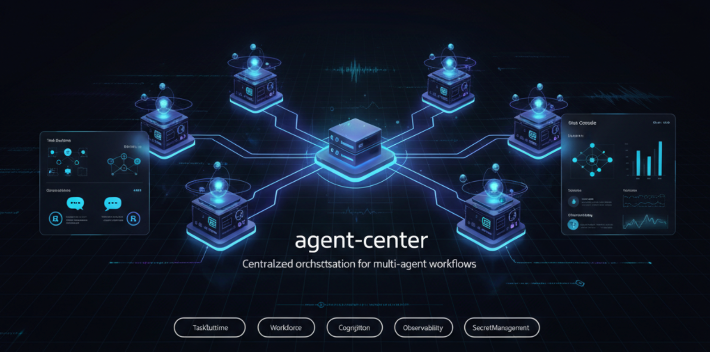

<h1 align="center">agent-center</h1>

<p align="center">
  <strong>English</strong>
  &nbsp;·&nbsp;
  <a href="./README.zh-CN.md">简体中文</a>
  &nbsp;·&nbsp;
  <a href="./docs/index.md">Docs</a>
  &nbsp;·&nbsp;
  <a href="./docs/design/roadmap.md">Roadmap</a>
  &nbsp;·&nbsp;
  <a href="./docs/deployment/v2.4-first-mile.md">Deploy Guide</a>
  &nbsp;·&nbsp;
  <a href="./CHANGELOG.md">CHANGELOG</a>
</p>

<br/>

<p align="center">
  
</p>

<br/>

<h3 align="center">A personal AI agent dispatch center.</h3>
<p align="center">Run one server. Attach workers from any machine. Agents run wherever — every conversation and decision lands on a thread you can trace.</p>

<br/>

> [!TIP]
> **Conversation is the product spine, not a log.** Tasks, Issues, decisions, progress — all hang off Conversation threads. This is the deepest difference between agent-center and the "agents are scripts" mindset: every dispatch, every InputRequest, every artifact is recoverable in its original thread.

<br/>

## Install

`agent-center` is **install-once-and-go**. One command installs the center, one installs each worker, and a matching pair of `upgrade` commands moves an existing install forward (atomic symlink swap + health probe + auto-rollback). Supported on macOS (this cycle's acceptance target) and Linux (systemd unit installed automatically; full validation deferred).

Default ports (loopback Web Console, plus the admin endpoint workers dial):

| Endpoint | Address | Notes |
|---|---|---|
| Web Console | `127.0.0.1:7100` | open this URL in a browser after install |
| Center server | `:7050` | moved off `:7000` because macOS AirPlay Receiver holds 7000 |
| Admin TCP (worker enroll) | `0.0.0.0:7300` | workers dial `tcp://<host>:7300` |

> **macOS AirPlay warning.** macOS Ventura+ runs an **AirPlay Receiver** that listens on **port 7000**, so the legacy `:7000` default fails to bind and the center never starts. The installed config defaults to **`:7050`** to avoid this. If you previously pinned `listen_addr: ":7000"`, either change it to `:7050` or turn off *System Settings → General → AirDrop & Handoff → AirPlay Receiver*.

### 1. Install the center

```bash
# From the release tarball, on the host machine:
cd agent-center-v2.10.3-<os>-<arch>/
./install center
# Default = FOREGROUND: drops files + config, then prints the run command:
agent-center server --config=<prefix>/etc/config.yaml   # logs to stdout
# Then open the Web Console URL (http://127.0.0.1:7100) — first-time setup
# mints the bootstrap admin token in the browser.
```

**Foreground by default (v2.7).** `install center` only drops the binaries + config and tells you the foreground command to run (`agent-center server`, logs to stdout) — it does **not** register a background service or auto-start on boot. To install a managed background service instead, add `--service`:

```bash
./install center --service   # registers + starts a LaunchAgent (macOS) / systemd unit (Linux), auto-starts on boot
```

`install center` is idempotent and upgrade-aware: re-running it on the same prefix detects the existing install and does nothing if the version matches. Default prefix is `~/.agent-center` (macOS / Linux user mode) or `/opt/agent-center` (Linux system mode); override with `--prefix=<dir>`.

### Agent execution — authentication & configuration

A worker spawns each agent's CLI (e.g. `claude`). The agent authenticates with the **same credential the worker user's own Claude Code uses** — agent-center does not require a separate API key:

- **Subscription `/login` works out of the box.** If the worker user has logged in to Claude Code (`claude` then `/login`, stored in the macOS keychain), the agent's claude uses that same login — no extra configuration. (`ANTHROPIC_API_KEY` in the worker's service environment also works if you prefer key-based auth.)
- The agent runs claude with `--setting-sources user,project`: **user** supplies the keychain `/login` credential, **project** lets the agent carry its own config in `<agent-home>/workspace/.claude` (created empty per agent).

**What the agent inherits from the worker user's `~/.claude`** (user-level settings, verified in acceptance):

| Inherited into the agent | Isolated from the agent |
|---|---|
| `~/.claude/settings.json` **hooks** (run under bypassPermissions), **plugins**, and **env** vars | **MCP servers** — the agent gets only its own agent-center MCP (pinned by `--strict-mcp-config`); the user's/plugin MCP servers are not loaded |

> ⚠️ **Security note.** Because auth and the user's settings load from the same "user" source, the agent inherits the worker user's `~/.claude` **hooks** and runs them under `bypassPermissions`. If you keep sensitive or side-effecting hooks there, be aware the agent will execute them. **Full user-level isolation** (auth without loading the user source, via a `setup-token` / `CLAUDE_CODE_OAUTH_TOKEN`) is tracked on the roadmap.

If claude has no reachable credential at all, orchestration still works end-to-end (dispatch → spawn → MCP connect → activity stream), but the agent's turn fails auth (`403 Request not allowed`) and its work item is marked failed.

### 2. Install a worker

A worker can run on the same machine as the center or any other machine. In the Web Console click **"+ Add Worker"**, type a friendly name, and copy the generated command — it already carries the bootstrap URL, a one-time enroll token, the pinned server fingerprint, and a unique `--worker-id`:

```bash
./install worker \
  --bootstrap=tcp://HOST:7300 \
  --server-fingerprint=sha256:... \
  --token=enroll_... \
  --worker-id=worker-... --worker-name="my box"
```

Like the center, `install worker` is **foreground by default**: it drops files + config and prints the `agent-center worker run …` command to run yourself (logs to stdout). Add `--service` to register a managed LaunchAgent/systemd unit that auto-starts on boot.

**v2.7.1 change — config is the single source of truth.** `install worker` now writes all enroll fields (worker_id / name / bootstrap / token / server_fingerprint) into `<prefix>/etc/config.yaml` (mode `0600`), and the printed/managed `worker run` command is just:

```bash
agent-center worker run --config=<prefix>/etc/config.yaml
```

The legacy `--worker-id` / `--bootstrap` / `--token` / `--server-fingerprint` / `--worker-name` flags are still accepted as overrides (a flag value wins over the config value), so existing scripts keep working — but the token no longer appears in `ps`, in your launchd plist, or in the printed install command. Upgrading from a pre-v2.7.1 install automatically migrates the older `config.yaml` so the new launch command works without re-supplying flags.

`--worker-id` is **required** — there is no hostname default, so a missing id is a hard error that points you back to the Web Console's Add Worker flow (which mints a unique id). This keeps two workers on one machine from silently colliding.

**Multiple workers per machine** are supported: each worker installs under its own subtree (`<prefix>/workers/<worker-id>/`); with `--service`, each gets its own LaunchAgent/systemd label (`com.agent-center.worker.<worker-id>`), so distinct `--worker-id`s coexist with zero overlap. (Re-running with the *same* `--worker-id` is treated as a re-enroll/upgrade of that worker.) `--server-fingerprint` is required when `--bootstrap` is `tcp://`.

> **Remote workers behind a private bind (`bootstrap_public_url`).** The Web Console's Add Worker command derives its `--bootstrap` address from the center's `admin_tcp_listen` bind. If the center binds a private/loopback address but workers dial it over a public DNS name, load balancer, or NAT, set the externally-reachable address explicitly — either `server.bootstrap_public_url: "center.example.com:7300"` in the config, or `install center --bootstrap-public-url=center.example.com:7300`. The Add Worker command then advertises that address instead of the bind one.

### 3. Upgrade the center

From a **source checkout**, pull the new code, rebuild the binary, then run `upgrade center` (it copies the new binaries, atomically swaps `current` → new version, runs a health probe, and auto-rolls-back if the probe fails):

```bash
git pull
make build                      # produces ./bin/agent-center at the new version
./bin/agent-center upgrade center
```

From a **release tarball**, extract the new version and run `./install center` again — it detects the existing install and walks the same atomic-swap path. `upgrade center` refuses with an error if there is no existing install at the prefix (use `install center` for fresh installs). Existing config (ports, blob store, keys) is preserved across upgrades.

### 4. Upgrade a worker

Same shape, but you must name the worker so the right subtree on a multi-worker host is targeted. The enroll token, bootstrap URL, and server fingerprint are preserved from the original install:

```bash
git pull && make build
./bin/agent-center upgrade worker --worker-id=worker-...
```

### Install from source (guided)

For a quick trial, a developer install, or onboarding a worker without a prebuilt tarball, a source installer clones, builds, and then **reuses the exact same `./install` path** as the tarball:

```bash
# Interactive wizard (asks for mode, version, prefix):
curl -fsSL https://raw.githubusercontent.com/oopslink/agent-center/main/install.sh | bash

# Pinned-tag Center install (recommended for anything stable):
curl -fsSL https://raw.githubusercontent.com/oopslink/agent-center/v2.10.3/install.sh | bash -s -- center --version v2.10.3

# Worker install — use the command the Web Console "Add Worker" generates:
curl -fsSL .../install.sh | bash -s -- worker \
  --version v2.10.3 --center tcp://HOST:7300 \
  --server-fingerprint sha256:... --token enroll_... --worker-name my-box

# Preview everything first — clones/builds/installs nothing:
curl -fsSL .../install.sh | bash -s -- center --dry-run
```

The release tarball remains the **recommended stable production** path. Notes on the source installer:

- **Pin a tag** with `--version vX.Y.Z` for stable installs. The `--channel main` (default when no version is given) is **development/unstable** and is labelled as such before it builds.
- It prints the resolved **repo / ref / commit / prefix** before any build or install, and runs no hidden `sudo`.
- The enrollment **token** and **server fingerprint** are sensitive — don't paste them into shared shell history or logs. The installer never echoes their values (`--dry-run` redacts them too).
- Missing build dependencies (`git`, `go`, `node`, `pnpm`/`corepack`) fail preflight early with copy-pasteable hints; no system packages are installed automatically.
- It needs a build toolchain on the host. Run `--help` for the full flag/env reference; flags also have `AGENT_CENTER_*` environment equivalents.

| Command | What it does |
|---|---|
| `agent-center install center` | Install the center (idempotent, upgrade-aware) |
| `agent-center install worker` | Install a worker daemon (enrolls against a running center) |
| `agent-center upgrade center` | Upgrade an existing center install (atomic swap + auto-rollback) |
| `agent-center upgrade worker --worker-id=<id>` | Upgrade a worker install |
| `agent-center uninstall center` | Remove the center (data preserved unless `--purge`) |
| `agent-center uninstall worker --worker-id=<id>` | Remove a single worker subtree |
| `agent-center server` | Run the center in the foreground (development) |
| `agent-center help` | Full command tree (subject-verb grouped) |

> Day-to-day operations — tasks, issues, fleet view, inspecting entities — live in the **Web Console**, not the CLI. The v2.7 CLI is deliberately scoped to install / upgrade / uninstall / run; the older data-management subcommands (`task create`, `issue open`, `ps`, `inspect`, …) were retired.

Full CLI surface: [CLI subcommands reference](./docs/design/implementation/03-cli-subcommands.md). Full deploy walkthrough: [v2.4 first-mile guide](./docs/deployment/v2.4-first-mile.md).

<br/>

## What it solves

| Pain | How agent-center handles it |
|---|---|
| Multiple agents on multiple machines, state scattered across N terminals | One server collects everything; `/fleet` shows every worker × execution × pending IR in real time |
| Agent stops mid-task to ask you something ("should I commit?") | InputRequest is a first-class concept — answer in a Web Console card and the agent resumes |
| Hard to trace what the agent did, why, and on whose authority | Every Task / Issue gets a Conversation thread; dispatch, decision, progress, and artifacts all land in it |
| Skill / MCP config scattered across each agent's repo | AgentInstance is a first-class AR: instructions + MCP servers + skill mounts are bound to the agent identity |
| Credentials | UserSecret BC, AES-256, plaintext-never-echo; agents reference secrets by `secret:<name>` |
| Multi-host deployment | v2.3 multi-host TCP+TLS (SSH-style fingerprint pinning) + v2.4 one-command first-mile |

<br/>

## Core concepts

Each is a noun your users will learn, backed by a DDD aggregate / value object / event / service:

| Concept | One-line definition |
|---|---|
| **Task** | A unit of work you (or Supervisor) created; status-driven lifecycle (open → running → completed / discarded, reopenable), assignable & claimable |
| **Issue** | A topic to discuss ("should we use X or Y?"); the conclusion can spawn 0, 1, or N Tasks |
| **Conversation** | A message thread attached to a Task / Issue / Channel / DM — the product spine |
| **Worker** | A machine running agents (local or remote); one machine can host multiple workers (v2.4) |
| **AgentInstance** | A named, persistent agent identity ("the coder on my MBP") with instructions + MCP + skills |
| **Supervisor** | A built-in agent that reads Conversation context and decides what to dispatch next — not a "brain," just another agent with logs |
| **InputRequest** | Agent blocks mid-execution asking you to decide; you answer in the Web Console and the agent resumes |
| **Project** | The container Tasks belong to; a worker can be mapped to multiple Projects |
| **Plan** | A DAG of tasks; `start` it and the center auto-dispatches each ready node as upstream tasks complete (draft → running → done → archived) |
| **AgentWorkItem** | An agent's work-queue item referencing a Task — drives execution state (queued / active / waiting_input / paused / done …) |
| **Memory** | Supervisor's persistent notes (markdown files, scoped per project / task / global) |

Full ubiquitous-language glossary: [bounded contexts § 1](./docs/design/architecture/strategic/03-bounded-contexts.md#-1-通用语言ubiquitous-language).

<br/>

## Design

`agent-center` follows [Domain-Driven Design](https://en.wikipedia.org/wiki/Domain-driven_design) with **nine domain Bounded Contexts** (+ a Memory file-service):

- **ProjectManager** *(Core)* — Project, Issue, Task, **Plan** (DAG orchestration), ProjectMember, Finding
- **Agent** *(Core)* — Agent (lifecycle), AgentWorkItem (work queue), AgentActivityEvent
- **Conversation** *(Core)* — Conversation (channel / DM / task / issue / plan), Message, participants
- **Identity** — Identity (user / agent), Organization, Member, Invitation
- **Workforce** — Worker (capability / dispatch), AgentInstance, BootstrapToken
- **Environment** — control-channel Worker + ordered, replayable command stream
- **Files** — FileTransferSession, FileReference, BlobStore (ULID file identity, ref-count GC)
- **SecretManagement** — UserSecret (AES-256-GCM) + master key + `secret:<name>` refs
- **Observability** — append-only domain Event store + EventSink

> Memory (the Supervisor's scoped notes) is a git-backed markdown **file service**, not a DB aggregate; the Supervisor itself is an OS-process runtime, not a domain aggregate. TaskRuntime + Discussion were merged into **ProjectManager**; there is no standalone Cognition BC. (Model re-derived from source — see the [DDD architecture browser](https://oopslink.github.io/agent-center/dev/v2.10.3/).)

Cross-BC interactions go through events / RPC; no shared physical tables (see [§ 9.z](./docs/rules/conventions.md)). All persistence is gated by each BC's Application Service — the transport (unix socket / TCP+TLS) is an implementation detail; **domain invariants always live behind the AppService**.

Documentation entry points:
- [Design overview](./docs/design/README.md)
- [DDD blueprint (plan + status)](./docs/design/ddd-blueprint.md)
- [Strategic / domain vision](./docs/design/architecture/strategic/00-domain-vision.md)
- [Tactical / per-BC overviews](./docs/design/architecture/tactical/)
- [ADR index](./docs/design/decisions/)
- [Project conventions (must-read)](./docs/rules/conventions.md)
- [Roadmap (deferred features)](./docs/design/roadmap.md)

<br/>

## Development

### Prerequisites

- **Go** 1.22+
- **Node.js** 20+ with **pnpm** (for the Web Console SPA)
- **macOS** or **Linux** (Windows untested)

### Build

```bash
make build                  # frontend (vite) + backend (go) + worker-daemon + fakeagent
                            # produces ./bin/{agent-center, agent-center-worker-daemon, fakeagent}

VERSION=v2.10.3 make build  # build with a specific version
```

The frontend SPA is built first (`web/` → `internal/webconsole/spa/dist/`) and then embedded into the Go binary via `go:embed`, so a single binary ships the full Web Console.

For SPA development, run the vite dev server separately and proxy `/api` to the loopback Go server — vite hot-reloads and the embedded chunk in the binary is ignored:

```bash
pnpm --dir web install      # one-time
pnpm --dir web run dev      # http://localhost:5173 with proxy → 127.0.0.1:7100
```

### Test, lint, smoke

```bash
make test            # go test ./...
make cover           # go test with coverage report
make cover-html      # render coverage as ./coverage.html
make vet             # go vet ./...
make lint            # vet + vendor / mock / doc-drift / raw-colors / idtail guards
                     # + SPA tsc -b + eslint (enforces conventions § 0.4)
make smoke           # fresh-binary deploy + drive a task to done — § 0.4 #4 gate
```

End-to-end tests (Playwright):

```bash
make e2e-install     # one-time: pnpm install + chromium download
make e2e             # full E2E suite, including deployed-pipeline spec
```

### Project layout

```
agent-center/
├── cmd/
│   ├── agent-center/               # main binary (server + CLI + install command)
│   ├── worker-daemon/              # worker daemon (separate binary)
│   └── fakeagent/                  # smoke-test agent (no LLM)
├── internal/                       # one subpackage per Bounded Context
│   ├── projectmanager/ agent/      # plus admin transport, webconsole, cli, ...
│   ├── conversation/   identity/
│   ├── workforce/      environment/
│   ├── files/          secretmgmt/
│   ├── observability/  cognition/memory/
│   └── ...
├── web/                            # React SPA (vite + TS + Tailwind)
│   └── src/                        # → internal/webconsole/spa/dist via go:embed
├── docs/
│   ├── design/                     # DDD architecture, ADRs, requirements
│   ├── plans/                      # phase / cycle plans + audits
│   ├── deployment/                 # deploy guides per version
│   ├── operations/                 # runbooks
│   └── rules/conventions.md        # cross-cutting design rules — read this
├── sites/                          # hand-written static docs site (no build; GitHub Pages)
├── tests/                          # E2E suites
├── contrib/                        # legacy install scripts (kept for reference)
└── Makefile
```

### Conventions

Read [`docs/rules/conventions.md`](./docs/rules/conventions.md) before contributing. Two rules that catch new contributors most often:

- **§ 0.4 — AppService is the only entry to domain state.** No process other than the server reads SQLite directly; CLI / worker / web all go through the admin transport.
- **§ 0.6 — Don't infer design intent without evidence.** Describe what *is* (observation) and what's *capable* (model). Don't bridge to "the system was designed to assume X" unless you can `grep` for it.

### Packaging (release tarballs)

`make release` builds a self-contained tarball for the host platform that's ready to feed to `./install`:

```bash
make clean-dist     # optional: wipe previous tarballs
make release        # → dist/agent-center-v<ver>-<os>-<arch>.tar.gz + sha256

# what it does:
#   1. make build (frontend + backend + worker-daemon)
#   2. assembles dist/agent-center-v<ver>-<os>-<arch>/ with bin/ +
#      install wrapper + LICENSE + README.md
#   3. tar -czf and prints sha256 + extract/verify recipe
```

Cross-platform tarballs (Linux × amd64/arm64 from a Mac build host, etc.), signing, GitHub Releases publishing, and CI are all deferred to the v3 "Deployment as Product" theme. For now `make release` covers the local-platform case, which is what you need to test the install flow end-to-end before promoting a release.

The **source guided installer** (top-level `install.sh` → `scripts/install/`) reuses this same layout via `make release-dir VERSION=<ref> OUT=<staging>` — it stages the release directory without tarring, then runs the staged `./install`. Its offline shell tests run with `make test-install`.

### Local docs site

The `sites/` directory is a **hand-written static site** (plain HTML + one shared
`assets/site.css` / `site.js`, **no build step**). It's a curated, public-facing
*showcase* of the docs — `docs/` stays the authoritative source. See
[`sites/README.md`](./sites/README.md) for the structure and the page ↔ source map.

```bash
# preview locally — just open the file, or serve the folder:
open sites/index.html                 # or: python3 -m http.server -d sites 5173
```

Deployment is automatic: `.github/workflows/pages.yml` publishes `sites/**` to
GitHub Pages on every push to `main` (project sub-path `/agent-center/`, all links
relative). There is nothing to build.

<br/>

## Contributing & feedback

This is currently a single-author project. If you'd like to contribute:

- **Bugs and design discussion** — open a GitHub Issue
- **Code contributions** — read [`docs/rules/conventions.md`](./docs/rules/conventions.md) first (§ 0.4 AppService discipline + § 0.6 layer discipline catch most issues)
- **Roadmap input** — point to a row in [Roadmap](./docs/design/roadmap.md) or open a Discussion

The static site under `sites/` is the public entry point (published to GitHub Pages); for the full detail browse `docs/` directly in the repo.
