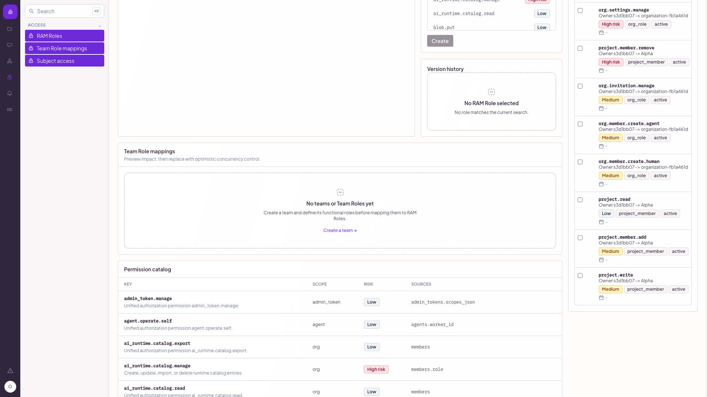
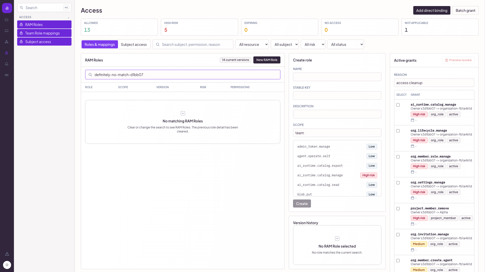
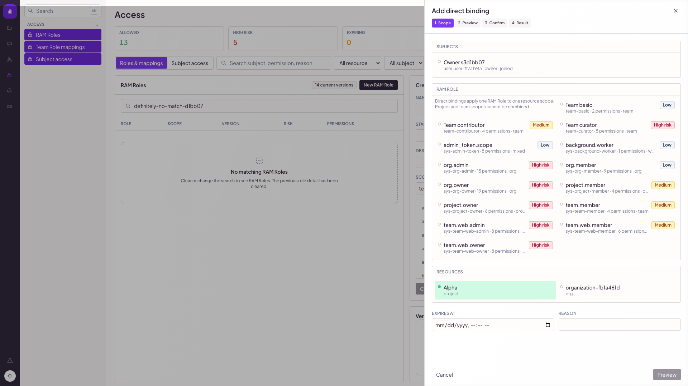

# T1461 S3 fresh full-truth remediation acceptance

Date: 2026-08-21 (Asia/Shanghai)

## Verdict

**Overall release gate: BLOCKED. Do not merge or release.**

- Fresh exact-candidate build/install/start and the three requested real-browser product states: **PASS**.
- Runtime identity, normal-path console, page errors, and Access network chain: **PASS**.
- Mixed-resource direct binding preview/apply rejection: **PASS**.
- Formal comparison against the three approved mockup originals: **BLOCKED — immutable originals and hashes were not supplied and do not exist in the repository or reachable history.**

This report does not reuse the earlier `bb29dbd5` runtime verdict for the recovered candidate. The older screenshots in the parent directory remain historical evidence only.

## Frozen candidate and recovery chain

- Authoritative base: `origin/main` = `00adf6b7b3c6871e3dff118d4af2b85a2c23a1c6`.
- Recovered evidence commit: `50f728dc842cb525499a1ca4fd1bdd46078c567c`.
- Tested code candidate (`reviewed_sha`): `d1bb07bc273b8a8f4d6a24621f25c1e59123b81b`.
- Dedicated delivery branch: `ac-exec/task-a3046a0b/exec-4c6a98f1`.
- The recovered commit is an ancestor of the tested candidate; no `origin/main` merge was performed.

During rerun, `TestAccessOverviewShowsTeamRAMAndDirectBindingUnion` failed deterministically because its fixed expiry (`2026-08-21T12:30:00Z`) had passed. The test now derives an expiry one hour in the future. Five consecutive focused reruns passed before the full package rerun.

## Fresh production-chain deployment

- Clean gate: `make clean && make lint && make build` — PASS.
- Built binary: `agent-center ac-exec/task-a3046a0b/exec-4c6a98f1-d1bb07bc (commit d1bb07bc)`.
- Install command: `./bin/agent-center install test-instance --id s3d1bb07 --with-seed --workers 1 --output json`.
- Generated prefix: `/Users/oopslink/.agent-center-test/s3d1bb07`.
- Generated web URL: `http://127.0.0.1:63077`.
- Runtime authority: `GET /api/system/version` returned branch `ac-exec/task-a3046a0b/exec-4c6a98f1`, commit `d1bb07bc`, and installed path `/Users/oopslink/.agent-center-test/s3d1bb07/center/current/bin/agent-center`.
- Installed `COMMIT` marker: `d1bb07bc`.
- Installed binary self-report: commit `d1bb07bc`.

The build, installed marker, installed binary, runtime endpoint, and reviewed SHA all resolve to the same code candidate.

## Real-browser acceptance

Chromium navigated from the signed-in Workspace page through the real sidebar **Access** link; no direct component URL or mock server was used for the acceptance journey. Final evidence was captured at 1920×1080.

### 1. Team Role mappings: no teams

Expected written contract: explain the prerequisite and provide a recovery action. Actual: `No teams or Team Roles yet`, explanatory copy, and `Create a team →` are visible.

### 2. RAM Role search: zero matches

Expected written contract: show a dedicated zero-result state and clear stale detail. Actual: `No matching RAM Roles` and `No RAM Role selected / No role matches the current search` are visible together; old detail/edit content is absent.

### 3. Direct binding: one role and one scope

Expected written contract: select one RAM Role and exactly one resource; project and team scopes cannot be combined. Actual: the drawer states that invariant, exposes radio-style single selection, and keeps Preview disabled until the flow is valid.

The same signed-in browser sent deliberately invalid two-resource payloads to both real endpoints. `/access/batch/preview` and `/access/batch/apply` each returned HTTP 422 with `mixed_direct_binding_scope`; no success response was observed.

## Console and network evidence

- After clearing logs and performing a normal Access reload, `agent-browser console --json` returned `messages: []`.
- `agent-browser errors --json` returned `errors: []`.
- Captured real Access requests included `GET /access/ram-roles`, `GET /access/overview?view=access`, `GET /access/ram-roles/team-basic`, and `GET /teams`.
- The two expected 422 console resource messages occurred only during the deliberate negative preview/apply probe. Logs were cleared, the normal page was reloaded, and console/page-error readback was empty.

## Approved-mockup checklist

| Surface | Live structure/behavior | Approved-original visual comparison |
|---|---|---|
| Team Role no-team state | PASS — explanation and create action visible | BLOCKED — original locator/hash missing |
| RAM Role zero-result state | PASS — list empty state and cleared detail visible | BLOCKED — original locator/hash missing |
| Direct binding scope state | PASS — one-role/one-resource contract visible; mixed payloads rejected | BLOCKED — original locator/hash missing |
| Pixel spacing, typography, colors, and exact copy | Live 1920×1080 evidence captured | NOT EXECUTABLE without approved originals |

Required unblock: provide the three immutable approved originals, or durable repository paths plus content hashes. A reviewer must then compare those exact assets against the three `fresh-d1bb07` captures. Historical screenshots are not substitutes for approved originals.

Additional visual risk observed during evidence QA: at 1280×720 the three-column RAM Role layout narrows the zero-result panel enough to clip part of the guidance copy. The 1920×1080 acceptance image is readable, but responsive behavior below that width needs a product decision or a separate fix before claiming broad desktop visual parity.

## Regression results

- `make lint` — PASS.
- `make build` — PASS; built binary self-reported `d1bb07bc`.
- `go test ./internal/persistence ./internal/authorization ./internal/team/service ./internal/webconsole/api` — PASS.
- `pnpm --dir web exec vitest run src/pages/Access.test.tsx --reporter=dot --maxWorkers=1 --minWorkers=1 --no-file-parallelism` — PASS, 15/15.
- `pnpm --dir tests/e2e/v2 exec playwright test tests/access-ram-role-crud.spec.ts --project=chromium-mac --workers=1 --reporter=list` — PASS, 2/2 against real spawned binaries/databases.

## Explicit gaps

1. The three approved mockup originals and hashes are unavailable, so visual parity cannot receive PASS.
2. The 1280×720 clipping risk is unresolved.
3. This report intentionally leaves the overall gate BLOCKED despite green runtime behavior.
