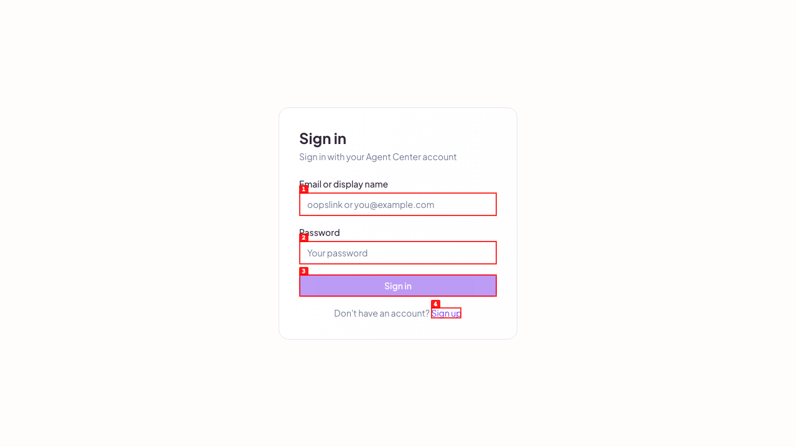
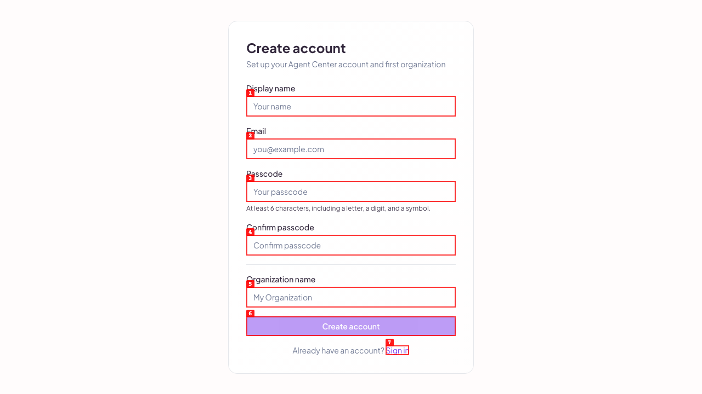
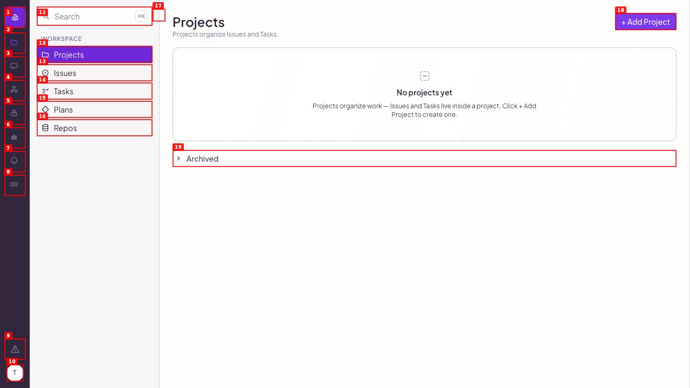
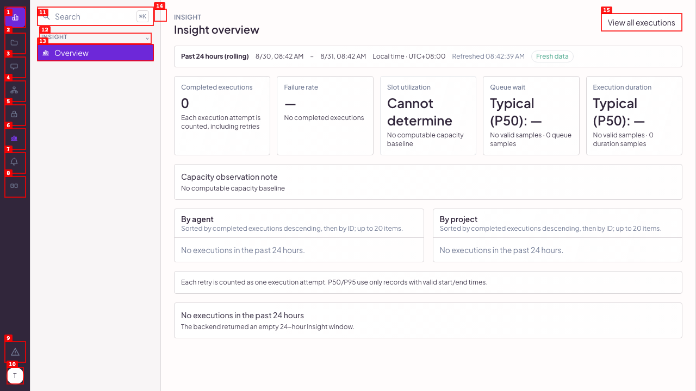

# T1803 Insight and S0 Gate independent acceptance

Date: 2026-08-31
Executor branch: `ac-exec/task-a90c6481/exec-6ed7c326`

## Verdict

REJECT

Insight is reachable through the real Web Console navigation and the S0 null-collection UI crash fix is effective on the deployed instance. The candidate cannot be accepted because three hard gates are red:

- `task-input/v1/README.md` and `task-input/v1/manifest.json` were absent, so the full assigned task input package could not be read.
- Deployed provenance is not the declared S3 candidate: deployed health reports `main-173fdb09`; the S3 Insight candidate ref resolves to `16dc58155dfa0cafd79c08595c8a8e378b5eede9`.
- `make lint` fails at `go vet ./...` with `internal/admin/api/agent_tools_write.go:794:2: unreachable code`.

There is also a live API contract failure: the real Insight overview/executions endpoints return `agents:null`, `projects:null`, and `executions:null` for an empty window, while the frozen contract requires empty arrays.

## Provenance

| Item | Observed |
| --- | --- |
| Local HEAD at execution start | `0a02c230b0df9a885eccecf17482920f929b230a` |
| Remote deployed main | `173fdb0913450370fae51831f0008d2f10165f8c` |
| Deployed health | `{"status":"ok","version":"main-173fdb09"}` |
| S3 Insight candidate ref | `16dc58155dfa0cafd79c08595c8a8e378b5eede9` |
| Real instance URL | `http://127.0.0.1:7100/` |
| Created test org route | `/organizations/org-6de116e1/insights/overview` |

Raw evidence:

- `raw/00-provenance-health-auth.log`
- `raw/01-fetch-origin-push.log`
- `raw/02-fetch-origin.log`
- `raw/03-post-fetch-refs.log`
- `raw/05-task-input-presence.log`

No agent-center database files, admin sockets, worker tokens, process arguments, `mcp_config.runtime.json`, or agent-center control-plane tools were used.

## Black-box Steps

### 1. Real browser entry

Step: opened `http://127.0.0.1:7100/` in `agent-browser`.

Expected: enter through the real Web Console, not a direct component URL.

Actual: the app loaded the real sign-in page.

### 2. Real signup flow

Step: used the visible `Sign up` link, filled a new user and organization, corrected passcode constraints from visible UI text, and submitted through the real form.

Expected: registration succeeds and lands in the authenticated product shell.

Actual: registration succeeded; the authenticated sidebar included `Workspace`, `Conversations`, `Teams`, `Access`, `Insight`, `Reminders`, and `System`.

### 3. Insight reachability through navigation

Step: clicked the authenticated sidebar `Insight` link.

Expected: user-reachable route opens organization Insight Overview, not an orphan direct URL.

Actual: browser navigated to `http://127.0.0.1:7100/organizations/org-6de116e1/insights/overview`.

### 4. UI contract and S0 null-collection gate

Step: inspected the rendered overview page.

Expected: page shows Past 24 hours, exact window bounds, refreshed/freshness state, summary cards, empty execution state, and does not crash if the backend returns empty collections.

Actual: the page rendered `Past 24 hours`, exact start/end, `Refreshed`, `Fresh data`, zero completed executions, null metric placeholders, agent/project empty states, and execution empty state. This is a PASS for the S0 UI null-collection crash fix.

Raw UI state: `raw/13-ui-state.json`.

### 5. Real API contract

Step: from the same authenticated browser origin, executed same-session `fetch()` for:

- `/api/orgs/org-6de116e1/insights/overview?window=24h`
- `/api/orgs/org-6de116e1/insights/overview?window=12h`
- `/api/orgs/org-6de116e1/insights/executions?window=24h&limit=50`

Expected:

- `window=24h` overview returns 200 with the frozen envelope.
- invalid window returns 400.
- empty data returns zeros/null metrics and empty arrays, not `null` collections.
- executions drilldown returns the frozen envelope and an empty `executions` array when no rows exist.

Actual:

- overview `24h`: 200 and freshness `fresh`.
- invalid `12h`: 400 with `invalid_window`.
- executions `24h`: 200 and freshness `fresh`.
- contract failure: overview returned `agents:null` and `projects:null`; executions returned `executions:null`.

Raw response: `raw/11-insight-api-fetch.txt`.

### 6. Authorization sanity

Step: called the organization Insight overview endpoint without the browser session cookie.

Expected: unauthenticated request is rejected.

Actual: 401 `{"error":"unauthenticated","message":"no session cookie"}`.

Raw response: `raw/00-provenance-health-auth.log`.

## S0 Gate Red/Green

| Check | Expected | Actual | Result |
| --- | --- | --- | --- |
| RED input condition | Backend may return null collections on this deployed instance | Real API returned `agents:null`, `projects:null`, `executions:null` | Observed |
| GREEN UI behavior | Insight Overview must not crash; it must render meaningful empty states | UI rendered fresh empty Insight overview and execution empty state | PASS |
| Frozen API contract | Empty collections must be arrays | Empty collections were `null` | REJECT |

## Build and Test Gates

| Gate | Result | Evidence |
| --- | --- | --- |
| `git diff --check` | PASS | `raw/20-git-diff-check.log` |
| `make lint` | REJECT | `raw/21-make-lint.log`: `go vet ./...` reports unreachable code |
| `make build` | PASS | `raw/22-make-build.log` |
| Focused Insight/API Go tests | PASS | `raw/23-go-insight-api-focused.log` |
| Focused Insight Overview Vitest | PASS | `raw/24-vitest-insight-overview.log` |

The focused tests are supporting evidence only; they do not replace the black-box browser/API acceptance above.

## Final Rationale

PASS for real navigation reachability of the Insight Overview page.

PASS for S0 UI recovery: the deployed page tolerates null backend collections and renders empty states.

REJECT overall because the deployed instance is not proven to be the declared candidate, the required task input package is missing, `make lint` is red, and the live Insight API violates the frozen empty-array wire contract.
