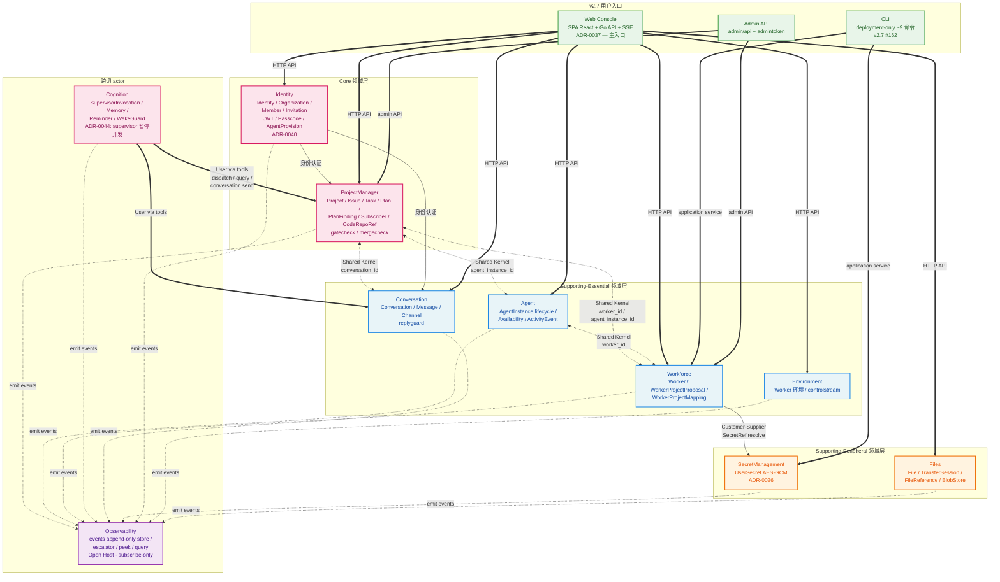

# 限界上下文 & Ubiquitous Language

> **DDD 战略层**

> 本文档定义 agent-center 的领域模型：**通用语言**（vocabulary） + **限界上下文**（bounded contexts） + **上下文映射**（context map）。

DDD 战略设计层。具体聚合 / 实体 / 值对象的字段与状态机迁移细节，分散在后续各章节。

> 🆕 **v2.7 状态**（2026-06-26 更新）：
> - **ProjectManager BC 新增**：取代 TaskRuntime + Discussion（v2.7 #131），统一管理 Project / Issue / Task / Plan / PlanFinding / Subscriber / CodeRepoRef。代码包 `internal/projectmanager`（含 `gatecheck/` / `mergecheck/` 子包）
> - **Identity BC 独立**：从 Conversation BC 中拆出（ADR-0040），管理 Identity / Organization / Member / Invitation。代码包 `internal/identity`
> - **Agent BC 独立**：AgentInstance 生命周期从 Workforce 独立。代码包 `internal/agent`
> - **Environment BC 新增**：Environment / workspace 管理 + controlstream。代码包 `internal/environment`
> - **Files BC 新增**：文件上传 / 管理。代码包 `internal/files`
> - BC1 **TaskRuntime** + BC2 **Discussion** 已 RETIRED（v2.7 #131，职责迁移至 ProjectManager）
> - BC7 **Bridge BC** 已 RETIRED（v2 per ADR-0031）
> - **Supervisor** 暂停主动开发（ADR-0044），代码骨架保留
> - v2.7 用户主入口 = Web Console（ADR-0037）；CLI 收窄为 deployment-only ~9 命令（v2.7 #162）

---

## § 1. 通用语言（Ubiquitous Language）

全部术语统一遵守：**代码包 / 文档 / CLI / event_type 字符串 / 数据库表名都用同一组词**。违反命名一致性见 [conventions § 12](../../../rules/conventions.md#-12-命名一致)。

### 1.1 核心实体（按上下文归属）

| 术语 | 上下文 | 定义 |
|---|---|---|
| **Project（项目）** | ProjectManager | 项目全生命周期管理的根聚合。包含 Issue / Task / Plan / PlanFinding / Subscriber / CodeRepoRef 等子实体。代码包 `internal/projectmanager` |
| **Issue（议题）** | ProjectManager | 待讨论的事项，属于 Project。可由 user / supervisor / agent 提起；多轮讨论 conclude 后可能产生 Task。（v2.7 从 Discussion BC 迁入 ProjectManager） |
| **Task（任务）** | ProjectManager | 工作单元，属于 Project。**只有 center 能创建 task，无野任务**（[conventions § 1](../../../rules/conventions.md#-1-单一来源--无野任务)）。（v2.7 从 TaskRuntime BC 迁入 ProjectManager） |
| **Plan（计划）** | ProjectManager | 项目的执行计划，包含 DAG 调度逻辑。子包 `plan_dag.go` / `plan_dispatch.go`。支持 GateCheck（`gatecheck/`）和 MergeCheck（`mergecheck/`）门禁 |
| **PlanFinding（计划发现）** | ProjectManager | Plan 执行过程中的发现 / 结论记录 |
| **Subscriber（订阅者）** | ProjectManager | 项目事件订阅者 |
| **CodeRepoRef（代码仓库引用）** | ProjectManager | 项目关联的代码仓库引用（`code_repo_ref.go`） |
| **Worker（工人/工作节点）** | Workforce | 用户开发机上的守护进程，能执行任务。代码包 `internal/workforce` |
| **WorkerProjectProposal（提议）** | Workforce | Worker 自动扫描发现的"候选项目映射"。需要用户确认才能升级成 WorkerProjectMapping。状态机 pending → accepted/ignored/superseded |
| **AgentInstance（agent 实例）** | Agent | 一等公民身份：用户起名 + 绑定 Worker + 配置 + 状态机（idle / active / sleeping / archived）。v2.7 从 Workforce 独立为 Agent BC。代码包 `internal/agent`（含 `service/` / `sqlite/` 子包） |
| **UserSecret（用户密钥）** | SecretManagement | 用户管理的密钥实体：name（全局唯一）+ kind + AES-GCM 加密 value + state machine（active / revoked）。代码包 `internal/secretmgmt` |
| **SecretRef（密钥引用）** | SecretManagement | VO，引用语法 `secret:<name>`；用在 `mcp_config` 等需要密钥的 config 字段里；DB 持久化时只存引用、不存明文 |
| **Identity（身份）** | Identity | 参与者的统一身份：`user:xxx` / `agent:xxx` / `system`。v2.6 从 Conversation BC 独立（ADR-0040）。代码包 `internal/identity` |
| **Organization（组织）** | Identity | 多租户组织实体 |
| **Member（成员）** | Identity | 组织成员关系 |
| **Invitation（邀请）** | Identity | 组织邀请 |
| **Environment（环境）** | Environment | Worker 端的工作环境 / workspace 管理。子包 `controlstream/`。代码包 `internal/environment` |
| **File（文件）** | Files | 文件上传 / 管理实体。代码包 `internal/files` |
| **Supervisor（监督者）** | Cognition | 中心的调度官 agent；LLM 驱动；事件触发；spawn 一次 claude code 进程做一次决策周期。**它也是 agent，不是"中央意识"**（[ADR-0003](../../decisions/0003-supervisor-not-brain.md)） |
| **SupervisorInvocation（监督者调用）** | Cognition | Supervisor 一次启动 → 退出的审计单元，含触发事件、prompt、输出、决策记录 |
| **Memory（记忆）** | Cognition | Supervisor 的持久脑，scoped notes（task / issue / conversation / worker / project / global / supervisor）。**物理形态 = file-based + git 仓**（每 scope 一个 `CLAUDE.md`，存 `$AGENT_CENTER_MEMORY_DIR/`），不走 DB 表 —— 详见 [ADR-0012](../../decisions/0012-memory-file-based.md) 与 [cognition/02-memory.md](../tactical/cognition/02-memory.md) |
| **DecisionRecord（决策记录）** | Cognition | Supervisor 在一次 invocation 中显式 emit 的具体决策（通过 CLI 调用动作时记录） |
| **Event（领域事件）** | Observability | 跨上下文的离散状态变化记录。落到 events 表，append-only |
| **AgentTraceEvent** | Observability | Agent JSONL 流中解析出的单条事件（thinking / tool call / tool result / 等）。**不入 events 表**：worker daemon 实时投影到 TaskExecution 摘要 + 写本地 `trace.jsonl`，execution 结束归档至 BlobStore（[ADR-0015](../../decisions/0015-agent-trace-not-in-events-table.md)） |
| **Conversation（会话）** | Conversation | 系统**内部**的消息时间线存储；纯业务模型，无 vendor 依赖；`kind=task` 跟 Task 1:1 / `kind=issue` 跟 Issue 1:1（详 [ADR-0039](../../decisions/0039-conversation-business-model-v2-unified.md)） |
| **Message（消息）** | Conversation | Conversation 内的一条留言。`content_kind` ∈ {text / system / agent_finding / supervisor_summary / conclusion_draft / task_proposal}；可空字段 `input_request_ref` 关联到 InputRequest；`kind=issue` Conversation 内的 Message 即"议事讨论"（不再有独立 IssueComment 实体）；append-only 不可变（详 [ADR-0039](../../decisions/0039-conversation-business-model-v2-unified.md)） |

### 1.2 行为动词

| 动词 | 主语 | 宾语 | 释义 |
|---|---|---|---|
| **Dispatch（派单）** | Supervisor | Task | 创建 Task 并指定 worker / agent CLI / prompt |
| **Conclude（收敛）** | User | Issue | 对 issue 做出结论；可能 spawn 0/1/N 个 Task |
| **Spawn（衍生）** | Issue conclude / Supervisor | Task | 创建子 Task / 由 Issue 结论创建 Task |
| **Escalate（升级到人）** | Supervisor | InputRequest / Issue | 把决策推给用户（Web Console UI / CLI 卡片）|
| **Enroll（注册）** | Worker | (Center) | 首次连接 center，凭 bootstrap token 换 session token |
| **Adopt（采纳）** | User | InputRequest 的 supervisor suggested answer | 选用 supervisor 倾向的答案 |
| **Withdraw（撤回）** | Issue opener | Issue | 撤销开启的 issue |
| **Open（开）** | User / Supervisor / Agent | Issue | 创建新 issue |
| **Cancel（取消）** | User / Supervisor | Task / InputRequest | 中止 |
| **Add-message（写入会话消息）** | Supervisor / Worker agent / User | Conversation | 调 `agent-center conversation send` 往 Conversation 内写一条 Message |
| **Comment（评论议题）** | User / Supervisor / Agent | Issue | 调 `agent-center issue comment` 往 Issue 写一条 IssueComment（结构化）|

### 1.3 状态机词汇

**Task（4 态，工作单元身份）:**

| 状态 | 含义 |
|---|---|
| `open` | 等开干 / 可被 dispatch |
| `suspended` | 暂停，可恢复 |
| `done` | 已完成（某次 execution `completed` 自动联动）|
| `abandoned` | 决定不做了（终态） |

> Task **没有 `failed`**。失败是某次执行的状态，不是 task 的状态。详见 [task-runtime/01-task.md § 2](../../retired/task-runtime/01-task.md) 与 [ADR-0010](../../decisions/0010-task-execution-two-layer-model.md)。

**TaskExecution（A2A 6 态，一次执行）:**

| 状态 | 含义 |
|---|---|
| `submitted` | 已创建，envelope 已发 / 等 ACK / 等 worker spawn agent |
| `working` | Agent 正在跑 |
| `input_required` | Agent 卡在 InputRequest |
| `completed` | 成功结束（终态） |
| `failed` | 失败结束（含 timeout / worker_lost / dispatch_no_ack 等，详 reason taxonomy）（终态） |
| `killed` | 被显式 kill（user / supervisor / abandon 或 suspend 前置）（终态） |

**Issue:**

| 状态 | 含义 |
|---|---|
| `open` | 刚开，无人响应 |
| `under_discussion` | 已有非 opener 的 comment 进入 |
| `concluded` | 用户拍板，准备收尾 |
| `closed_no_action` | 结论是不做 |
| `closed_with_tasks` | 结论是做这些，已 spawn tasks |
| `withdrawn` | 撤回 |

**InputRequest:**

| 状态 | 含义 |
|---|---|
| `pending` | 等回应 |
| `responded` | 已应答，agent 继续 |
| `timed_out` | 超时 |
| `canceled` | 任务取消导致 |

**Worker:**

| 状态 | 含义 |
|---|---|
| `online` | 长连接活跃，心跳正常 |
| `offline` | 长连接断开 |
| `enrolling` | 注册过程中（短暂）|

### 1.4 基础设施词汇

| 术语 | 定义 |
|---|---|
| **BlobStore** | 大文件存储抽象（v1 LocalDirBlobStore，未来 S3）。见 [implementation/01-blob-store.md](../../implementation/01-blob-store.md) |
| **Worktree-root** | Worker 上某个 project 用于派生 task worktree 的根目录 |
| **Dispatch envelope** | Supervisor 派单时下发到 worker 的载荷结构。见 [08-prompt-assembly.md](../tactical/agent-harness/01-prompt-assembly.md) |
| **Skill** | 教 agent 怎么用工具的 markdown 文档（worker-agent.md / supervisor.md）。见 [10-skill-cli-tooling.md](../tactical/agent-harness/02-skill-cli-tooling.md) |
| **CLI 子命令** | `agent-center <op>` 形式的实际工具入口 |
| **Trigger event** | 触发 SupervisorInvocation 的源事件 |

### 1.5 易混淆术语对照

| 用 | **不要**用 | 理由 / 见 |
|---|---|---|
| Supervisor | | [ADR-0003](../../decisions/0003-supervisor-not-brain.md) |
| Issue | | [ADR-0004](../../decisions/0004-issue-not-suggestion.md) |
| Worker daemon | | "Worker" 一词在本系统专指守护进程 |
| Agent / Worker agent | | 避免与 Worker daemon 混 |
| Memory | | conventions § 12 |
| Worktree | | conventions § 12 |
| BlobStore | | conventions § 12 |
| TaskExecution | | "一次执行"唯一名词；AgentSession 已下线，见 [ADR-0010](../../decisions/0010-task-execution-two-layer-model.md) |

---

## § 2. 限界上下文（Bounded Contexts）

agent-center 的领域划分为 **10 个 live 限界上下文**。Web Console / CLI / BlobStore 不是 BC（属于表现层 / 基础设施）。另有 3 个 retired BC（TaskRuntime / Discussion / Bridge）作历史记录保留。

### BC-PM: ProjectManager（项目管理）— v2.7 Core BC

**职责**: 项目全生命周期管理——Project / Issue / Task / Plan / PlanFinding / Subscriber / CodeRepoRef。取代原 BC1 TaskRuntime + BC2 Discussion 的所有职责。包含 GateCheck（门禁检查）和 MergeCheck（合并检查）子能力。

**代码包**: `internal/projectmanager`（含 `gatecheck/` / `mergecheck/` / `service/` / `sqlite/` 子包）

**核心聚合**:
- `Project`（根聚合；项目元数据 + 成员管理 `project_member.go`）
- `Issue`（独立聚合；项目内的议题，`issue.go`）
- `Task`（独立聚合；项目内的工作单元，`task.go`；含 block lease 机制 `task_block_lease`）
- `Plan`（独立聚合；项目的执行计划，`plan.go`；含 DAG 调度 `plan_dag.go` / dispatch `plan_dispatch.go`；支持归档 `plan_archive`）
- `PlanFinding`（Plan 子实体；执行过程中的发现 / 结论，`plan_finding.go`）
- `Subscriber`（Project 子实体；事件订阅者，`subscriber.go`）
- `CodeRepoRef`（Project 子实体；关联的代码仓库引用，`code_repo_ref.go`）

**核心操作**:
- 项目管理：project CRUD / member 管理 / subscriber 管理 / code repo ref 管理
- 议题管理：issue open / comment / conclude / close
- 任务管理：task create / start / complete / reopen（reopened → running 合法转换）/ archive
- 计划管理：plan create / dispatch / DAG 依赖管理 / gate check / merge check / archive
- 发现管理：plan finding create / update

**门禁子能力**:
- `gatecheck/`：Plan 执行前的门禁检查（代码质量 / 依赖 / 权限等）
- `mergecheck/`：合并前检查（冲突 / review / CI 等）

---

> ⚠️ **RETIRED BCs**: 以下 BC1 TaskRuntime + BC2 Discussion 已从代码库删除（v2.7 #131），职责迁移至上方 **ProjectManager BC**。下文作为历史设计记录保留；战术设计见 [retired/](../../retired/)。

### BC1: TaskRuntime（任务运行时） — RETIRED (v2.7 #131 → ProjectManager)

> ⚠️ **RETIRED (v2.7 #131 carve-out).** TaskRuntime BC has been deleted from the codebase (code + tables removed; fresh DB is new-model-only). Its responsibilities are now carried by the **ProjectManager BC (pm.Task)** + **Agent work-items**. The section below is retained as a HISTORICAL design record only; the tactical design has moved to [retired/task-runtime/](../../retired/task-runtime/00-overview.md). For the current v2.7 design see sites/designs/v2.7/.

**职责**: Task / TaskExecution / InputRequest 全生命周期 + 派单协议 + 派单可靠性 + 子任务层级 + 任务依赖 + Worker 侧运行时（workspace 物理 / shim 模型 / Agent CLI 子进程 / JSONL 解析 / per-execution 目录 / reconcile worker 端 / kill 进程级机制）+ Artifact 收集。**协议与运行时实施同 BC**（[ADR-0019](../../decisions/0019-bc-scheduling-execution-merged-to-task-runtime.md)）；状态权威在 center，实际执行在 worker，物理 split 不切 BC。

**核心聚合**:
- `Task`（独立 Aggregate Root，4 态状态机；身份不变；`conversation_id` 字段绑定 `kind=task` Conversation 1:1；`parent_task_id` 自引用记血缘）
- `TaskExecution`（独立 Aggregate Root；持 `task_id` 强引用 Task，1:N；A2A 6 态状态机；`execution_id` = 主身份 + 幂等 + fencing key；[ADR-0019](../../decisions/0019-bc-scheduling-execution-merged-to-task-runtime.md) / [ADR-0010](../../decisions/0010-task-execution-two-layer-model.md)）
- `InputRequest`（独立 Aggregate Root；通过 `task_execution.pending_input_request_id` 关联到 TaskExecution；UI 投递走 Conversation Message + `input_request_ref` 字段，见 [ADR-0017 § 5](../../decisions/0017-task-as-conversation.md)）
- `Artifact`（TaskExecution 子实体；独立表 `artifacts`；归属 execution；append-only）

**核心事件**:
- `task.created`（payload 含 `conversation_id`）/ `task.priority_changed` / `task.eta_changed` / `task.workspace_mode_changed` / `task.dependency_added` / `task.dependency_removed` / `task.suspended` / `task.resumed` / `task.done` / `task.abandoned` / `task.dispatch_limit_reached`
- `task_execution.created` / `task_execution.dispatched` / `task_execution.working` / `task_execution.input_required` / `task_execution.completed` / `task_execution.failed` / `task_execution.kill_requested` / `task_execution.killed`
- `input_request.requested` / `input_request.responded` / `input_request.timed_out` / `input_request.canceled`
- `worktree.created` / `worktree.released` / `artifact.uploaded` / `task_log.archived` / `task_trace.archived`（agent_trace JSONL 不作为事件流入 events 表，见 [ADR-0015](../../decisions/0015-agent-trace-not-in-events-table.md)）

> **不引入**: `task.bound_card_requested` / `task.progress_milestone_reached`（[ADR-0016](../../decisions/0016-task-progress-via-bound-thread.md) 规划，被 [ADR-0017](../../decisions/0017-task-as-conversation.md) supersede 后撤回 —— 进度走 `conversation.message_added`，绑定信息携带在 `task.created` payload）

**核心操作**:
- 中心端：`dispatch` / `kill-execution` / `abandon-task` / `suspend-task` / `resume-task` / `query tasks` / `query executions` / `respond-to-input-request`
- Worker 端：agent 通过本机 unix socket 调 CLI（`request-input` / `report-progress` / `report-artifact` / `open-issue` / `read-task-context`）
- Worker daemon 也是 Conversation 合法 actor：通过 center 长连 RPC 调 `conversation add-message` 把进度 milestone / agent 请示载体写入 `task.conversation_id`（[ADR-0017 § 4 / § 8](../../decisions/0017-task-as-conversation.md)）

**派单可靠性**: ACK + `execution_id` 幂等 + worker 本机 per-execution 目录 + reconcile 协议 + Shim 模型（detached agent，daemon 升级不影响 agent）（详见 [ADR-0011](../../decisions/0011-dispatch-reliability-protocol.md) + [ADR-0018](../../decisions/0018-detached-agent-via-per-execution-shim.md)）

**关键约束**: 一次 execution = 一个 agent 进程（v1 1:1，[ADR-0010](../../decisions/0010-task-execution-two-layer-model.md)）；AgentSession 概念已下线

**详细设计**: [task-runtime/00-overview.md](../../retired/task-runtime/00-overview.md)（BC wrap）+ [01-task.md](../../retired/task-runtime/01-task.md) + [02-task-execution.md](../../retired/task-runtime/02-task-execution.md) + [03-input-request.md](../../retired/task-runtime/03-input-request.md)

### BC2: Discussion（讨论） — RETIRED (v2.7 #131 → ProjectManager)

> ⚠️ **RETIRED (v2.7 #131 carve-out).** Discussion BC has been deleted from the codebase (code + tables removed; fresh DB is new-model-only). Its responsibilities are now carried by the **ProjectManager BC (pm.Issue)** + **Agent work-items**. The section below is retained as a HISTORICAL design record only; the tactical design has moved to [retired/discussion/](../../retired/discussion/00-overview.md). For the current v2.7 design see sites/designs/v2.7/.

**职责**: Issue 全生命周期 + Issue conclude spawn Tasks（议事消息走 Conversation BC Message，[ADR-0021](../../decisions/0021-issue-as-conversation.md)）

**核心聚合**:
- `Issue`（根，单聚合）

> [ADR-0021](../../decisions/0021-issue-as-conversation.md) 后：**删除 `IssueComment` 实体**；Issue 跟 `kind=issue` Conversation 1:1，议事消息复用 Conversation Message。

**核心事件**: `issue.opened` / `issue.discussion_started` / `issue.concluded` / `issue.withdrawn` / `issue.tasks_spawned`

> 删除项：（议事消息走 `conversation.message_added` (kind=issue) 路径）

**核心操作**: `issue open / comment (facade) / conclude / close / bind-conversation`；议事走 Conversation Message 时间线 (per [ADR-0039](../../decisions/0039-conversation-business-model-v2-unified.md))

**详细设计**: [discussion/00-overview.md](../../retired/discussion/00-overview.md)

### BC3: Workforce（工作池）

**职责**: Worker 注册 / 在线状态 / WorkerProjectProposal（自动发现）/ WorkerProjectMapping / Project 元数据映射

> **注意**：v2.7 AgentInstance 已独立为 Agent BC（`internal/agent`）；Project 全生命周期管理已迁至 ProjectManager BC（`internal/projectmanager`）。本 BC 仅保留 Worker 节点管理 + 项目映射能力。

**代码包**: `internal/workforce`

**核心聚合**:
- `Worker`（根）+ `WorkerProjectMapping`（实体，子从属；已生效的稳定映射）
- `WorkerProjectProposal`（根，独立聚合；自动发现的候选，等用户确认才升级为 Mapping）

**核心事件**:
- `worker.enrolled` / `worker.online` / `worker.offline` / `worker.heartbeat` / `worker.config.updated`
- `worker_project_proposal.proposed` / `worker_project_proposal.accepted` / `worker_project_proposal.ignored` / `worker_project_proposal.unignored`
- `worker_project_mapping.added` / `worker_project_mapping.invalidated`

**核心操作**: `worker join` / `worker list / status` / `worker proposal list / accept / ignore`

**详细设计**: [workforce/00-overview.md](../tactical/workforce/00-overview.md)

### BC-Agent: Agent（Agent 实例）

**职责**: AgentInstance 生命周期管理——创建 / 配置 / 状态机（idle / active / sleeping / archived）/ 可用性跟踪 / CLI 配置 / 活动事件记录。v2.7 从 Workforce BC 独立。

**代码包**: `internal/agent`（含 `service/` / `sqlite/` 子包）

**核心聚合**:
- `AgentInstance`（根，独立聚合；`agent.go`）
- `Availability`（实体；agent 可用性状态，`availability.go`）
- `ActivityEvent`（实体；agent 活动事件记录，`activity_event.go`）
- `Directory`（读模型；agent 目录查询，`directory.go`）

**核心事件**: `agent_instance.created / config_updated / activated / idle / sleeping / awakened / archived`

**核心操作**: agent create / list / show / config set / archive / CLI 配置（`cli.go`）

### BC4: Cognition（认知 / 监督者）

**职责**: Supervisor 运行模型 + Memory + Reminder + WakeGuard + Decision 记录

> **注意**：Supervisor 暂停主动开发（ADR-0044），但 Cognition BC 的代码骨架 + Memory / Reminder / WakeGuard 子能力保留并持续使用。

**代码包**: `internal/cognition`（含 `memory/` / `reminder/` / `wakeguard/` 子包）

**核心聚合**:
- `SupervisorInvocation`（根，DB 表 `supervisor_invocations`） + `DecisionRecord`（实体，从属，append-only）
- `Memory`（根，独立聚合；`memory/` 子包；**物理形态 = file-based + git 仓**，见 [ADR-0012](../../decisions/0012-memory-file-based.md)）
- `Reminder`（根，独立聚合；`reminder/` 子包；定时提醒管理——edit config / clone / delete）
- `WakeGuard`（独立聚合；`wakeguard/` 子包；supervisor 唤醒守卫 / 防重入）

**核心事件**: `supervisor.invocation_started` / `supervisor.invocation_ended` / `supervisor.decision_made` / `supervisor.invocation_failed_alert`

**核心操作**:
- 内部 supervisor 唤醒触发器（事件驱动 + WakeGuard 防重入）
- Memory 走 file ops（`Edit` / `Write` 原生工具 + `git commit`），无专用 CLI
- Reminder 管理：edit config / clone / delete（全栈 service / repo / API + FE）

**详细设计**: [cognition/00-overview.md](../tactical/cognition/00-overview.md)（BC 入口）+ + [02-memory.md](../tactical/cognition/02-memory.md) + [03-reminder.md](../tactical/cognition/03-reminder.md)

### BC5: Observability（观测）

**职责**: 跨上下文事件总线（`events` append-only 表）+ 实时投影 + 查询接口 + 升级告警 + 窥视

**代码包**: `internal/observability`（含 `escalator/` / `peek/` / `query/` 子包）

**核心聚合**:
- `Event`（append-only 行；表本身是 event stream，单条 immutable）
- 读模型 projections（从 events 投影出来）

**子能力**:
- `escalator/`：事件升级 / 告警机制
- `peek/`：实时窥视 agent 活动
- `query/`：统一查询接口

**核心事件**: 不产生新事件（订阅其它上下文的事件，做投影 / 归档 / 查询）

**核心操作**: inspect / query / peek / stats

**详细设计**: [observability/00-overview.md](../tactical/observability/00-overview.md)

### BC6: Conversation（会话）

**职责**: 系统**内部**的会话消息时间线存储。纯业务模型；承载所有领域 thread 的消息时间线。子包 `replyguard/`（回复防重）。

> **注意**：v2.6 起 Identity 已独立为 Identity BC（ADR-0040，`internal/identity`）。本 BC 不再管理 Identity。

**代码包**: `internal/conversation`（含 `replyguard/` 子包）

**核心聚合**:
- `Conversation`（根） + `Message`（实体，从属于 Conversation）
- `Channel`（根，独立聚合；频道管理）

**核心事件**: `conversation.opened` / `conversation.message_added` / `conversation.closed`

**核心操作**:
- `conversation send <conv> <content>` (**内部写入**；Web Console 用户主入口)
- `conversation list`
- `inspect conversation <id>`

**对外接口（被其它 BC 调用）**:
- "往 Conversation X 写一条 Message" —— Cognition 等通过 API 调用
- emit `conversation.message_added` 事件 —— 任何 BC 订阅；Web Console SSE 推浏览器（per [ADR-0037](../../decisions/0037-web-console-as-main-user-ui.md)）

**详细设计**: [conversation/00-overview.md](../tactical/conversation/00-overview.md)

### BC-Identity: Identity（身份）

**职责**: 统一身份认证与组织管理。v2.6 从 Conversation BC 独立（ADR-0040）。管理 Identity（user / agent / system）、Organization（多租户）、Member（成员关系）、Invitation（邀请）。支持 JWT 认证、passcode 验证、agent provision。

**代码包**: `internal/identity`

**核心聚合**:
- `Identity`（根，独立聚合；3 kinds: user / agent / system；`identity.go`）
- `Organization`（根，独立聚合；`organization.go`；含 OrgLock `orglock.go`）
- `Member`（实体；组织成员关系，`member.go`；含 MemberService `memberservice.go`）
- `Invitation`（实体；组织邀请，`invitation.go`）

**核心能力**:
- JWT 认证（`jwt.go`）
- Passcode 验证（`passcode.go`）
- Agent provision（`agentprovision.go`）
- AppService 统一应用服务入口（`appservice.go`）

**核心事件**: `identity.registered` / `organization.created` / `member.added` / `invitation.created`

### BC-Env: Environment（环境）

**职责**: Worker 端的工作环境 / workspace 管理 + 控制流（controlstream）。管理 Environment 实体的生命周期。

**代码包**: `internal/environment`（含 `controlstream/` / `service/` / `sqlite/` 子包）

**核心聚合**:
- `Worker`（环境视角的 worker 实体，`worker.go`）
- 控制事件（`control_event.go`）
- 控制日志（`control_log.go`）

**核心能力**:
- `controlstream/`：Worker ↔ Center 实时控制流

### BC-Files: Files（文件管理）

**职责**: 文件上传 / 管理 / URI 解析 / transfer session。

**代码包**: `internal/files`（含 `service/` / `sqlite/` 子包）

**核心聚合**:
- `File`（文件实体；含 BlobStore 后端 `blobstore.go`）
- `TransferSession`（文件传输会话，`transfer_session.go`）
- `FileReference`（文件引用，`reference.go`）
- `FileURI`（文件 URI 解析，`file_uri.go`）

### BC7: Bridge（渠道桥接层） — RETIRED

> **v2 已撤回**（per [ADR-0031 v2 Drop Bridge / Vendor Integration](../../decisions/0031-v2-drop-bridge-vendor-integration.md)）。
>
> v1 Bridge BC 负责 vendor（飞书 / DingTalk / Web chat 等）双向同步；v2 撤回所有 vendor 接入 + Bridge BC 设计/实装。**v2 用户主入口 = Web Console（[ADR-0037](../../decisions/0037-web-console-as-main-user-ui.md)）+ CLI（[ADR-0038](../../decisions/0038-cli-ux-enhancement.md)）**。
>
> v3+ 重新设计 Bridge / vendor 接入；vendor 作为 Conversation 业务模型的 view / projection 层（[roadmap.md](../../roadmap.md) v3+「AgentImage 模型 + Memory git 化 / Bridge 重新设计」条）。

### BC8: SecretManagement（用户密钥管理）

**职责**: 中心化管理**用户密钥**（user-domain secrets）：MCP env vars / 云凭据 / 未来 repo deploy key 等。提供加密存储 / 解析 / rotate / revoke / audit。**不管系统内部凭证**（BootstrapToken / session_token / 飞书 app_secret / S3 key）。

**Subdomain kind**: Supporting Domain（不差异化但必要的能力）

**核心聚合**:
- `UserSecret`（根，独立聚合；含 AES-GCM 加密 value + state machine `active / revoked`）

**核心事件**: `user_secret.created` / `user_secret.rotated` / `user_secret.revoked` / `user_secret.accessed` / `user_secret.access_denied`

**核心操作**: `secret create / list / rotate / revoke / usage`（明文不跨 CLI 边界）

**关键约束**:
- DB 不存明文（仅 AES-GCM ciphertext + nonce）
- Master key 从配置文件加载（[implementation § 7.10](../tactical/secret-management/00-overview.md)），**不入 DB / 不入 event / 不入 trace**
- CLI 不打印明文
- worker daemon resolve 校验 `caller.worker_id == agent_instance.worker_id`（防越权）
- 明文仅 worker daemon spawn agent 前短暂落 `home_dir/mcp_config.runtime.json`（mode 0600），execution 后清理

**详细设计**: [secret-management/00-overview.md](../tactical/secret-management/00-overview.md)（BC 入口 + § X.1-X.6 wrap）+ [01-user-secret.md](../tactical/secret-management/01-user-secret.md) + [ADR-0026](../../decisions/0026-user-secret-management-bc.md)

---

## § 3. 上下文映射（Context Map）

**关键性质**（v2.7）：

- **Core 领域层（ProjectManager / Identity）**：系统核心差异化能力；零外部 vendor 依赖；所有外发通过 emit domain events
- **Supporting-Essential（Agent / Workforce / Conversation / Environment）**：系统骨架，务实精巧
- **Supporting-Peripheral（SecretManagement / Files / Observability）**：降级可运行
- **用户入口面**：Web Console 是主入口（ADR-0037）；CLI 收窄为 deployment-only（v2.7 #162）；Admin API 提供管理操作
- **Observability（Open Host / Subscribe-only）**：所有 BC emit 事件到 `events` 表；只订阅不发起；提供 escalator / peek / query 能力
- **Cognition（跨切）**：Supervisor 通过工具调其它 BC（ADR-0044 暂停主动开发，骨架保留）
- **Bridge BC7** / **TaskRuntime BC1** / **Discussion BC2**：已 retired

### 3.1 上下游关系一览

| 上游 → 下游 | 模式 | 内容 |
|---|---|---|
| ProjectManager ↔ Workforce | Shared Kernel | Task 引用 worker_id；Plan dispatch 需要 Worker 可用性 |
| ProjectManager ↔ Agent | Shared Kernel | Task 引用 agent_instance_id；dispatch 绑定 AgentInstance |
| ProjectManager ↔ Conversation | Shared Kernel | Issue / Task 可关联 conversation_id |
| Agent ↔ Workforce | Shared Kernel | AgentInstance 引用 worker_id |
| Identity → ProjectManager | 身份认证 | 用户 / agent 身份认证后访问 ProjectManager 操作 |
| Identity → Conversation | 身份认证 | 消息写入需身份认证 |
| Workforce → SecretManagement | Customer-Supplier | Worker daemon spawn agent 前调 SecretResolutionService.resolve 拿明文（[ADR-0026](../../decisions/0026-user-secret-management-bc.md)）|
| Cognition → ProjectManager | "User" via tools | Supervisor 通过工具调 dispatch / query / issue 等操作 |
| Cognition → Conversation | "User" via tools | Supervisor 通过工具调 conversation send |
| Observability ← ALL | Open Host (subscribe-only) | 所有上下文 emit domain events，Observability 是订阅方 |

### 3.2 Anti-Corruption Layers

| ACL | 位置 | 隔离对象 |
|---|---|---|
| **Agent CLI Adapter** | `internal/agentadapter`（claudecode / codex / opencode 子包） | 各 agent CLI 命令格式 / streaming 协议差异 ↔ 统一 AgentInstance 概念 |
| **Claude Stream Parser** | `internal/claudestream` | Claude streaming protocol 差异 ↔ 统一事件流 |
| **BlobStore Adapter** | `internal/blobstore` | file-based / S3 实现 ↔ 统一 BlobStore 接口 |
| **Admin Client Transport** | `internal/admin/clienttransport` | 本地 / 远程传输差异 ↔ 统一 Admin API |

---

## § 4. 不是限界上下文的部件

| 部件 | 性质 | 代码包 |
|---|---|---|
| **Web Console** | 表现层 / UI 层，不持有自己的聚合；是所有领域 BC 的呈现 | `internal/webconsole`（api / spa / sse） |
| **CLI** | 命令入口层，deployment-only ~9 命令（v2.7 #162） | `internal/cli` |
| **Admin** | 管理操作层（备份 / 系统管理） | `internal/admin`（api / backup / clienttransport） |
| **BlobStore** | 基础设施抽象，跨多个上下文使用 | `internal/blobstore` |
| **Agent Adapter** | agent CLI 适配器（claudecode / codex / opencode） | `internal/agentadapter` |
| **Worker Daemon** | Worker 守护进程生命周期 | `internal/workerdaemon` |
| **Supervisor Manager** | Supervisor 生命周期管理 | `internal/agentsupervisor` / `internal/supervisormanager` |
| **Persistence** | SQLite + migrations | `internal/persistence` |
| **Outbox** | Transactional outbox 模式 | `internal/outbox` |
| **MCP Host** | MCP server 托管 | `internal/mcphost` |
| **Config / Settings** | 配置管理 | `internal/config` / `internal/settings` |
| **Utilities** | ID 生成 / 时钟 / @mention 解析 / Claude 流解析 / 用量追踪 | `internal/idgen` / `internal/clock` / `internal/mention` / `internal/claudestream` / `internal/usage` |
| **`agent-center` binary** | 单一可执行文件容器，不是 BC | — |

---

## § 5. 命名一致性约定（代码 / event_type / 表名）

代码包前缀 / event_type 前缀 / 表名遵循上下文命名：

| 上下文 | 代码包 | event_type 前缀 | 备注 |
|---|---|---|---|
| **ProjectManager** | `projectmanager`（`gatecheck/` / `mergecheck/` / `service/` / `sqlite/`） | `project.*` / `issue.*` / `task.*` / `plan.*` | v2.7 核心 BC，取代 TaskRuntime + Discussion |
| **Cognition** | `cognition`（`memory/` / `reminder/` / `wakeguard/`） | `supervisor.*` | Memory 走 file-based git 仓不入 DB |
| **Identity** | `identity` | `identity.*` / `organization.*` / `member.*` | v2.6 从 Conversation 独立（ADR-0040） |
| **Agent** | `agent`（`service/` / `sqlite/`） | `agent_instance.*` | v2.7 从 Workforce 独立 |
| **Workforce** | `workforce` | `worker.*` / `worker_project_proposal.*` / `worker_project_mapping.*` | Worker 节点 + 项目映射 |
| **Conversation** | `conversation`（`replyguard/`） | `conversation.*` / `message.*` | Identity 已独立到 identity 包 |
| **Environment** | `environment`（`controlstream/` / `service/` / `sqlite/`） | `environment.*` | Worker 环境管理 |
| **Observability** | `observability`（`escalator/` / `peek/` / `query/`） | (不产事件) | 跨上下文事件总线 |
| **SecretManagement** | `secretmgmt` | `user_secret.*` | 用户密钥管理 |
| **Files** | `files`（`service/` / `sqlite/`） | `file.*` | 文件上传 / 管理 |

具体 schema 见 [implementation/02-persistence-schema.md](../../implementation/02-persistence-schema.md)（TBD）。

---

## § 6. Published Language

跨 BC 通信的稳定接口（即 DDD "Published Language"）由**两层共同构成**：

| 层 | 内容 | 权威定义位置 |
|---|---|---|
| **领域事件流** | `events` 表 schema + 各 BC emit 的 event_type 闭集（`project.*` / `issue.*` / `task.*` / `plan.*` / `worker.*` / `agent_instance.*` / `supervisor.*` / `conversation.*` / `identity.*` / `environment.*` / `file.*` / `user_secret.*`）+ payload 形态（含 reason+message 双字段，[§ 16](../../../rules/conventions.md#-16-错误--状态信息双字段reason--message)）| 各 BC 战术文档 / `tactical/observability/00-overview.md` |
| **CLI 命令** | `agent-center <subcommand>` 的子命令集 + 参数 / 返回 schema（user / supervisor / Web Console 共用同一套）| 各 BC 战术文档 § 7 CLI 命令 / `tactical/agent-harness/02-skill-cli-tooling.md` |

**关键性质**：

- **稳定 / 演进**：事件 schema + CLI 接口加版本化策略；ADR 控制 breaking changes（如 [ADR-0019](../../decisions/0019-bc-scheduling-execution-merged-to-task-runtime.md) 改变 BC 边界时，相关 event_type 不动；[ADR-0021](../../decisions/0021-issue-as-conversation.md) 删 `issue.commented` 事件 + 新增 content_kind 是 schema 演进）
- **跨 BC 共享**：所有 BC 一致用同一组词（[conventions § 12](../../../rules/conventions.md#-12-命名一致)）；不允许重命名 / 同义词
- **Open Host Service**：Observability BC 是 PL 的**订阅方**，所有上下文 emit 事件后由 Observability 订阅做投影 / 查询 / 审计；详见 [observability/00-overview.md](../tactical/observability/00-overview.md)
- **零外部依赖**：PL 跟外部系统无关；v2 无 vendor ACL（per ADR-0031）；v3+ 重新设计时遵循 [conventions § 9.y](../../../rules/conventions.md)

**不属于 Published Language 的**：

- BC 内部聚合的私有方法 / 字段（如 TaskExecution 的 cancel_requested_at 是 BC 内字段，不暴露为 PL）
- 各 BC 内部表的物理结构（属于 implementation 层）
- AgentTraceEvent（JSONL trace，**不入 events 表**，[ADR-0015](../../decisions/0015-agent-trace-not-in-events-table.md)）
- v1 Bridge BC 内 vendor 翻译 ledger（v2 已撤回 per ADR-0031；此项保留作"PL boundary 示例"教学）

**自检**（设计新跨 BC 接口时必答）：

- 我新增的事件 / CLI 命令属于 PL 吗？是的话 schema 跟现有事件 schema 兼容吗？
- 我用的术语在 [§ 1.1 通用语言表](#-1-通用语言ubiquitous-language) 里吗？
- 我新增的字段是 PL 一部分（跨 BC 可见）还是 BC 内私有？

---

## § 7. 给 § 3-§ 6 的指引

本文件定下"概念地图"。后续各章节展开**单个 BC 的内部细节**，应遵循：

- **不重新定义术语**：直接引用本文 § 1.1-1.3
- **不跨 BC 引入新动词**：跨 BC 操作走"上下游模式"（如 Customer-Supplier），不重命名
- **BC 内 schema** 归 [implementation/02-persistence-schema.md](../../implementation/02-persistence-schema.md)，本架构层只给"聚合 + 字段语义"概念
