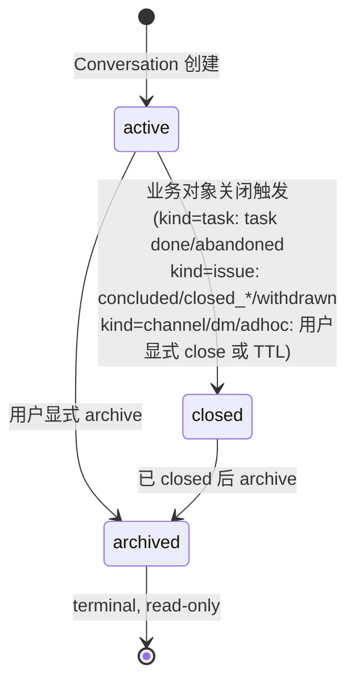

# Conversation 聚合（+ Message 子从属）

> **DDD 战术层** · BC: Conversation · 聚合: Conversation（AR）+ Message（Entity，子从属）

Conversation 是系统内部"消息时间线"的承载体。Message 是 thread 内单条消息，结构化字段化（content_kind / direction / sender_identity_id 等），不存 vendor 渲染细节。

---

## § 1. 状态机（3 态，[ADR-0032](../../../decisions/drafts/0032-conversation-channel-as-first-class.md)）



| 状态 | 含义 |
|---|---|
| `active` | 接受新 message 写入；UI 正常显示 |
| `closed` | 业务对象生命周期 close；message 不再写入但 conversation entry 仍 active 列表里 |
| `archived` | 用户主动归档；read-only；UI 默认隐藏；CLI inspect 仍可查 |

> v2 [ADR-0031](../../../decisions/drafts/0031-v2-drop-bridge-vendor-integration.md) 撤回 vendor 后，「飞书 thread 仍能看」等 vendor 体验描述删去 —— v2 用户主入口是 Web Console + CLI。

---

## § 2. Conversation Kind 详解（6 种，v2 重命名后 [ADR-0032](../../../decisions/drafts/0032-conversation-channel-as-first-class.md)）

| kind | 何时创建 | 何时关闭 | 一致性约束 |
|---|---|---|---|
| `dm` | 用户在 Web Console 主动开 DM；或 supervisor 主动 push 时懒创建 | 一般不自动关闭；用户主动 archive 或 inactivity 超长 TTL 后 close | 每个用户 ↔ supervisor / agent 唯一一个 DM conversation |
| `channel` | 用户 `agent-center channel create` 或 Web Console 「新建 channel」（v2 CV1 重命名自 group_thread；业务一等公民）| 用户显式 archive；不自动 close | name 全局唯一；必有 participant（CV2）|
| `adhoc` | 短期一次性对话（如 supervisor 主动 push 不属于既有 dm/channel 的场合） | 完成 / TTL（默认 24h） | 一次性 |
| `notification` | Supervisor 发周期 review / 系统主动外呼 | 通常发送后短期 close | 通常单向（outbound only） |
| `task` | Task 创建时同事务建 kind=task Conversation（[ADR-0017](../../../decisions/0017-task-as-conversation.md) 待 CV1-CV4 闭环后 rewrite）| Task `done` / `abandoned` → close；保留全部历史 | 跟 Task **1:1**（task.conversation_id ↔ conversation.id）|
| `issue` | Issue 创建时同事务建 kind=issue Conversation；CV4 后加「从父 channel messages 派生 Issue」入口（待议）| Issue `concluded` / `closed_*` / `withdrawn` → close | 跟 Issue **1:1**（issue.conversation_id ↔ conversation.id）|

> ⚠️ 关于 task / issue kind 的细则（来源 / closer 路径 / thread_key 写入方向等）—— [ADR-0017](../../../decisions/0017-task-as-conversation.md) / [ADR-0021](../../../decisions/0021-issue-as-conversation.md) **待 CV1-CV4 闭环后 rewrite**（[ADR-0031 Step 3](../../../decisions/drafts/0031-v2-drop-bridge-vendor-integration.md)）。当前 § 2.1 / 2.2 仅作 v1 历史记录，不反映 v2 vendor 撤回后的最终形态。

### 2.1 kind=task 生命周期补充

- **创建**: 同步建 conversation 走 a/e（飞书 @bot / Web Console）；懒创建走 b/c/d（CLI `task bind-conversation` / 飞书 slash `/track` / @bot 自由文本 / center 硬规则 fallback）。详见 [ADR-0017 § 7 / § 10](../../../decisions/0017-task-as-conversation.md)
- **thread_key 写入方向**: 与 a 路径（inbound 创建时已有 vendor thread）相反，task conversation 的 `primary_channel_thread_key` 由 Bridge 发出 Task root card 后回写
- **写入 actor**: supervisor / worker daemon / 用户 / 系统都可写；worker daemon 通过 [TaskRuntime BC 长连 RPC](../task-runtime/00-overview.md) 调 `conversation add-message`（[ADR-0017 § 8](../../../decisions/0017-task-as-conversation.md)）
- **InputRequest 集成**: agent 调 `request-input` 时同事务写 InputRequest 行 + 一条 `content_kind=agent_finding, input_request_ref=<id>` 的 Message 到 task.conversation_id；conversation_id 为 null 时触发 § 10.4 fallback bind 到 `notification.default_channel`，未配置则 InputRequest 创建失败、task fail
- **关闭后**: status=closed 的 task conversation 不再写入；v1 不引入 GC（保留期由后续 [implementation/02-persistence-schema.md](../../../implementation/) 决定）

### 2.2 kind=issue 生命周期补充

- **创建**: 同步建走"用户/agent 在飞书 @bot / Web Console / supervisor 自主开 issue"路径；懒创建走 CLI `agent-center issue bind-conversation` / 飞书 slash `/track-issue` (v2 推迟) / @bot 自由文本"盯一下 Issue #X"。详见 [ADR-0021 § 1 / § 7](../../../decisions/0021-issue-as-conversation.md)
- **thread_key 写入方向**: 同 task kind —— Bridge 发出 Issue root card 后回写 `primary_channel_thread_key`
- **写入 actor**: supervisor / 用户 / agent（via worker daemon）/ 系统都可写；议事消息走 `conversation add-message` (kind=text/conclusion_draft/task_proposal/agent_finding/system/supervisor_summary)
- **关闭后**: status=closed 不再写入；v1 不引入 GC

---

## § 3. Conversation 字段（v2，[ADR-0032](../../../decisions/drafts/0032-conversation-channel-as-first-class.md)）

```
conversation (
  id                       ULID/UUID
  kind                     dm | channel | adhoc | notification | task | issue
  name                     TEXT, nullable      -- universal；channel 创建时 app 层必填；其他 kind 可填可空
  description              TEXT, nullable      -- universal nullable
  status                   active | closed | archived  -- v2 加 'archived' 状态
  parent_conversation_id   ULID/UUID, nullable -- universal 父子链（channel→issue / issue→task 等；为 CV3 carry-over 铺基础）
  created_by               TEXT                -- universal；任何 Conversation 都有创建者 actor
  created_at               ISO8601 TEXT
  updated_at               ISO8601 TEXT
  archived_at              ISO8601 TEXT, nullable
  archived_by              TEXT, nullable
  message_count            INT                 -- universal 计数（v1 已有）
  last_message_at          ISO8601 TEXT, nullable
  version                  INT                 -- 乐观锁
)

-- channel name 强制全局唯一（其他 kind 任意）
UNIQUE INDEX conversation_channel_name_uq (name) WHERE kind = 'channel' AND name IS NOT NULL

-- 父子链按 parent 查 children（CV3 carry-over 需）
INDEX conversation_parent_idx (parent_conversation_id) WHERE parent_conversation_id IS NOT NULL
```

### v2 删除的字段（[ADR-0031](../../../decisions/drafts/0031-v2-drop-bridge-vendor-integration.md) vendor 撤回）

- ❌ `primary_channel_hint` — vendor 路由 ID（飞书群 ID 等）
- ❌ `primary_channel_thread_key` — vendor thread key
- ❌ `title` 字段 → 改为 universal `name`（含 channel 的 channel name 用同字段表达）

> v3+ 重新设计 Bridge / vendor 接入时，vendor 路由信息走 **独立 ChannelBinding 表**（不再 inline 在 Conversation），跟业务模型清晰解耦。届时 [ADR-0022](../../../decisions/0022-conversation-not-aligned-with-im-hierarchy.md) 「Conversation 不对齐 IM 层级」的精神升级为「Conversation 是纯业务时间线，vendor 是 view」。

---

## § 4. Message（Entity，子从属）

### 4.1 字段

```
message (
  id                      ULID/UUID
  conversation_id         FK → conversations (强引用，不可变)
  sender_identity_id      TEXT  -- 'user:hayang' / 'supervisor:<inv-id>' / 'agent:<session-id>' / 'system'
  content_kind            text | system | agent_finding | supervisor_summary | conclusion_draft | task_proposal
  content                 TEXT  -- markdown / JSON 视 kind 而定
  direction               inbound | outbound | internal  -- v3+ vendor 接入后语义复用；v2 vendor 撤回后 direction 主要表达 "user→system" vs "system→user"
  input_request_ref       ULID/UUID, nullable  -- 跨 BC 关联到 TaskRuntime InputRequest.id（[ADR-0017 § 5](../../../decisions/0017-task-as-conversation.md) 待 rewrite）
  posted_at               ISO8601 TEXT  -- 服务器时间
)
```

> v2 删除字段（[ADR-0031](../../../decisions/drafts/0031-v2-drop-bridge-vendor-integration.md) vendor 撤回）：
> - ❌ `vendor_msg_ref` — vendor message id；v3+ Bridge 重设计时若需要，走独立 vendor_msg_map 表，不挂 Message base

### 4.2 Content Kinds 详解（6 种）

| kind | 用途 | content 格式 |
|---|---|---|
| `text` | 用户自由文本输入 / 普通 markdown / slash 命令留痕 | markdown 字符串 |
| `system` | 系统元信息（"已 spawn task X" / "task created / dispatched / status changed" 之类）| markdown 字符串 |
| `agent_finding` | Agent / worker daemon 的进展 / 请示 / 完成报告（含 `input_request_ref` 非空时承载 InputRequest 问题）| markdown 字符串 |
| `supervisor_summary` | Supervisor 的分析 / 决策 / 中间思考摘要 | markdown 字符串 |
| `conclusion_draft` | Issue conclude flow 中 supervisor 写的"结论草案"（在 `kind=issue` Conversation 内）；Bridge 渲染为富卡片含 [确认结论] [改后确认] [不做] 按钮（[ADR-0021 § 10](../../../decisions/0021-issue-as-conversation.md)）| markdown 字符串（含 Task spawn 列表）|
| `task_proposal` | Issue 议事中提出的"建议 spawn 的 Task"（独立条目，supervisor 或 user 写）| markdown 字符串 |

**没有 `lark_card`** —— card 是渲染细节，由 Bridge 翻译。Conversation Message 只存语义（"这是个 system / summary / 用户文本"），不存 vendor rendering。

Bridge 根据 content_kind + `input_request_ref` 决定渲染（详见 [bridge/01-feishu-integration § 6](../bridge/01-feishu-integration.md)）。

> **撤回 `task_progress` content_kind**：[ADR-0016](../../../decisions/0016-task-progress-via-bound-thread.md) 曾规划新增 `task_progress` kind 承载 worker 进度流；[ADR-0017](../../../decisions/0017-task-as-conversation.md) supersede 后撤回 —— 进度本质就是 worker 的 `agent_finding`，复用既有 kind 即可。

未来 kind（v2+）：voice / image / file / is_pinned / parent_message_id 等视需求按需新增。

### 4.3 Message Direction 语义

| direction | 含义 |
|---|---|
| `inbound` | 从 vendor 同步进来（Bridge 收 vendor event 后写）|
| `outbound` | 内部写入待 Bridge 推到 vendor |
| `internal` | 纯系统内对话，无 vendor 同步（如 supervisor 写一条 system message 标记但不外发 —— v1 罕用，保留扩展）|

---

## § 5. Lifecycle Operations

| Op | 行为 | 跨聚合写 |
|---|---|---|
| `open` | 创建 Conversation（按 kind 走不同 Factory 路径，详见 [00-overview § 4.1](00-overview.md)）| task/issue kind 时跨 BC 跟 Task/Issue 同事务建（强 1:1）|
| `add-message` | 往 Conversation 写一条 Message | outbound 路径 emit `conversation.message_added` 让 Bridge 投递；inbound 同样 emit |
| `close` | 状态终结 | 同事务（如 task done / issue concluded 时跨 BC 触发）|

---

## § 6. Invariants

### Conversation 不变量

1. **id / kind 不可变**：创建时定，永不改
2. **terminal 状态 closed 不可逆**
3. **closed 后不再接受 add-message**：应用层校验
4. **kind=task / kind=issue 必有上游强引用**：`task.conversation_id` / `issue.conversation_id` 跟 conversation 互为镜像（[ADR-0017](../../../decisions/0017-task-as-conversation.md) / [ADR-0021](../../../decisions/0021-issue-as-conversation.md)）
5. **kind=task / kind=issue 不通过 Bridge inbound 自动创建**：必走 TaskRuntime / Discussion 的同步建 / 懒创建路径
6. **primary_channel_thread_key 由 Bridge 异步回写**：对 Conversation 自身无业务意义，仅作路由 hint

### Message 不变量

1. **append-only**：Message INSERT 后不修改（v2+ 加 edit history 是别的事；v1 不支持）
2. **conversation_id / sender_identity_id 不可变**：创建时填，永不改
3. **direction 不可变**：创建时定
4. **vendor_msg_ref dedupe**：单 channel 内 vendor msg id 唯一（防 Bridge 重复写入；应用层校验）
5. **closed Conversation 不接 add-message**：跟 § 6.3 配合
6. **input_request_ref 跟 InputRequest 同事务双写**（[ADR-0017 § 5 + ADR-0014 § 2](../../../decisions/0017-task-as-conversation.md)）
7. **没有 `lark_card` content_kind**：Card 是渲染细节归 Bridge BC

---

## § 7. CLI 命令

| 命令 | 用途 |
|---|---|
| `agent-center conversation add-message --id=X --content="..." [--kind=text/system/...] [--dedupe-key=...]` | 往指定 Conversation 内写一条 Message（内部存储；Bridge 自动同步外发）|
| `agent-center conversation list [--participant=...] [--kind=...] [--since=...]` | 列 / 过滤 Conversation |
| `agent-center inspect conversation <id>` | 时间线（全部 Message） |
| `agent-center conversation read <id> [--tail=N]` | 拉最近 N 条消息（给 supervisor 当 context 用）|

完整 CLI 见 [agent-harness/02-skill-cli-tooling.md](../agent-harness/02-skill-cli-tooling.md)。

---

## § 8. 领域事件

| Event | 触发 | 主要 payload |
|---|---|---|
| `conversation.opened` | 新建 Conversation | conversation_id, kind |
| `conversation.closed` | Conversation 终结 | conversation_id, reason+message |
| `conversation.message_added` | Message 入库（不区分 inbound/outbound，由 message.direction 字段标识）| conversation_id, message_id, sender, content_kind, direction |

详见 [observability/00-overview.md § 7.5 事件总览](../observability/00-overview.md)。

---

## § 9. References

- [ADR-0007 引入 Conversation 层](../../../decisions/0007-conversation-as-unified-session.md)（Refined by 0009 → 0021）
- [ADR-0017 Task ↔ Conversation 1:1](../../../decisions/0017-task-as-conversation.md)（Refined by 0021）
- [ADR-0021 Issue ↔ Conversation 1:1，统一 Issue/Task 模式](../../../decisions/0021-issue-as-conversation.md)
- [00-overview.md](00-overview.md) — BC 入口（Domain Services / Factory / 跨 BC 交互）
- [02-identity.md](02-identity.md) — Identity AR + ChannelBinding
- [bridge/01-feishu-integration.md § 6 渲染规则](../bridge/01-feishu-integration.md)
- [task-runtime/03-input-request.md](../task-runtime/03-input-request.md) — InputRequest + Message 集成
