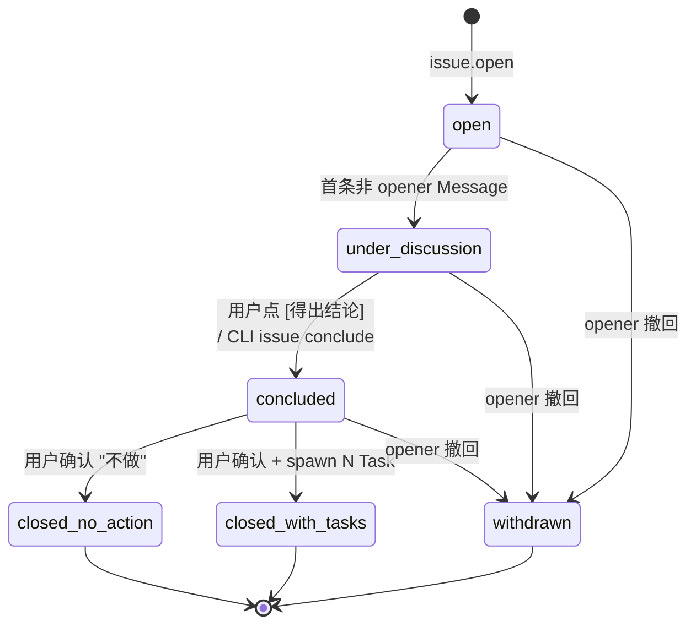

# Discussion BC — DDD 战术设计 Overview

> **DDD 战术层** · BC: Discussion
>
> Issue 全生命周期：议题（"议事 thread"）的开 / 评论 / 结论 / 撤回 + 跟 TaskRuntime BC 协作 spawn Tasks。
>
> [ADR-0021](../../../decisions/0021-issue-as-conversation.md) 后：**Issue ↔ Conversation 1:1**；IssueComment 实体已删（议事讨论复用 Conversation Message）；Discussion BC 仅持 Issue 一个聚合，Bound Card 概念消失（统一为 Conversation root card 路径）。

---

## § 0. BC 一览

### 0.1 职责

| 维度 | 内容 |
|---|---|
| **聚合管理** | Issue（6 态状态机，单聚合 AR）|
| **议事 IO** | 复用 Conversation Message（`kind=issue` Conversation 1:1 关联到 Issue）|
| **conclude 协议** | Issue conclude → 调 TaskRuntime BC 的 IssueConcludeSpawn 批量建 Tasks（同事务，all-or-nothing） |
| **跨 BC 协作** | Discussion → TaskRuntime（spawn）/ Discussion → Conversation（1:1 强引用）/ Discussion → Bridge（emit `conversation.opened` 让 Bridge 发 Issue root card）|

### 0.2 UL 切片

直接来自 [strategic/03-bounded-contexts § 1](../../strategic/03-bounded-contexts.md) 标 Discussion 上下文的术语：

- `Issue`（聚合根，议事 thread）
- `Conclude` / `Close` / `Withdraw` / `Open` / `Spawn`（行为动词）
- `IssueResolution`（结论判定 VO，状态机终态枚举：closed_no_action / closed_with_tasks / withdrawn）

> **删除项**：`IssueComment` 实体（[ADR-0021](../../../decisions/0021-issue-as-conversation.md)：议事消息复用 Conversation Message，content_kind ∈ {text / system / agent_finding / supervisor_summary / **conclusion_draft** / **task_proposal**}）；`BoundCard` / `ChannelBinding (Discussion)` 概念（统一为 Conversation root card 路径）

详细 UL 定义见 strategic/03。

### 0.3 Context Map 位置

[strategic/03-bounded-contexts § 3](../../strategic/03-bounded-contexts.md)：

- **Discussion ↔ Conversation**：**Shared Kernel / 1:1**（`issue.conversation_id` 1:1 强引用 `kind=issue` Conversation；同事务双写，[ADR-0021](../../../decisions/0021-issue-as-conversation.md)）
- **Discussion → TaskRuntime**：Customer-Supplier（Issue conclude 批量 spawn Tasks via IssueConcludeSpawn）
- **TaskRuntime → Discussion**：Customer-Supplier（worker 上 agent 调 `agent-center open-issue` 创建 Issue）
- **Cognition → Discussion**："User" via tools（Supervisor 调 `issue open` / `issue conclude` / `issue comment` facade）
- **Bridge → Discussion**：Customer-Supplier（inbound 时 Bridge 调 `conversation add-message` 到 `kind=issue` Conversation；不再有 "issue thread binding" 例外路径）
- **Observability ← Discussion**：Open Host（订阅 `issue.*` 事件做投影 / inspect 查询）

---

## § 1. 聚合清单 + 聚合详情（X.1）

> **单聚合 BC**：仅 Issue 一个 AR；按 [ddd-blueprint § 3.1](../../../ddd-blueprint.md) 规则，聚合详情合并进本 § 1，不另起 `01-issue.md`。

### 1.1 Aggregate Root: Issue

#### 状态机（6 态）



转换规则：

- `open → under_discussion`：Conversation 内第一条**非 opener** 的 Message 写入（基于关联 Conversation Message，不再基于独立 IssueComment）
- `under_discussion → concluded`：用户点 [得出结论] 按钮 / CLI `agent-center issue conclude <id>`；触发 supervisor "conclude flow" 写一条 `kind=conclusion_draft` Message
- `concluded → closed_with_tasks`：用户确认 conclusion_draft（含 Task spawn 列表），同事务调 IssueConcludeSpawn 建 Tasks
- `concluded → closed_no_action`：用户确认结论 = "不做"，issue 关闭无产物
- `* → withdrawn`：opener 撤回 / 用户标记不再相关；终态

**终态**：`closed_no_action` / `closed_with_tasks` / `withdrawn` 不可逆。

#### 字段

```
issue (
  id                          ULID/UUID
  project_id                  ULID/UUID FK
  title                       TEXT
  description                 TEXT (markdown; 长文走 BlobStore，本字段存 blob_ref；详见 conventions § 8)
  opened_by_identity_id       'user:hayang' | 'supervisor:invocation-N' | 'agent:session-X'
  opened_at                   ISO8601 TEXT

  status                      open | under_discussion | concluded | closed_no_action | closed_with_tasks | withdrawn

  concluded_at                ISO8601 TEXT, nullable
  conclusion_summary          TEXT, nullable (即 conclude 时填的 IssueResolution.summary)
  concluded_by_identity_id    TEXT, nullable

  conversation_id             ULID/UUID, nullable, FK → conversations.id (kind=issue) 1:1 强引用
                              -- 同步建路径下 issue 创建时填；CLI/agent 路径下 null，懒创建后填
  related_conversation_ids    TEXT (JSON array of conversation_id) -- 弱关联触发血缘，可选

  -- 跨血缘血缘字段
  -- task.from_issue_id 在 TaskRuntime BC 内（弱血缘 task → issue）
)
```

**没有** `bound_card_json` / `channel_binding_json` / 任何 channel 字段 —— Issue 跟 vendor 的关联通过 Conversation 间接持有（Conversation 持 `primary_channel_thread_key`）。

#### Lifecycle Operations（聚合内 ops）

| Op | 行为 | 跨聚合写 |
|---|---|---|
| `open` | 创建 Issue（5 来源入口，详见 § 4.1）| 同步建路径：同事务建 Conversation (kind=issue) + 写 issue.conversation_id |
| `comment` | 往关联 Conversation 写一条 Message（facade，详见 § 4.2）| 写 Message（属于 Conversation BC）；本 op 是 CLI/skill 包装，不涉及 Issue 字段改动 |
| `withdraw` | issue.status → withdrawn | 无跨聚合 |
| `conclude` | supervisor 写一条 `kind=conclusion_draft` Message + 用户确认后转 closed_*；若 `closed_with_tasks` 则调 IssueConcludeSpawn | conclude 终结时同事务写 N 个 Task（跨 BC 协议，见 § 3.2）|

### 1.2 Entity（子从属）

**无**。[ADR-0021](../../../decisions/0021-issue-as-conversation.md) 删除了 IssueComment 实体；议事消息走 Conversation Message。

### 1.3 Value Objects（按使用聚合分组）

| VO | 用在哪 | 描述 |
|---|---|---|
| **IssueResolution** | Issue conclude 入参 + 状态机终态枚举 | `{kind: closed_no_action \| closed_with_tasks \| withdrawn, summary, tasks?: IssueConcludeSpec[]}`；`closed_with_tasks` 时 tasks 字段对应 IssueConcludeSpec（详见 [task-runtime/00-overview § 3.4 IssueConcludeSpawn](../task-runtime/00-overview.md)）|
| **IdentityRef** | opened_by / concluded_by | `user:<id>` / `supervisor:<invocation-id>` / `agent:<session-id>`；跨 BC 共享 VO，权威定义在 Conversation BC（[conversation/01 § 2 Identity](../conversation/01-conversation.md)）|

> **VO 命名**：本 BC 内 VO 数量克制；议事的"消息内容 + content_kind"是 Conversation BC 的 Message 模型，不再镜像到本 BC。

---

## § 2. Invariants

### Issue 聚合不变量

1. **`status` 单调推进**：open → under_discussion → concluded → closed_*（具体路径） / withdrawn；终态不可逆
2. **opener 不变**：`opened_by_identity_id` 创建时确定，**不可改**
3. **withdrawn 后封锁议事 IO**：状态 = withdrawn 后不再接受新 Message 写入到 issue.conversation_id；CLI / API 应阻止
4. **closed_with_tasks 必带 task list**：转 closed_with_tasks 时同事务必须成功 spawn N (N≥1) 个 Task（all-or-nothing）；spawn 失败 → 不进 closed_with_tasks 终态
5. **conversation_id 1:1 不可解绑**：填了之后只能整体替换为 null（withdraw / abandon 场景），不允许"换一个 conversation"；多 channel 镜像推到 v2（[ADR-0017 § 9](../../../decisions/0017-task-as-conversation.md) 同对称约束）
6. **conversation_id ↔ Conversation 一致性**：`issue.conversation_id != null` 时对应 Conversation `kind=issue` 且 status=open；同事务双写约束

### 跨聚合不变量

- **Issue ↔ Conversation 1:1 强引用**：`issue.conversation_id` 唯一对应一个 `kind=issue` Conversation；反向 Conversation 不持回引（单向，[conventions § 9.x](../../../../rules/conventions.md)）
- **跨 BC 写入**：Issue conclude → 同事务写 N 个 Task + 写 1 条 Message（conclusion_draft → 最终 system 提示）；遵循 [ADR-0014 § 2](../../../decisions/0014-event-sourcing-level.md)

---

## § 3. Domain Services（X.3）

### 3.1 IssueLifecycleService

**职责**：Issue 开 / 撤回 / 结论流转 + 跨 BC 协作（调 TaskRuntime IssueConcludeSpawn / emit 事件让 Bridge 同步）。

| 维度 | 内容 |
|---|---|
| 入参 | `OpenIssueCommand` / `WithdrawIssueCommand` / `ConcludeIssueCommand`（含 IssueResolution VO） |
| 出参 | Issue 状态迁移 + emit 对应 issue.* event |
| 跨聚合 | conclude 时跨 BC 写 N Task + 1 Message + Issue 状态 |
| 单活校验 | 同 issue 不允许并发 conclude（应用层乐观锁 issue.version 列） |
| Reason 语义化 | withdraw 时填 reason+message（[conventions § 16](../../../../rules/conventions.md)） |

### 3.2 IssueConcludeSpawn（caller 视角）

**主体在 TaskRuntime BC**（详见 [task-runtime/00-overview § 3.4](../task-runtime/00-overview.md)）。Discussion BC 作为 caller：

```
1. IssueLifecycleService.conclude 触发，IssueResolution.kind = closed_with_tasks
2. 单事务内：
   a. 校验 IssueResolution.tasks 合法（local_id 解析、dep 图无环、既有 task ref 存在）
   b. 调 TaskRuntime BC IssueConcludeSpawn(tasks[]) → 返回 N 个 task.id
   c. 写一条 kind=system Message 到 issue.conversation_id ("已 spawn task #X / #Y / #Z")
   d. issue.status = closed_with_tasks; issue.concluded_at / conclusion_summary / concluded_by 填值
   e. emit issue.concluded + issue.tasks_spawned
3. 任一失败 → all rollback (transaction)
```

跨 BC 调用是 Customer-Supplier 同事务双写（[ADR-0014 § 2](../../../decisions/0014-event-sourcing-level.md)），不是异步 saga。

---

## § 4. Factories（X.4）

### 4.1 IssueFactory（5 caller）

| Caller | 触发 | conversation_id 处理 |
|---|---|---|
| **CLI** | `agent-center issue open --title=... --description=... --project=...` | null（懒创建路径）|
| **Web Console** | 表单提交 | 同步建（Web 是 conversation 的 channel binding 之一）|
| **飞书 @bot 自由文本** | "讨论一下 X" → Bridge 写 inbound DM/group Message → Supervisor 解析意图 → 调 issue open | 同步建（继承当前用户所在飞书渠道；同 ADR-0017 a 路径模板） |
| **Supervisor** | 自主开 issue（从用户对话推断意图）| 同步建（supervisor 知道 caller channel）|
| **Worker (agent)** | `agent-center open-issue --title=...` (worker daemon 中转，跨 BC) | null（懒创建，跟 CLI 同路径） |

### 4.2 IssueCommentFactory（facade）

**不存在为独立 Factory** —— "Issue 评论" 即 "往 issue.conversation_id 写 Message"。

`agent-center issue comment <id> --content=...` CLI 内部翻译为 `conversation add-message --to=<issue.conversation_id> --content=... --kind=text`。多入口跟 ADR-0017 Task Message 写入路径完全对称：

| 入口 | 内部行为 |
|---|---|
| 人 - CLI | facade 转 conversation add-message |
| 人 - Web Console | 直接调 conversation add-message |
| 人 - 飞书 thread 内回复 | Bridge inbound → conversation add-message（[bridge/01-feishu-integration § 4](../bridge/01-feishu-integration.md)） |
| Supervisor | facade 转 conversation add-message |
| Worker (agent) | facade 转 conversation add-message via worker daemon |

写入 conversation_id=null 的 issue 时：facade 返回错误提示 "Issue #X 未绑定 conversation，请先 `issue bind-conversation`"，不自动创建。

### 4.3 ConversationFactory（caller 视角）

Issue 创建走同步建路径时，跨 BC 触发 Conversation BC 创建 `kind=issue` Conversation。主体在 Conversation BC（详见 [conversation/01 § 3](../conversation/01-conversation.md)）。Discussion BC 是 caller。

---

## § 5. Repositories（X.5）

接口签名（Go-style，含 `ctx context.Context` 参数；架构层契约，跟实现解耦）：

### 5.1 IssueRepository

```go
type IssueRepository interface {
    FindByID(ctx context.Context, id IssueID) (*Issue, error)
    FindByProject(ctx context.Context, projectID ProjectID, filter IssueFilter) ([]*Issue, error)
    FindByStatus(ctx context.Context, status IssueStatus, filter IssueFilter) ([]*Issue, error)
    FindByOpener(ctx context.Context, openerIdentityID string) ([]*Issue, error)
    Save(ctx context.Context, i *Issue) error                  // 新建 + 全量更新（含乐观锁 version 列）
    UpdateStatus(ctx context.Context, id IssueID, from, to IssueStatus, version int) error
    UpdateConversationID(ctx context.Context, id IssueID, conversationID ConversationID) error
    UpdateConclusion(ctx context.Context, id IssueID, summary string, concludedBy string, concludedAt time.Time) error
    UpdateRelatedConversationIDs(ctx context.Context, id IssueID, ids []ConversationID) error
}

// Domain errors
var (
    ErrIssueNotFound           = errors.New("discussion: issue not found")
    ErrIssueAlreadyExists      = errors.New("discussion: issue already exists")
    ErrIssueInvalidTransition  = errors.New("discussion: invalid issue status transition")
    ErrIssueVersionConflict    = errors.New("discussion: issue version conflict (optimistic lock)")
    ErrIssueAlreadyConcluded   = errors.New("discussion: issue already concluded")
    ErrIssueWithdrawn          = errors.New("discussion: issue is withdrawn, cannot mutate")
    ErrIssueNoConversationBound = errors.New("discussion: issue has no conversation bound (use issue bind-conversation)")
)
```

> **删除项**：`IssueCommentRepository`（IssueComment 实体已删，议事消息走 Conversation BC `MessageRepository`，[ADR-0021](../../../decisions/0021-issue-as-conversation.md)）

### 5.2 约定

- 外部只通过 Issue.id 引用 Issue AR（[conventions § 0.3](../../../../rules/conventions.md) AR 守门）
- IssueComment 历史数据查询 → 走 Conversation BC `MessageRepository.FindByConversationID(ctx, issue.conversation_id)`（跨 BC 走 Conversation 接口）
- Repository 是**领域层抽象接口**；实现层落到 [implementation/02-persistence-schema.md](../../../implementation/) (TBD)
- 乐观锁：`UpdateStatus` / `Update*` 带 `version int` 参数，CAS 失败返回 `ErrIssueVersionConflict`
- Domain errors 用 sentinel error pattern；调用方用 `errors.Is` 判定
- **跨 BC tx 由 application service 协调**：
  - **同步建 issue + Conversation**：Issue.open (a/e 路径) 同事务建 Issue + kind=issue Conversation + 写 issue.conversation_id（[ADR-0021 § 1](../../../decisions/0021-issue-as-conversation.md) + [ADR-0014 § 2](../../../decisions/0014-event-sourcing-level.md)）
  - **Issue conclude with `closed_with_tasks`**：跨 BC tx 调 [TaskRuntime IssueConcludeSpawn](../task-runtime/00-overview.md) 批量建 N 个 Task + 写 issue.status / conclusion_summary + 写一条 system Message（all-or-nothing）；任一失败 → 全部 rollback

---

## § 6. 跨聚合引用出方向（X.6）

| 引用方 → 被引方 | 强弱 | 一致性窗口 | 触发场景 | ADR |
|---|---|---|---|---|
| **Issue → Conversation**（`issue.conversation_id`） | 强 / 1:1 | tx 同步（同步建路径同事务）/ tx 同步（懒创建另事务） | 同步建 issue.open / 懒创建 `issue bind-conversation` | [ADR-0021](../../../decisions/0021-issue-as-conversation.md) |
| **Issue → Conversation**（`issue.related_conversation_ids`） | 弱 / N:N | 无 | 自动（R1 飞书 DM/group @bot 触发开 issue → 关联触发源 conversation；R2 supervisor 派子任务关联 sub-task conversation）/ 手动（R3 `agent-center issue link-conversation`）| [ADR-0021 § 9](../../../decisions/0021-issue-as-conversation.md) |
| **Task → Issue**（`task.from_issue_id`，TaskRuntime BC 内）| 弱 / 血缘 | tx 同步（创建时填，从不变） | IssueConcludeSpawn 创建 task | - |

**跨聚合一致性策略汇总**：

- **同步建 issue + Conversation**：单事务内创建 Issue + 创建 Conversation (kind=issue) + 写 issue.conversation_id（[ADR-0014 § 2](../../../decisions/0014-event-sourcing-level.md)）
- **issue conclude with tasks**：单事务内 spawn N Task + 写 1 Message + Issue 状态终结（跨 BC 同事务，TaskRuntime BC 跨 BC 写）
- **懒创建 `issue bind-conversation`**：单事务内建 Conversation + 写 issue.conversation_id

---

## § 7. 跨 BC 交互

### 7.1 Supervisor 唤醒事件白名单

Discussion emit 的事件中触发 supervisor 唤醒的子集：

| 事件 | 典型 supervisor 决策 |
|---|---|
| `issue.opened` | 评估是否要立即 bind-conversation（同步建路径）/ 是否要问用户更多上下文 |
| `conversation.message_added`（kind=issue Conversation 内）| 议事消息推入；评估是否要 supervisor 回复 / 写 conclusion_draft |
| `issue.discussion_started` | （= issue.status 转 under_discussion）评估议事进度 |
| `issue.concluded` | 评估是否触发后续动作（如通知用户）|
| `issue.tasks_spawned` | 评估 spawn 的 task 是否需要立即派单 |
| `issue.withdrawn` | 通常不动作（已是显式撤回） |

详见 [cognition/00-overview.md](../cognition/00-overview.md)。

### 7.2 Bridge 渲染（outbound）

| 事件 | Bridge 渲染动作 |
|---|---|
| `conversation.opened` (kind=issue) | Bridge 发 Issue root card 到 vendor 当前位置（DM / 群里 thread root）→ 该 card 形成 thread root → 回写 `conversation.primary_channel_thread_key` |
| `conversation.message_added`（kind=issue Conversation 内的 Message）| 按 `content_kind` 渲染（参见 [bridge/01-feishu-integration § 6](../bridge/01-feishu-integration.md)）：text 普通消息 / conclusion_draft 富卡片含 [确认结论] [改后确认] [不做] 按钮 |
| `issue.concluded` / `issue.tasks_spawned` | Bridge 渲染一条 `kind=system` Message 到 issue.conversation_id 提示 "已结论 / 已 spawn task #X / #Y / #Z" |

详见 [bridge/01-feishu-integration.md](../bridge/01-feishu-integration.md)。

### 7.3 Observability 订阅

Observability BC 订阅 Discussion 全部 `issue.*` 事件做投影 / 查询 / inspect。详见 [observability/00-overview.md § 7.5 事件总览](../observability/00-overview.md)。

### 7.4 Customer-Supplier 上下游汇总

| 上游 → 下游 | 模式 | 内容 |
|---|---|---|
| Discussion → TaskRuntime | Customer-Supplier | Issue conclude 后批量创建 Tasks（IssueConcludeSpawn 主体在 TaskRuntime BC） |
| TaskRuntime → Discussion | Customer-Supplier | Worker 上 agent 调 `open-issue` 命令 Discussion 创建 Issue |
| Discussion ↔ Conversation | Shared Kernel / 1:1 | issue.conversation_id 1:1 强引用 kind=issue Conversation（[ADR-0021](../../../decisions/0021-issue-as-conversation.md)）|
| Discussion ↔ Workforce | Shared Kernel | Issue 引用 project_id |
| Bridge → Discussion | Customer-Supplier（间接）| inbound 时 Bridge 调 Conversation BC API（`conversation add-message`），不直接调 Discussion API；议事消息归 Conversation BC 持有 |
| Cognition → Discussion | "User" via tools | Supervisor 调 `issue open` / `issue conclude` / `issue comment` facade / `issue bind-conversation` |
| Observability ← Discussion | Open Host | 全部 `issue.*` 事件订阅 |

完整 context map 见 [strategic/03-bounded-contexts § 3](../../strategic/03-bounded-contexts.md)。

---

## § 8. Out-of-Scope / Future Work

| 项 | 归属 |
|---|---|
| 飞书 /slash 命令 `/open-issue title="..."` | [roadmap](../../../roadmap.md)（v1 不实现）|
| 飞书 slash `/track-issue <id>` | [roadmap](../../../roadmap.md)（同 ADR-0017 § 6 task `/track` 模板，issue 同步推到 v2） |
| Agent 主动评论 issue（agent 在 issue 议事内自由发言）| [roadmap](../../../roadmap.md)（v1 agent 只能调 open-issue，不主动议事）|
| 自动从 conversation 消息推断 IssueComment | [out-of-scope](../../../requirements/03-out-of-scope.md)（[ADR-0021](../../../decisions/0021-issue-as-conversation.md) 明示议事必须主动写 Message 到 issue.conversation_id；不做自动镜像）|
| Issue 之间的引用 / epic-story 分层 | [out-of-scope](../../../requirements/03-out-of-scope.md) |
| Issue 1:N 多 conversation 镜像 | [roadmap](../../../roadmap.md)（[ADR-0021 § 8 + ADR-0017 § 9](../../../decisions/0021-issue-as-conversation.md) 显式驳回 v1）|
| Issue conversation 关闭后 reopen | [roadmap](../../../roadmap.md) |
| Issue 多 vendor 镜像（飞书 / DingTalk 同时绑）| [roadmap](../../../roadmap.md)（v1 单 vendor）|
| `Message.is_pinned` / `parent_comment_id` / `reactions`（普适 Message 扩展）| [roadmap](../../../roadmap.md)（v2+ 加在 Conversation Message 上对所有 kind 都生效）|

---

## § 9. References

### 相关 ADR

- [ADR-0004 Issue 取代 Suggestion](../../../decisions/0004-issue-not-suggestion.md)
- [ADR-0007 引入 Conversation 层](../../../decisions/0007-conversation-as-unified-session.md)（Refined by 0009 → 0021）
- [ADR-0009 Issue 与 Conversation 解耦 + 外部集成走 Bridge](../../../decisions/0009-issue-conversation-decoupled-via-bridge.md)（**Superseded by 0021**；historical reference）
- [ADR-0014 事件溯源走 L1](../../../decisions/0014-event-sourcing-level.md)（同事务双写原则）
- [ADR-0017 Task ↔ Conversation 1:1](../../../decisions/0017-task-as-conversation.md)（Refined by 0021；Issue 路线对称模板）
- [ADR-0020 Card 限制在 Bridge BC](../../../decisions/0020-card-confined-to-bridge-bc.md)（**Superseded by 0021**；中间方案）
- [ADR-0021 Issue 即 Conversation 1:1](../../../decisions/0021-issue-as-conversation.md)（**当前权威**）

### 战略层

- [strategic/03-bounded-contexts § 1 UL](../../strategic/03-bounded-contexts.md)（Discussion 上下文术语）
- [strategic/03-bounded-contexts § 2 BC2 Discussion](../../strategic/03-bounded-contexts.md)
- [strategic/03-bounded-contexts § 3 Context Map](../../strategic/03-bounded-contexts.md)

### 跨 BC 协作文档

- [task-runtime/00-overview.md § 3.4 IssueConcludeSpawn](../task-runtime/00-overview.md) — Issue conclude 批量 spawn Tasks 的主体实现
- [conversation/00-overview.md](../conversation/00-overview.md) — kind=issue Conversation + Message.content_kind 扩展
- [bridge/01-feishu-integration.md](../bridge/01-feishu-integration.md) — Issue root card 渲染 + bound thread 移除
- [cognition/00-overview.md](../cognition/00-overview.md) — Supervisor 在 Issue 议事中的角色
- [observability/00-overview.md](../observability/00-overview.md) — issue.* 事件订阅 + 投影读模型

### 横切方法论

- [conventions](../../../../rules/conventions.md) § 0 DDD / § 1 无野任务（Issue 是 agent 想造新工作的唯一途径）/ § 8 BlobStore（description 大文走 blob）/ § 11 Issue / InputRequest / 状态事件三者分清 / § 16 reason+message
