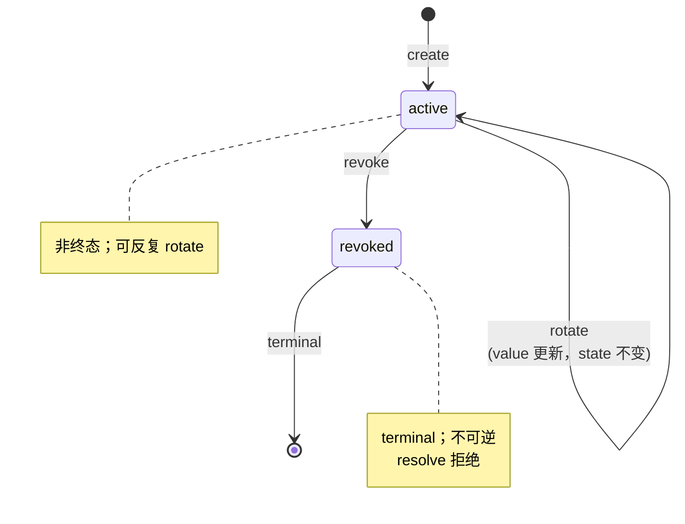

# UserSecret 聚合（独立 AR）

> **DDD 战术层** · BC: SecretManagement · 聚合: UserSecret（独立 AR）
>
> 设计依据：[ADR-0026 SecretManagement BC](../../../decisions/drafts/0026-user-secret-management-bc.md)

UserSecret 是用户密钥的持久身份 + 加密载体。**仅管理用户密钥**（user-domain secrets，如 MCP 用的 GitHub PAT / DB password / 云凭据等）；**不管系统内部凭证**（BootstrapToken / session_token / 飞书 app_secret / S3 access key）—— 后者各自 BC 自管。

---

## § 1. UserSecret 状态机



---

## § 2. 模型

```
user_secret (
  id                ULID
  name              str          -- 全局唯一，用户起名（如 "github-pat"）
  kind              enum         -- mcp | cloud_credential | repo_deploy_key | other
  value_ciphertext  bytea        -- AES-GCM 加密的明文
  value_nonce       bytea        -- AES-GCM nonce
  state             enum         -- active | revoked
  created_at        ISO8601 TEXT
  created_by        str
  last_used_at      ISO8601 TEXT, nullable
  rotated_at        ISO8601 TEXT, nullable
  revoked_at        ISO8601 TEXT, nullable
  revoked_by        str, nullable
  version           int          -- 乐观锁
)

UNIQUE INDEX user_secret_name_uq (name)
INDEX user_secret_state_kind_idx (state, kind)
```

### 字段说明

- `id`：ULID 主键
- `name`：用户友好引用名，**全局唯一**（v2 单租户）；DNS-style slug 推荐（小写字母 + 数字 + 短横线）
- `kind`：分类，方便用户 list / filter；枚举开放扩展（添加 enum 值不破坏）
- `value_ciphertext` + `value_nonce`：AES-GCM 加密产物；master key 不入库（详 § 4）
- `state`：`active` 是非终态（rotate 不改 state）；`revoked` 是终态
- `last_used_at`：每次 SecretResolutionService.resolve 成功更新；用于「孤儿 secret」清理决策（用户回头看哪个 secret 长期没用）
- `rotated_at`：方便审计 + 用户看「上次换是啥时候」
- `revoked_at` + `revoked_by`：审计

---

## § 3. 命名规则

- name 必须 1-64 字符，`[a-z0-9-]+` （小写字母 + 数字 + 短横线）
- 推荐 DNS-style slug（`github-pat`、`prod-db-pwd`、`aws-cloud-key` 等）
- name 全局唯一；想换 name 必须 create 新 secret + 改所有 mcp_config 引用 + revoke 旧

---

## § 4. 加密模型

### 4.1 算法

**AES-GCM 256-bit**（authenticated encryption）：

- Master key: 32 bytes，base64 编码后存配置文件首行
- Nonce: 12 bytes 随机，每次加密生成（存 DB 跟 ciphertext 一起）
- Ciphertext: AES-GCM 输出（含 authentication tag）

### 4.2 Master Key 来源

| 来源 | 描述 |
|---|---|
| **配置文件** | `secret_management.master_key_file` 配置项（[implementation/04-configuration.md § 7.10](../../../implementation/04-configuration.md)）；mode 0600；systemd `LoadCredential=` / env-based 加载 |
| **不允许** | DB / event payload / trace / git 仓 / 任何会被同步出 VPS 的地方 |

> Master key 一旦丢失 → 所有 ciphertext 不可解。运维要自己备份 master_key_file，**这是基础设施层责任**，不在本 BC 内做 key escrow。

### 4.3 内存生命周期

```
create / rotate 路径:
  CLI 进程 → 读 stdin / pinentry 拿明文
         → 调 UserSecretService.Create(plaintext, ...)
         → Service 进程内 AES-GCM 加密 → ciphertext + nonce
         → 写 DB
         → 立即丢弃明文（栈上变量 + GC 释放）
         → 返回 success（不回显明文）

resolve 路径:
  worker daemon → 调 SecretResolutionService.Resolve(name, agent_instance_id)
              → Service 校验授权
              → 读 DB ciphertext + nonce
              → AES-GCM 解密拿明文
              → 返回明文给 worker daemon
              → worker daemon 内存里短暂持有
              → 写 home_dir/mcp_config.runtime.json (mode 0600)
              → spawn agent → agent 进程结束 → daemon unlink runtime.json
```

---

## § 5. UserSecret Invariants

1. **name 全局唯一**（UNIQUE INDEX 强制；create 冲突时返回 ErrSecretNameTaken）
2. **revoked 是终态**（不可 re-activate / rotate；要重用 name 必须先 hard-delete，但 v2 不提供 hard-delete CLI；改用新 name）
3. **value 通过 AES-GCM 加密存储**；明文不入 DB
4. **明文出 Service / Factory 即丢**（CLI / Service / Repository 任一层都不持有跨边界的明文）
5. **resolve 必须 worker_id 匹配**：caller worker session 的 worker_id 等于 `AgentInstance(agent_instance_id).worker_id`

---

## § 6. UserSecretService 接口（C/R/U lifecycle）

### 6.1 Create

```
UserSecretService.Create(req CreateRequest) (id UserSecretID, err error)
  CreateRequest = { name, kind, plaintext, created_by }

校验:
  - name 全局唯一（SELECT FOR UPDATE 防并发）
  - name 命名规则合法
  - kind 合法
  - plaintext 非空

行为:
  1. AES-GCM(master_key, plaintext) → ciphertext + nonce
  2. 入 user_secrets：state=active, created_at=now, created_by=req.created_by
  3. emit user_secret.created { id, name, kind, created_by }
  4. plaintext 内存释放
  5. 返回 id
```

### 6.2 Rotate

```
UserSecretService.Rotate(req RotateRequest) error
  RotateRequest = { name, plaintext, by }

校验:
  - secret 存在 + state=active（revoked 拒绝）
  - plaintext 非空

行为:
  1. AES-GCM(master_key, plaintext) → ciphertext + nonce
  2. UPDATE user_secrets SET value_ciphertext=?, value_nonce=?, rotated_at=now, version=version+1 WHERE name=? AND version=?
  3. emit user_secret.rotated { id, name, by, rotated_at }
```

### 6.3 Revoke

```
UserSecretService.Revoke(req RevokeRequest) error
  RevokeRequest = { name, by, reason? }

校验:
  - secret 存在 + state=active

行为:
  1. UPDATE state=revoked, revoked_at=now, revoked_by=req.by, version=version+1
  2. emit user_secret.revoked { id, name, by, reason }
```

---

## § 7. SecretResolutionService（worker daemon ↔ center 解析）

### 7.1 接口

```
SecretResolutionService.Resolve(req ResolveRequest) (plaintext string, err error)
  ResolveRequest = { name, agent_instance_id }
  caller = worker daemon (session_token 认证)
```

### 7.2 校验链

```
1. caller 提供的 session_token → 解析 worker_id W
2. SELECT user_secrets WHERE name=? AND state='active'
   → if miss → ErrSecretNotFound
   → if revoked → ErrSecretRevoked
3. SELECT agent_instances WHERE id=agent_instance_id
   → verify worker_id == W （防越权：worker 只能 resolve 跑在自己上的 agent 的 secret）
   → if mismatch → ErrSecretAccessDenied
4. AES-GCM decrypt(value_ciphertext, value_nonce, master_key) → plaintext
   → if master_key 未加载 → ErrMasterKeyUnavailable
5. UPDATE last_used_at = now (best effort, 不强一致)
6. emit user_secret.accessed { id, name, by=worker_id, agent_instance_id, accessed_at }
   失败 emit user_secret.access_denied { name, by=worker_id, reason }
7. 返回 plaintext
```

### 7.3 错误处理（worker 端）

| Error | Worker 行为 |
|---|---|
| ErrSecretNotFound | NACK envelope reason=`secret_unresolvable`, message="secret '<name>' not found" |
| ErrSecretRevoked | NACK reason=`secret_unresolvable`, message="secret '<name>' revoked" |
| ErrSecretAccessDenied | NACK reason=`secret_unresolvable`, message="not authorized to resolve '<name>' for this agent" |
| ErrMasterKeyUnavailable | NACK reason=`internal_error`, message="center secret system unavailable"（运维问题，需告警）|

详见 [ADR-0011 Dispatch Reliability Protocol](../../../decisions/0011-dispatch-reliability-protocol.md)（NACK reasons 表）。

---

## § 8. SecretUsageQueryService

### 8.1 接口

```
SecretUsageQueryService.UsageOf(name string) ([]AgentInstanceUsage, error)
  AgentInstanceUsage = { agent_instance_id, worker_id, json_paths []string }
    json_paths = 该 SecretRef 在 mcp_config JSON 内出现的路径（如 "mcpServers.github.env.GITHUB_TOKEN"）
```

### 8.2 实现

扫所有 `agent_instances.config`（JSONB / TEXT）查 `secret:<name>` 引用：

```sql
SELECT id, worker_id, config FROM agent_instances WHERE state != 'archived'
-- 在应用层用 JSON 解析找 "secret:<name>" 字符串值
-- v2 单租户体量下足够；v3+ 可建 secret-reference index 表
```

---

## § 9. CLI

| 命令 | 用途 | 同机要求 |
|---|---|---|
| `agent-center secret create --name=<n> --kind=<k>` | 创建（交互输入明文，stdin / pinentry）；CLI 进程内立即加密 | center 同机 |
| `agent-center secret list [--kind=<k>] [--state=<s>]` | 列出元数据（无明文）：name / kind / state / created_at / last_used_at / rotated_at | center 同机 / 远程 |
| `agent-center secret rotate <name>` | 重写 value（交互输入新明文）| center 同机 |
| `agent-center secret revoke <name> [--reason=<r>]` | 终态 revoke | center 同机 |
| `agent-center secret usage <name>` | 反查：哪些 AgentInstance 引用了它（含 JSON path）| center 同机 / 远程 |

> v2 **不提供** `secret show <name>` 显示明文 CLI ——用户忘了就 rotate。明文不跨命令边界。

CLI 错误提示样例：

```
$ agent-center secret create --name=GitHub-PAT --kind=mcp
Enter secret value: ****
✗ name 'GitHub-PAT' 不合法：必须匹配 [a-z0-9-]+，1-64 字符
  建议：agent-center secret create --name=github-pat --kind=mcp

$ agent-center secret revoke nonexistent
✗ secret 'nonexistent' 不存在

$ agent-center secret rotate github-pat
Enter new value: ****
✓ secret 'github-pat' rotated.
  Note: 正在跑的 execution 仍用旧值（home_dir/mcp_config.runtime.json）；下次 spawn 用新值。
```

---

## § 10. 事件

| 事件 | 触发 | payload |
|---|---|---|
| `user_secret.created` | Create | `id, name, kind, created_by, created_at` |
| `user_secret.rotated` | Rotate | `id, name, by, rotated_at` |
| `user_secret.revoked` | Revoke | `id, name, by, reason?, revoked_at` |
| `user_secret.accessed` | Resolve 成功 | `id, name, by (worker_id), agent_instance_id, accessed_at` |
| `user_secret.access_denied` | Resolve 失败 | `name (可能 not_found), by (worker_id), reason` |

> 所有 event payload **不含明文**；只含 metadata。

---

## § 11. References

- [ADR-0026 SecretManagement BC](../../../decisions/drafts/0026-user-secret-management-bc.md)
- [ADR-0027 MCP per-agent 注入](../../../decisions/drafts/0027-mcp-per-agent-injection.md)
- [00-overview.md](00-overview.md) — BC 入口
- [workforce/04-agent-instance.md](../workforce/04-agent-instance.md) — AgentInstance.config.mcp_config 字段
- [agent-harness/01-prompt-assembly.md](../agent-harness/01-prompt-assembly.md) — worker daemon 注入流程
- [conventions § 13 安全 / 凭据处理](../../../../rules/conventions.md)
- [implementation/04-configuration.md § 7.10 secret_management.*](../../../implementation/04-configuration.md)
