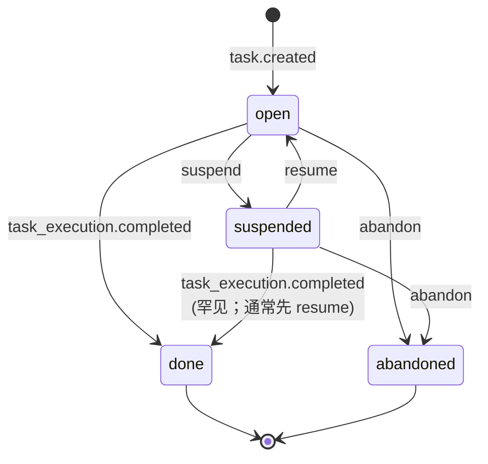

# Task 聚合

> **DDD 战术层** · BC: TaskRuntime · Aggregate Root
>
> 工作单元身份；4 态状态机；身份不变；属于一个 project。

详细 BC 视图（聚合清单 / Domain Service / Factory / Repo / 跨聚合引用）见 [00-overview.md](00-overview.md)。

---

## § 1. 概述

**Task 是工作单元身份**（"做这件事"）—— 不是"执行"。

| 维度 | 含义 |
|---|---|
| 身份 | `id`（uuid）不变；同一 task 可被多次 dispatch（产生 N 条 TaskExecution） |
| 项目归属 | 永远绑一个 project（[conventions § 1](../../../../rules/conventions.md)：无野任务） |
| 失败语义 | **Task 没有 `failed` 状态**：某次 execution 失败 ≠ task 失败；task 仍可重派 |
| 重派 | retry = 同 task 上创建新 execution；不创建新 task（[ADR-0010](../../../decisions/0010-task-execution-two-layer-model.md)） |

> "两层模型" 的工作单元层。详见 [00-overview § 1.1](00-overview.md) 聚合清单 + [02-task-execution.md](02-task-execution.md)（一次执行 = TaskExecution）。

---

## § 2. 状态机



> Task **没有 `failed` 状态**：Task 整体只有"完成 / 没完成 / 暂停 / 放弃"四种业务语义；具体执行失败由 TaskExecution 承载（重派 = 新 execution）。

---

## § 3. 状态语义

| 状态 | 含义 | 终态? | 能 dispatch 新 execution? |
|---|---|---|---|
| `open` | 等开干 / 可被 dispatch | 否 | ✅ |
| `suspended` | 暂停，可恢复 | 否 | ❌ |
| `done` | 干完了（任一 execution 成功） | **是** | ❌ |
| `abandoned` | 决定不做了 | **是** | ❌ |

> Task **没有 `failed` 状态**。Task 整体只有"完成 / 没完成 / 暂停 / 放弃"四种业务语义。

---

## § 4. 状态迁移

| 迁移 | 触发 | 触发者 | 备注 |
|---|---|---|---|
| → `open` | Task 创建（CLI / Issue conclude / supervisor spawn / Web Console / Bridge） | Center | 初始状态 |
| `open → suspended` | `suspend-task` 动作 | User / Supervisor | 前置：先 kill 当前 active execution（若有），见 [00-overview § 3.5 KillCoordinator](00-overview.md) |
| `suspended → open` | `resume-task` 动作 | User / Supervisor | 不续跑 —— 要继续干必须新建 execution |
| `open → abandoned` | `abandon-task` 动作 | User / Supervisor | 前置：先 kill 当前 active execution（若有） |
| `suspended → abandoned` | `abandon-task` 动作 | User / Supervisor | 同上 |
| 任何非终态 → `done` | `task_execution.completed` 事件 | Center（自动联动） | 自动派生事件 `task.done`，actor=`system` |

**`done` 与 `abandoned` 不可逆**。从 `suspended` 想再做 → resume 回 `open` → 新建 execution。

**Lifecycle ops 权限**：

| 动作 | User | Supervisor | Worker | Agent |
|---|---|---|---|---|
| suspend-task | ✅ | ✅ | ❌ | ❌ |
| resume-task | ✅ | ✅ | ❌ | ❌ |
| abandon-task | ✅ | ✅ | ❌ | ❌ |

Worker / Agent 不能直接改 Task 状态（[conventions § 1](../../../../rules/conventions.md)：center 是状态权威）。Agent 想"中止" → `report-failure` → execution 进 `failed`（不是 Task `abandoned`）。

---

## § 5. 字段（架构层概念，schema 归实现层）

| 字段 | 类型 | 必填 | 含义 |
|---|---|---|---|
| `id` | uuid | ✅ | 主身份；不变 |
| `project_id` | string | ✅ | 归属 project（无散单） |
| `status` | enum | ✅ | open / suspended / done / abandoned |
| `title` | string | ✅ | 短标题 |
| `description` | string \| blob_ref | ✅ | 任务正文；≤10 KB 内联，超过用 BlobStore（[conventions § 8](../../../../rules/conventions.md)） |
| `priority` | enum | ✅ | high / medium / low；默认 medium |
| `eta_at` | timestamp | 可空 | 期望完成时刻（柔性，过期不影响系统行为） |
| `requires_worktree` | bool | ✅ | 默认 true；详见 [02-task-execution § 8 Workspace](02-task-execution.md) |
| `depends_on_task_ids` | JSON array | ✅ | 前置 task uuid 列表；默认 `[]`；详见 § 8 |
| `parent_task_id` | uuid | 可空 | 父 task 血缘（不阻塞，仅记录） |
| `from_issue_id` | uuid | 可空 | 来源 Issue 血缘（IssueConcludeSpawn 创建时填） |
| `current_execution_id` | uuid | 可空 | 指向当前 active execution（或最近一次）；submitted / 终态 + 等待重派时为 null |
| `conversation_id` | uuid | 可空 | 该 task 绑定的 `kind=task` Conversation；按来源决定创建时机（a/e 同步建 / b/c/d 懒创建 null）；详见 § 7 与 [ADR-0017](../../../decisions/0017-task-as-conversation.md) |
| `created_by` | string | ✅ | user:xxx / supervisor:xxx |
| `created_at` | timestamp | ✅ | |
| `updated_at` | timestamp | ✅ | |

---

## § 6. 可变性

| 字段 | 创建后可改? | 修改前置条件 |
|---|---|---|
| `priority` | ✅ | 非终态 |
| `eta_at` | ✅ | 非终态 |
| `depends_on_task_ids` | ✅ | 非终态 + 无活动 execution |
| `requires_worktree` | ✅ | 非终态 + 无活动 execution |
| `title` / `description` | ✅ | 非终态 |
| `id` / `project_id` / `parent_task_id` / `from_issue_id` | ❌ | 创建后不可改 |
| `status` | 系统驱动 | 仅通过 § 4 列的动作触发 |
| `current_execution_id` | 系统驱动 | dispatch / execution 状态变化时自动更新 |
| `conversation_id` | 系统驱动 | 仅 null → 非 null（绑定）：a/e 路径 task.created 同事务；b/c/d 路径懒创建（详见 § 7）；v1 不支持 unbind（非 null → null）—— 见 [roadmap](../../../roadmap.md) |

---

## § 7. Conversation 绑定（1:1）

[ADR-0017](../../../decisions/0017-task-as-conversation.md)：**Task ↔ Conversation 1:1**。所有 task 相关可见 IO（supervisor 分析 / worker 进展 / agent 请示 / 用户回应）走同一个 `kind=task` Conversation，复用既有 Message 模型。

### 7.1 按来源决定创建时机

| Task 来源 | conversation 创建时机 |
|---|---|
| a. 飞书用户 @bot 直接发起 | Task.created 同事务建 Conversation + emit `conversation.opened` + Bridge 发 Task root card 回写 `primary_channel_thread_key` |
| b. Issue concluded spawn（IssueConcludeSpawn）| **不**建；`task.conversation_id=null`；用户后续触发懒创建 |
| c. Supervisor 自主开（v1 暂无） | 同 b |
| d. CLI 直接 `task create` | 同 b |
| e. Web Console 新建 | 同 a（Web Console 是 Conversation 的另一个 channel binding） |

### 7.2 懒创建触发

| 路径 | 触发 |
|---|---|
| 用户 CLI | `agent-center task bind-card <task_id> --channel=feishu --auto` 或 `--to=<conv_id>` |
| 飞书 slash 命令 | `/track <task_id>` —— Bridge 直接转 bind-card（不经 supervisor） |
| 飞书 @bot 自由文本 | "盯一下 T-42" → supervisor 解析意图 → bind-card |
| Center 硬规则 fallback | agent 调 `request-input` 且 task.conversation_id=null → 自动 bind 到 `notification.default_channel`；未配置 → InputRequest 创建失败、execution → `failed(reason=no_input_channel)`（详见 [03-input-request § 8 fallback](03-input-request.md)） |

详见 [ADR-0017 § 10](../../../decisions/0017-task-as-conversation.md)。

### 7.3 CLI

```
agent-center task bind-card <task_id> --channel=feishu --auto         # 新建 conversation + 推到 default channel
agent-center task bind-card <task_id> --channel=feishu --to=<conv_id> # 绑到既有 conversation
agent-center task unbind-card <task_id>                                # v1 不支持，留接口给 v2
```

### 7.4 事件

Conversation 创建走既有 `conversation.opened`，不引入 Task 侧专用绑定事件。`task.conversation_id` 写入由所在事务的状态变更（task.created 或后续 bind 动作）携带 —— 不需要额外 audit event；`task.created` payload 含 `conversation_id` 字段已足够审计（[ADR-0014 § 3](../../../decisions/0014-event-sourcing-level.md)）。

**不引入**：`task.bound_card_json` 字段 / `task.bound_card_requested` 事件 / `task.progress_milestone_reached` 事件 / `task_progress` content_kind（[ADR-0016](../../../decisions/0016-task-progress-via-bound-thread.md) 期间的规划，被 ADR-0017 全部撤回）。

---

## § 8. 依赖（depends_on_task_ids）

### 8.1 语义

```
T-B.depends_on_task_ids = [T-A1, T-A2]
=>  T-B 可 dispatch 的前提:
        T-A1.status == 'done' AND T-A2.status == 'done'
```

- 用 JSON 数组字段（[conventions § 9.x](../../../../rules/conventions.md)：简单 list-of-id 用 JSON 不做 join 表）
- **不引入新 Task 状态**（如 `blocked`）；"是否可派"是**计算属性**（查 deps 状态）

### 8.2 Dep 状态对应可派性

| Dep 状态组合 | T-B 可派? | 怎么处理 |
|---|---|---|
| 所有 dep = `done` | ✅ | supervisor 决定何时派 |
| 任一 dep ∈ `open` / `suspended` | ❌（暂时） | dep 完成事件唤醒 supervisor 重评估 |
| 任一 dep = `abandoned` | ❌（永久） | supervisor 决定 abandon T-B 或人工介入 |

> dep 进 abandoned 不自动 cascade abandon 依赖者；自动 cascade 推 [roadmap](../../../roadmap.md)。

### 8.3 创建时校验

- 所有 dep task_id 存在（不存在则拒绝）
- 不能 self-dep
- 整个 dep 图无环（DFS 检测，深度上限 32）
- 允许跨 project 依赖（v1 不限制；后续按需收紧）

### 8.4 运行时修改 deps

允许，前置：

| 条件 | 必须 |
|---|---|
| Task 在非终态 | `status ∈ {open, suspended}` |
| Task **无活动 execution** | `current_execution_id IS NULL` |

**Add dep 额外校验**：

- ✅ dep task_id 存在
- ✅ 不能 self-dep
- ✅ 加完无环（DFS 更新图）
- ❌ **不能 add 一个 `abandoned` 状态的 dep**（明示性强；想 add 必须该 dep 还活着）

**Remove dep**：dep 必须在当前 list 中（不允许静默 no-op）。

事件：

- `task.dependency_added { task_id, dep_task_id, by, at }`
- `task.dependency_removed { task_id, dep_task_id, by, at }`

权限：User / Supervisor 可改；Worker / Agent 不行。

### 8.5 跟 parent_task_id 的区分

| 概念 | 含义 | 阻塞? |
|---|---|---|
| `parent_task_id` | 父子血缘（"我从哪个 task spawn 出来"） | ❌ 不阻塞 |
| `depends_on_task_ids` | 前置依赖（"我等谁 done"） | ✅ 阻塞 |

如果想"父完成才能子派" → **显式**把 `parent_task_id` 加到子 task 的 `depends_on_task_ids`。

### 8.6 查询能力

- `agent-center query tasks --blocked-by=<task_id>` —— 反查"我 done 后能解锁谁"
- `inspect task <id>` 输出含 "blocked by: T-3 (open), T-7 (suspended)"

---

## § 9. 创建来源（Factory caller）

Task 创建走 [00-overview § 4.1 TaskFactory](00-overview.md)，**5 个 caller**：

| Caller | 触发 | conversation 创建 |
|---|---|---|
| CLI `task create` | 用户 | 不建（懒） |
| IssueConcludeSpawn（Domain Service）| Discussion BC | 不建（懒）；filed `from_issue_id` |
| Supervisor | v1 暂无（roadmap） | 不建（懒） |
| Web Console | 用户 Web UI | task.created 同事务建 |
| Bridge（飞书 @bot）| 用户飞书消息 | task.created 同事务建 |

IssueConcludeSpawn 走批量事务性 spawn（all-or-nothing），支持 batch 内 task 间引用依赖。详见 [00-overview § 3.4 IssueConcludeSpawn](00-overview.md)。

---

## § 10. Invariants

设计 / 实现必须保持：

1. **Task 永远绑一个 project**（[conventions § 1](../../../../rules/conventions.md)）—— `project_id` 不为空且不可改
2. **Task `id` 创建后不变**
3. **Task `from_issue_id` / `parent_task_id` 创建后不可改**（血缘字段）
4. **Task 状态机迁移仅 § 4 表内动作触发**；终态 `done` / `abandoned` 不可逆
5. **任意时刻 task 最多 1 条 active execution**（单活约束；在 DispatchService 应用层校验，详见 [00-overview § 3.1](00-overview.md)）
6. **Task 没有 `failed` 状态**（执行失败属 execution）
7. **`conversation_id` 仅 null → 非 null**（v1 不支持 unbind；非 null 后不再变）

> Execution 相关 invariants → [02-task-execution § 13](02-task-execution.md)
> InputRequest 相关 invariants → [03-input-request § 9](03-input-request.md)
> 跨聚合 invariants 汇总 → [00-overview § 2](00-overview.md)

---

## § 11. References

- [ADR-0010 两层模型](../../../decisions/0010-task-execution-two-layer-model.md)
- [ADR-0014 事件溯源 L1](../../../decisions/0014-event-sourcing-level.md)
- [ADR-0017 Task ↔ Conversation 1:1](../../../decisions/0017-task-as-conversation.md)
- [ADR-0019 BC 合并](../../../decisions/0019-bc-scheduling-execution-merged-to-task-runtime.md)
- 同 BC：[00-overview.md](00-overview.md) / [02-task-execution.md](02-task-execution.md) / [03-input-request.md](03-input-request.md)
- 跨 BC：[discussion/00-overview.md](../discussion/00-overview.md)（IssueConcludeSpawn caller）/ [conversation/00-overview.md](../conversation/00-overview.md)（kind=task）
- [conventions § 1 / § 8 / § 9](../../../../rules/conventions.md)
