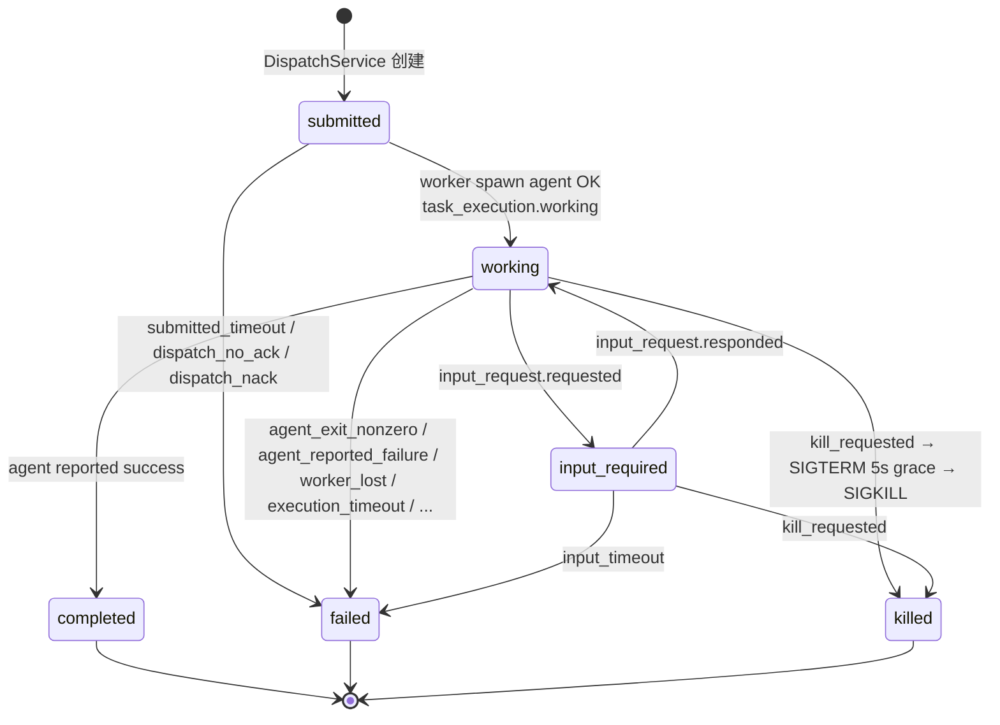

# TaskExecution 聚合

> **DDD 战术层** · BC: TaskRuntime · 独立 Aggregate Root
>
> 一次 dispatch → 结束的运行痕迹；6 态状态机；`execution_id` = 主身份 + 幂等 + fencing key。
>
> 持 `task_id` 强引用 Task；1:N 于 Task（同 task 多次 dispatch 产生多条 execution）；retry = 同 task 新 execution_id（[ADR-0010](../../../decisions/0010-task-execution-two-layer-model.md)）。
>
> **本文档同时承载原 BC4 Execution 的 worker 侧运行时细节**（shim / Workspace 物理 / JSONL / Artifact）：物理跨机器但概念同 BC（[ADR-0019](../../../decisions/0019-bc-scheduling-execution-merged-to-task-runtime.md)）。

详细 BC 视图见 [00-overview.md](00-overview.md)。

---

## § 1. 概述

"两层模型" 的执行层。

| 维度 | 含义 |
|---|---|
| 身份 | `execution_id`（uuid）= 主身份 + 幂等 + fencing key；不变 |
| AR 性质 | **独立 Aggregate Root**（不是 Task 的子 Entity；[ADR-0019](../../../decisions/0019-bc-scheduling-execution-merged-to-task-runtime.md)） |
| 关联 Task | 持 `task_id` 强引用；创建时即定，不可改 |
| 关联 Worker | 持 `worker_id` 强引用；创建时即定，不可改 |
| 失败语义 | execution 终态 `failed` / `killed`；不影响 Task 仍在 `open` |
| 重派 | 创建新 execution_id；旧 id 永远停在终态 |

---

## § 2. 状态机



> `kill` 流程实际由 `task_execution.kill_requested`（Center 发起）触发 worker SIGTERM → 5s grace → SIGKILL → emit `task_execution.killed`。状态机视角下 `* → killed` 是单一逻辑迁移。

> `kill` 流程实际由 `task_execution.kill_requested`（Center 发起）触发 worker SIGTERM → 5s grace → SIGKILL → emit `task_execution.killed`。状态机视角下 `* → killed` 是单一逻辑迁移。

---

## § 3. 状态语义

| 状态 | 含义 | 终态? |
|---|---|---|
| `submitted` | 已创建，envelope 发出 / pending ACK / 等 worker spawn agent | 否 |
| `working` | Agent 子进程在跑 | 否 |
| `input_required` | Agent 卡在 InputRequest，等用户 / supervisor 回答 | 否 |
| `completed` | 成功结束（agent exit 0 + 无未 resolve input_request） | **是** |
| `failed` | 失败结束（含 timeout / exit ≠ 0 / worker_lost 等） | **是** |
| `killed` | 被显式 kill（user / supervisor 触发；或 abandon-task / suspend-task 前置触发） | **是** |

---

## § 4. 状态迁移

| 迁移 | 触发事件 | 谁 emit | 备注 |
|---|---|---|---|
| `submitted → working` | `task_execution.working` | Worker daemon | **agent 子进程 spawn 成功**后才转（worktree 建好 + agent PID 拿到）；不是 ACK 即转 |
| `working → input_required` | `input_request.requested` | Worker daemon（代 agent） | 详见 [03-input-request.md](03-input-request.md) |
| `input_required → working` | `input_request.responded` | Center | 写入 response 那一刻立刻转；worker 侧 agent 异步解阻塞 |
| `working → completed` | `task_execution.completed` | Worker daemon | agent exit 0 + 无未 resolve input_request；payload 含 artifact 引用 |
| `working → failed` | `task_execution.failed` | Worker daemon | reason ∈ § 7 |
| `* → killed`（含 input_required） | `task_execution.killed` | Worker daemon | 由 `task_execution.kill_requested`（Center）触发 |

> **Center 端两阶段 cancel**：先 emit `task_execution.kill_requested`（仅落 `cancel_requested_at` 时间戳），worker 收事件 → SIGTERM → 5s grace → SIGKILL → emit `task_execution.killed`。状态对外仍呈现为当时态 + `cancel_requested_at` 提示等待中；不引入新状态。

**边界情况**：

| 场景 | 行为 |
|---|---|
| Cancel `submitted` 状态的 execution（agent 还没 spawn） | 不 SIGTERM；直接转 killed；emit `task_execution.killed` |
| Cancel `input_required` 状态的 execution | 走 § 10 进程级流程；同时 input_request.canceled |
| Cancel 已终态的 execution | 报错（不可对终态操作） |
| 重复 kill（grace 期再点） | 幂等 no-op（`cancel_requested_at` 已存在） |
| Worker 离线时发 kill | Center 记录 `cancel_requested_at`，事件留在 worker 派单队列；上线后处理；最终通过 reconcile 或 timeout 触发 |

---

## § 5. 字段（含 DispatchEnvelope VO）

### 5.1 TaskExecution 字段

| 字段 | 类型 | 含义 |
|---|---|---|
| `id` (`execution_id`) | uuid | 主身份；幂等 + fencing key |
| `task_id` | uuid | 所属 task |
| `worker_id` | uuid | 派给哪个 worker（确定后不变） |
| `status` | enum | submitted / working / input_required / completed / failed / killed |
| `dispatch_state` | enum | pending_ack / acked / null（acked 之后或终态时为 null） |
| `agent_instance_id` | uuid | 强引用 AgentInstance（[ADR-0024](../../../decisions/drafts/0024-agent-instance-first-class.md)），不可变；`agent_cli` 通过 join AgentInstance 拿 |
| `workspace_mode` | enum | worktree / direct（透自 task.requires_worktree；VO 性质，见 § 8） |
| `cwd` | string | 实际 CWD（worktree 路径 或 base_path） |
| `branch_name` | string \| null | worktree 模式下的新 branch（默认 `task/<execution_id>`）；direct 模式 null |
| `base_branch` | string \| null | worktree 模式下 base branch（默认 main） |
| `priority` | enum | 透自 task |
| `eta_at` | timestamp \| null | 透自 task |
| `execution_timeout_override` | duration \| null | 仅向上覆盖默认 6h |
| `working_seconds_accumulated` | int | accumulated working 时间（不计 input_required 期间） |
| `pending_input_request_id` | uuid \| null | input_required 时指向当前 IR |
| `started_at` | timestamp | submitted 创建时刻 |
| `working_started_at` | timestamp \| null | 第一次进 working 的时刻 |
| `cancel_requested_at` | timestamp \| null | 收到 kill 请求的时刻；nullable，不引入状态 |
| `ended_at` | timestamp \| null | 终态时刻 |
| `completed_reason` / `completed_message` | string | completed 时填（一般 null / "agent reported success"） |
| `failed_reason` / `failed_message` | string | failed 时填（reason ∈ § 7） |
| `killed_reason` / `killed_message` | string | killed 时填（reason ∈ {user_request / supervisor_request / abandon_precondition / suspend_precondition / reconcile_stale / reconcile_unknown / timeout_kill}） |

> 所有 reason 字段必须配 message 字段（[conventions § 16](../../../../rules/conventions.md)）。

### 5.2 DispatchEnvelope VO

Center → Worker 派单载荷：

```yaml
DispatchEnvelope:
  envelope_version: "v1"

  # Identity
  execution_id:    uuid               # 主身份 + 幂等 + fencing
  task_id:         uuid
  worker_id:       uuid
  project_id:      string
  conversation_id: uuid?              # task.conversation_id 透传；worker daemon 据此写进度 message / InputRequest 载体 message。null → 跳过 progress 写入；InputRequest 触发 fallback

  # Agent + Workspace
  agent_instance_id: uuid             # 强引用 AgentInstance ([ADR-0024](../../../decisions/drafts/0024-agent-instance-first-class.md))；worker 端 join AgentInstance 拿 agent_cli + config + home_dir
  workspace_mode:    string           # worktree | direct
  base_branch:       string?          # worktree 模式默认 main

  # Task content (worker 组装 prompt)
  task_title:                  string
  task_description:            string?       # ≤10KB 内联
  task_description_blob_ref:   string?       # 或 blob 引用

  # Context refs (worker 按需 fetch)
  from_issue_id:           uuid?
  parent_task_id:          uuid?
  depends_on_task_ids:     [uuid]            # 已满足；仅上下文用

  # Signals
  priority:    string                 # high | medium | low
  eta_at:      timestamp?

  # Overrides
  execution_timeout_override:  duration?
  extra_skill_files:           [string]?
```

### 5.3 ACK / NACK 协议

```
Center → Worker: DispatchEnvelope
Worker → Center: DispatchAck   { execution_id, accepted=true, message?, acked_at }
              or DispatchNack { execution_id, accepted=false, reason, message, acked_at }
```

| 结果 | Center 行为 |
|---|---|
| ACK accepted=true | `dispatch_state='acked'`；监听后续 worker 事件 |
| NACK | `task_execution → failed(reason='dispatch_nack:<sub>', message=...)`；触发 supervisor wake |
| 30s 没 ACK | `task_execution → failed(reason='dispatch_no_ack')`；触发 supervisor wake |

NACK reason 标准枚举见 [ADR-0011](../../../decisions/0011-dispatch-reliability-protocol.md) § Decision 2。

DispatchService 协议视图见 [00-overview § 3.1](00-overview.md)。

---

## § 6. 不可变 / append-only

- TaskExecution 一旦创建，`id` / `task_id` / `worker_id` / `agent_instance_id` / `workspace_mode` 等"派单契约"字段不可改
- 状态机只能按 § 4 列的迁移路径走
- 终态后不可变

---

## § 7. 失败 / killed reason 枚举

### 7.1 Failed reason

failed_reason 是 supervisor 重派决策的关键信号：

| reason | 含义 |
|---|---|
| `agent_exit_nonzero` | Agent 子进程退出码 ≠ 0 |
| `agent_reported_failure` | Agent 调 `agent-center report-failure` 显式上报 |
| `worktree_setup_failed` | git worktree add 出错 / 磁盘 / 权限等 |
| `submitted_timeout` | 在 submitted 状态超 5 min（worker 没起来 agent） |
| `execution_timeout` | 在 working 累计超 `execution_timeout`（默认 6h） |
| `input_timeout` | InputRequest 超时（默认 T2=24h） |
| `worker_lost` | Worker 心跳超 `worker_heartbeat_timeout`（默认 60s） |
| `dispatch_no_ack` | Envelope 发出后 30s 没 ACK |
| `dispatch_nack:<sub_reason>` | Worker 显式 NACK（含 worker_at_capacity / mapping_missing / 等） |
| `no_input_channel` | agent 调 `request-input` 时 task.conversation_id=null 且 `notification.default_channel` 未配 → fallback 失败、InputRequest 无法创建（[ADR-0017 § 10.4](../../../decisions/0017-task-as-conversation.md)） |
| `shim_no_hello` | Daemon spawn shim 后 60s 内未收到 ShimHello（[ADR-0018 § 7](../../../decisions/0018-detached-agent-via-per-execution-shim.md)） |
| `shim_crashed` | Shim 进程崩溃（PID 死 / start_time mismatch）；agent 若还活则连带 SIGTERM（同上 ADR） |

reason 之外必须填 message（人类可读详情）。

### 7.2 Killed reason

| reason | 上下文 |
|---|---|
| `user_request` | 用户直接 kill-execution |
| `supervisor_request` | Supervisor 决策 kill |
| `abandon_precondition` | abandon-task 自动前置 kill（Task 状态 → abandoned） |
| `suspend_precondition` | suspend-task 自动前置 kill（Task 状态 → suspended） |
| `reconcile_stale` / `reconcile_unknown` | Worker reconcile 端 audit-only emit（详见 § 11） |
| `timeout_kill` | execution_timeout 触发的 KillCoordinator 路径 |

KillCoordinator 协议视图（两阶段决策）见 [00-overview § 3.5](00-overview.md)；进程级机制见 § 10。

### 7.3 Timeout 策略

4 类独立 timeout（TimeoutScanner 在 Center 端 30s 周期 ticker，详见 [00-overview § 3.3](00-overview.md)）：

| # | 类型 | 看的对象 | v1 默认 | 触发后 |
|---|---|---|---|---|
| 1 | `submitted_timeout` | TaskExecution 在 submitted | 5 min | execution → failed(`submitted_timeout`) |
| 2 | `execution_timeout` | TaskExecution working 累计 | 6 h | Center 发 kill_requested → SIGTERM → execution → failed(`execution_timeout`) |
| 3 | `input_request_timeout` | InputRequest 在 pending | T1=4h ping / T2=24h fail（见 [03-input-request.md § 7](03-input-request.md)） | InputRequest → timed_out → execution → failed(`input_timeout`) |
| 4 | `worker_heartbeat_timeout` | Worker 心跳静默 | 60 s | worker → offline；上面所有 active execution → failed(`worker_lost`) |

**关键细节**：

- **execution_timeout 不计 input_required 时间**：用 `working_seconds_accumulated` 字段，worker heartbeat 自上报；input_required 期间时钟暂停
- **per-task override**：dispatch envelope 可带 `execution_timeout_override`（仅向上覆盖，避免恶意短 timeout）；其他 timeout 不允许 task 级 override
- **不引入新事件**：timeout 触发的 fail 复用 `task_execution.failed`，reason 字段表达细分

### 7.4 Retry 策略

- TaskExecution 进 `failed` → emit 事件 → wake supervisor
- Supervisor 看 `failed_reason` + `failed_message` + 上下文决定：重派同 task（新 execution）/ 开 Issue 升级 / 通知用户 / 无动作
- **Center 端零内置重试逻辑**。retry = 普通 dispatch（同代码路径）
- 兜底：`max_executions_per_task=3`（v1 全局默认）；超限 emit `task.dispatch_limit_reached`

---

## § 8. Workspace 模式（workspace_mode VO）

`workspace_mode` 是挂在 TaskExecution 上的 VO 性质字段。每个 execution 必有 CWD。

### 8.1 两种模式

| 模式 | `requires_worktree` | CWD | 隔离 | 典型用途 |
|---|---|---|---|---|
| **worktree** | `true`（默认） | `base_path + ".wt/task-<execution_id>"`（per-execution git worktree） | git worktree 隔离 | 改代码 / 新 branch / 起 PR / 并发执行 |
| **direct** | `false` | `base_path` 自身 | 无 | 读项目文件 / 想在用户当前 branch in-place / 想看用户工作树上下文 |

### 8.2 决策维度（不是"是不是 code 工作"）

判断要不要 worktree 看 4 个问题：

1. 需要跟用户当前工作树**隔离**吗？
2. 需要**干净 base branch** 起手（不继承 uncommitted）吗？
3. 这个 task 可能跟其他 task 在同 project **并发**跑（互踩风险）吗？
4. 是否必须 push 到 base_path 当前 branch（in-place hot fix）？

任一 yes → worktree。Q4 单独 yes → direct。都 no → direct 更轻。

写进 supervisor.md skill：

```
Default: worktree (requires_worktree=true).

Use worktree when ANY:
  - Need isolation from user's current working tree
  - Need fresh main-branch start (don't inherit uncommitted state)
  - Task may run concurrently with other tasks on same project
  - Will create a PR or new branch as artifact

Use direct when ANY:
  - User explicitly wants modifications in-place on current branch
  - Task is pure reading / synthesis with no git interaction
  - Want agent's working output visible in user's current dir

Default to worktree on uncertainty — isolation is safer.
```

### 8.3 Direct 模式约束

- CWD = `base_path`，agent 能读 CLAUDE.md / AGENTS.md / 项目其他文件（[ADR-0005](../../../decisions/0005-project-charter-stays-in-project-repo.md)）
- **按约定**不修改项目文件；不强制 enforcement（v1 不做 readonly mount，推 [roadmap](../../../roadmap.md)）
- 多 direct 模式 execution 共享 base_path → 接受无锁并发（假定 agent 只读、副作用最小）
- direct 模式仍**必须**有 WorkerProjectMapping（要 base_path）；worker 选择策略与 worktree 模式一致

### 8.4 Workspace 资源生命周期事件

| Event | 触发 |
|---|---|
| `task_execution.working` | execution 进入 working；payload 含 `workspace_mode` + `cwd` |
| `worktree.created` | **仅** worktree 模式 emit |
| `worktree.released` | **仅** worktree 模式 24h GC 时 emit |

Direct 模式不引入 ephemeral 资源 / 不 emit `worktree.*`。

### 8.5 修改 workspace_mode

Task 的 `requires_worktree` 字段**可改**，前置条件：

- Task 在非终态（`open` 或 `suspended`）
- Task **无活动 execution**（先 kill 当前 execution 或等结束）

事件：`task.workspace_mode_changed { task_id, old_mode, new_mode, by, at }`。

---

## § 9. Worker 端运行时

> 本节合并自原 BC4 Execution 的 worker 侧实施细节（shim 模型 / Workspace 物理创建 / JSONL 解析 / per-execution 目录 / progress milestone）。物理跑在 worker 上，状态权威仍在 center（[ADR-0019](../../../decisions/0019-bc-scheduling-execution-merged-to-task-runtime.md)）。

### 9.1 Per-execution 目录布局 + 幂等

Worker 本机为每条 execution 维护独立目录：

```
~/.agent-center-worker/exec/<execution_id>/
  envelope.json         # 原始 DispatchEnvelope（写完即不变）
  status.json           # 运行 phase 状态（running / done）
  events.jsonl          # 本地待 ACK 事件队列
  agent.log             # agent 子进程 stdout/stderr
  shim.sock             # shim → agent 的本地 unix socket
  shim.pid              # shim 进程 PID + start_time
```

详细字段见 [ADR-0018 § 3](../../../decisions/0018-detached-agent-via-per-execution-shim.md)（per-execution 目录布局按 ADR-0019 carve 后归本文件本节，不再分散到 workforce）。

### 9.2 Worker 端处理时序

```
1. 收到 DispatchEnvelope
2. 查 ~/.agent-center-worker/exec/<execution_id>/ 目录幂等:
   - 无目录 → 建目录 → 写 envelope.json → 继续
   - 目录存在 + status.json.phase=running → 重发 ACK；不重起 shim
   - 目录存在 + status.json.phase=done → 重发 ACK；不做事
3. 校验 envelope (`agent_instance_id` 解析到本机已 known AgentInstance + 其 agent_cli ∈ capabilities[detected ∧ enabled] / mapping / base_branch / version)
4. 失败 → NACK + reason + message；目录回滚
5. 通过 → ACK
6. 准备 workspace:
   - worktree 模式: git worktree add -b task/<execution_id>
   - direct 模式: CWD = base_path
   - emit task_execution.working { workspace_mode, cwd, ... }
   - worktree 模式额外 emit worktree.created
7. 组装 prompt (详见 [agent-harness/01-prompt-assembly.md](../agent-harness/01-prompt-assembly.md))
8. 生成 shim_token (一次性 nonce)
9. Spawn shim 子命令 (detached, setsid)，env 注入（§ 9.3 + AGENT_CENTER_SHIM_TOKEN）：
   agent-center worker shim --execution-id=... --shim-token=... --cmd=... -- <args>
10. 等 ShimHello (60s 超时 → failed reason='shim_no_hello')；
    shim 起 agent CLI 子进程、写 status.json、连 daemon 上报
11. 进入 normal monitoring loop (接 shim 主动上报的事件 + 转发 agent RPC)
```

### 9.3 Env 注入（daemon → shim → agent）

**daemon → shim**（spawn `agent-center worker shim` 子命令时）：

```
AGENT_CENTER_EXECUTION_ID       = <uuid>
AGENT_CENTER_TASK_ID            = <uuid>
AGENT_CENTER_PROJECT_ID         = <string>
AGENT_CENTER_CONVERSATION_ID    = <uuid> or ""    # task.conversation_id；空字符串表示未绑定
AGENT_CENTER_WORKSPACE_MODE     = "worktree" | "direct"
AGENT_CENTER_CWD                = <resolved path>
AGENT_CENTER_PRIORITY           = "high" | "medium" | "low"
AGENT_CENTER_ETA_AT             = <ISO 8601> or ""
AGENT_CENTER_SHIM_TOKEN         = <crypto random nonce>   ★ 仅 daemon → shim
```

**shim → agent**（除 SHIM_TOKEN 外原样透传 + 改写 WORKER_SOCK 指向 shim）：

```
AGENT_CENTER_WORKER_SOCK        = ~/.agent-center-worker/exec/<execution_id>/shim.sock
                                  ★ 指向 shim 的本地 socket，不是 daemon 主 socket
                                  (daemon 升级窗口期 agent 调 RPC 不受影响)
```

详见 [ADR-0018](../../../decisions/0018-detached-agent-via-per-execution-shim.md)。

### 9.4 Shim 模型

详见 [ADR-0018](../../../decisions/0018-detached-agent-via-per-execution-shim.md)。要点：

- Shim = `agent-center worker shim` 子命令；detached + setsid 启动；脱离 daemon process group
- daemon 死时：shim 不死、agent 不死（agent parent=shim）；events 继续 append events.jsonl；daemon 重启后 shim 重连 + catchup
- daemon 正常时：shim 主动连 daemon 上报事件 + 转发 agent RPC；daemon 是 single 对 center 的出口
- Fencing：`shim_token`（一次性 nonce）+ `shim.pid` 内 PID + start_time 防 spoof
- 异常 timeout：daemon spawn shim 60s 无 ShimHello → execution → failed(reason='shim_no_hello')；shim 探活探测 agent 进程崩溃 → emit failed(reason='shim_crashed')

### 9.5 Agent CLI 子进程 + JSONL 解析

详见 [ADR-0002](../../../decisions/0002-no-llm-sdk-use-cli-agents.md)（不用 LLM SDK，走 CLI agent）。

- Shim spawn agent CLI 子进程（claude-code / codex / opencode 选一）
- Agent CLI 输出 JSONL 流到 stdout；shim 实时解析
- Shim 通过本地 unix socket 暴露 RPC 给 agent 调（`request-input` / `report-progress` / `report-artifact` / `open-issue` / `read-task-context` 等）
- agent_trace JSONL 不入 events 表（[ADR-0015](../../../decisions/0015-agent-trace-not-in-events-table.md)）；execution 结束时归档至 BlobStore（emit `task_trace.archived`）；本地保留 24h

### 9.6 进度上报到 Conversation（worker daemon milestone 行为）

Worker daemon（实际是 shim → daemon 转）边解析 agent JSONL 边判断 milestone，命中后调 `conversation add-message` 写一条 `content_kind=agent_finding` 的 Message 到 `task.conversation_id`。`task.conversation_id=null` 时跳过（普通 progress milestone **不**触发 fallback；只有 InputRequest 触发）。

**5 条 milestone**：

| Milestone | 触发条件 |
|---|---|
| **status 变化** | TaskExecution status 转换（submitted → working → input_required → completed / failed / killed） |
| **activity 类型变化** | `current_activity` 大类切换（如 "editing files" → "running tests"）；不按具体文件名变 |
| **长 tool call** | 单次 tool call 持续 > 30s（开始 + 结束各发一次） |
| **累计摘要** | 每累计 N 个 tool call 发一条摘要（N 默认 20，可配） |
| **用户在 task conversation 内询问** | 用户在 task conversation 里说话 → 立即 push 一条当前快照（不烧 supervisor） |

阈值（30s / N=20）走配置。

> **不 emit `task.progress_milestone_reached` 事件** —— 进度通过 `conversation.message_added` 走 outbound 链路；不需要专门 progress 事件类。详见 [ADR-0017 § 4](../../../decisions/0017-task-as-conversation.md)。

---

## § 10. Kill 进程级机制

KillCoordinator 协议视图（两阶段决策；含 abandon-precondition / suspend-precondition）见 [00-overview § 3.5](00-overview.md)。本 § 描述 worker 收到 `task_execution.kill_requested` 后的物理动作。

```
1. Center 收 kill 请求 (user/supervisor)
2. Center 写 task_executions.cancel_requested_at = now
   emit task_execution.kill_requested { execution_id, reason, message }
3. Worker 收事件:
   a. SIGTERM 给 agent 子进程
   b. 等 5s grace（worker.yaml 可配置）
   c. 还活着 → SIGKILL
   d. 进程死后:
        - 关 unix socket (若 agent 阻塞在 request-input)
        - 取消未完 input_request (emit input_request.canceled)
        - 已 emit 的 trace events / agent 显式 artifacts 保留
        - 不主动扫 worktree 挖产物 (24h GC 期人工查)
        - emit task_execution.killed { reason, message }
4. Center: execution.status=killed
   若是 abandon-task 前置: 继续走 abandon 流程
   若是 suspend-task 前置: 继续走 suspend 流程
```

`reason` ∈ § 7.2（user_request / supervisor_request / abandon_precondition / suspend_precondition / timeout_kill）。

**边界**：

| 场景 | 行为 |
|---|---|
| Cancel `submitted`（agent 还没 spawn） | 不 SIGTERM；直接转 killed |
| Cancel `input_required` | 走上述流程；同时 input_request.canceled |
| 重复 kill 在 grace 期 | 幂等 no-op（`cancel_requested_at` 已存在） |
| abandon 前置 kill 超时（worker 离线 / SIGKILL 也不死） | CLI 报错；task 不进 abandoned；v1 不做 `--force-abandon`（推 [roadmap](../../../roadmap.md)） |

---

## § 11. Reconcile worker 端响应

ReconcileService 协议视图见 [00-overview § 3.2](00-overview.md)。本 § 描述 worker 端响应行为。

Worker enroll / 重连后第一件事：

```
Worker → Center: Reconcile { worker_id, local_active_executions: [...] }
Center → Worker: ReconcileResponse {
  active:  [...],     # 继续跑
  stale:   [...],     # center 已标 failed/killed/done; worker 杀本地进程
  unknown: [...],     # 不存在或归属其他 worker
}
```

Worker 端响应：

- `active` → 继续上报事件
- `stale` / `unknown` → SIGTERM 本地 agent；emit `task_execution.killed { reason='reconcile_stale' / 'reconcile_unknown' }`（仅审计；Center 不改状态）

**约束**：Worker reconcile 完成前不接新 dispatch。

---

## § 12. Artifact 子实体

Artifact 是 TaskExecution 的子实体。

### 12.1 模型

- **独立表 `artifacts`**（不是 task / execution 的 JSON 字段）—— 跨 task 查询友好；增量上报并发安全
- **归属 execution**（不是 task）—— 每次执行各产物
- `kind` 是 **free-form 字符串**（v1 推荐 `pr_url` / `file` / `report` / `diff` / `test_run` / `note`，不强校验）
- 大内容（>10KB）走 BlobStore，`blob_ref` 字段引用（[conventions § 8](../../../../rules/conventions.md)）

### 12.2 字段

| 字段 | 含义 |
|---|---|
| `id` | uuid |
| `task_id` | FK（冗余但便于 query） |
| `execution_id` | FK（artifact 归属一次执行） |
| `kind` | TEXT free-form |
| `title` | 短标签 |
| `blob_ref` | BlobStore 相对路径（nullable） |
| `url` | 外部 URL（nullable） |
| `metadata_json` | type-specific 字段（JSON 字符串） |
| `created_at` | timestamp |
| `created_by` | agent:execution-id / supervisor:invocation-id |

### 12.3 上报方式

```
agent-center report-artifact --kind=pr_url --title="..." --url=https://...
agent-center report-artifact --kind=file --title="..." --blob-ref=$(agent-center blob put design.md)
agent-center report-artifact --kind=test_run --title="..." --metadata='{"passed":10,...}'
```

CLI → shim → worker daemon → forward to center → insert + emit `artifact.uploaded`。

### 12.4 不可变 / append-only

- 一旦 insert 不可修改
- 要"更新" → insert 新一条（inspect 按 created_at desc 显示，最新覆盖视觉）
- v1 不允许删除（DB 行保留；BlobStore lifecycle 独立）

---

## § 13. Invariants

设计 / 实现必须保持：

1. **TaskExecution 永远绑一个 task 和一个 worker**（`task_id` / `worker_id` 创建后不可改）
2. **`execution_id` 唯一**：retry 创建新 id；旧 id 永远停在终态
3. **执行权威在 Center**：Worker / Agent 不能直接改 execution 状态；状态变化由事件流转 → Center 写
4. **状态机迁移单向**：终态 `completed` / `failed` / `killed` 不可逆
5. **"派单契约"字段不可改**：`id` / `task_id` / `worker_id` / `agent_instance_id` / `workspace_mode` / `base_branch` / `branch_name` 创建后冻结（[ADR-0024](../../../decisions/drafts/0024-agent-instance-first-class.md)）
6. **每个 reason 字段配 message**（[conventions § 16](../../../../rules/conventions.md)）—— `completed_reason`+`completed_message` / `failed_reason`+`failed_message` / `killed_reason`+`killed_message`
7. **大字段走 BlobStore**（[conventions § 8](../../../../rules/conventions.md)）
8. **Artifact append-only**：insert 后不可修改 / 不可删（v1）

> Task 相关 invariants → [01-task § 10](01-task.md)
> InputRequest 相关 invariants → [03-input-request § 9](03-input-request.md)
> 跨聚合 invariants 汇总（含单活约束）→ [00-overview § 2](00-overview.md)

---

## § 14. References

### 相关 ADR

- [ADR-0002 不用 LLM SDK 走 CLI agent](../../../decisions/0002-no-llm-sdk-use-cli-agents.md)
- [ADR-0005 项目宪章留 project 仓](../../../decisions/0005-project-charter-stays-in-project-repo.md)
- [ADR-0010 两层模型](../../../decisions/0010-task-execution-two-layer-model.md)
- [ADR-0011 派单可靠性协议](../../../decisions/0011-dispatch-reliability-protocol.md)
- [ADR-0014 事件溯源 L1](../../../decisions/0014-event-sourcing-level.md)
- [ADR-0015 agent_trace 不进 events 表](../../../decisions/0015-agent-trace-not-in-events-table.md)
- [ADR-0017 Task ↔ Conversation 1:1](../../../decisions/0017-task-as-conversation.md)
- [ADR-0018 Detached agent + per-execution shim 模型](../../../decisions/0018-detached-agent-via-per-execution-shim.md)
- [ADR-0019 BC 合并](../../../decisions/0019-bc-scheduling-execution-merged-to-task-runtime.md)

### 同 BC

- [00-overview.md](00-overview.md) — BC wrap + Domain Service + Factory + Repo
- [01-task.md](01-task.md) — Task 聚合
- [03-input-request.md](03-input-request.md) — InputRequest 聚合

### 跨 BC

- [workforce/00-overview.md](../workforce/00-overview.md) — Workforce BC 入口（Worker 注册 / heartbeat / Mapping / Proposal）
- [agent-harness/01-prompt-assembly.md](../agent-harness/01-prompt-assembly.md) — Prompt 组装（worker spawn agent 时使用）
- [bridge/01-feishu-integration.md](../bridge/01-feishu-integration.md) — Bridge 渲染 milestone / Artifact
- [observability/00-overview.md](../observability/00-overview.md) — 事件总览 / inspect

### 横切方法论

- [conventions § 8 BlobStore / § 9 mutator / § 16 reason+message](../../../../rules/conventions.md)
