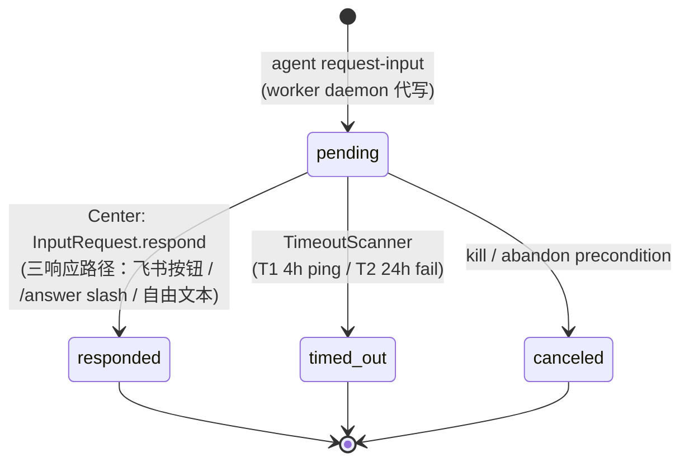

# InputRequest 聚合

> **DDD 战术层** · BC: TaskRuntime · 独立 Aggregate Root
>
> Agent 执行中需要外部输入的**同步阻塞**请求。

InputRequest 是独立聚合（独立表 / 独立状态机 / 独立超时；不合并到 Conversation Message）。UI 投递走 [Task ↔ Conversation 1:1 模型](../../../decisions/0017-task-as-conversation.md)：写一条 `content_kind=agent_finding, input_request_ref=<id>` 的 Message 到 `task.conversation_id`，Bridge 渲染时附按钮。详见 [ADR-0017 § 5](../../../decisions/0017-task-as-conversation.md)。

详细 BC 视图见 [00-overview.md](00-overview.md)。

---

## § 1. 概述

### 1.1 触发场景

- Agent 想跑危险命令（`rm -rf`、`git push -f`、`docker prune`）
- Agent 遇到歧义（"用 REST 还是 GraphQL？"）
- Agent 完成里程碑要 gate（"测试通过了，要继续写 PR 描述吗？"）
- Agent 撞到意料之外的情况（"测试在另一个无关模块也挂了，要修吗？"）

### 1.2 调用方式

Agent 通过 CLI 命令主动请示：

```
agent-center request-input --question="..." [--options="A,B,C"] [--urgency=normal|urgent]
```

行为：**阻塞**，等中心回应。stdout 输出 JSON：

```json
{ "answer": "...", "decided_by": "human:hayang | supervisor:invocation-id", "decided_at": "..." }
```

超时：默认 24h（可配置），超时返回非零退出码 + 错误 JSON。

Agent 怎么知道有这个命令？通过 [`worker-agent.md`](../agent-harness/02-skill-cli-tooling.md) skill。

---

## § 2. 状态机



---

## § 3. 字段

| 字段 | 类型 | 含义 |
|---|---|---|
| `id` | uuid | 主身份 |
| `task_execution_id` | uuid | 所属 execution（创建后不可改）|
| `status` | enum | pending / responded / timed_out / canceled |
| `question` | string | agent 提出的问题 |
| `options` | JSON array \| null | 候选答案选项（可选） |
| `urgency` | enum | normal / urgent（默认 normal）|
| `requested_at` | timestamp | 创建时刻 |
| `responded_at` | timestamp \| null | 用户 / supervisor 回应时刻 |
| `responded_by` | string \| null | `human:<user_id>` / `supervisor:<invocation_id>` |
| `response_text` | string \| null | 答复内容 |
| `ended_reason` / `ended_message` | string \| null | 终态附加（timed_out / canceled 时填）|

reason 字段配 message（[conventions § 16](../../../../rules/conventions.md)）。

---

## § 4. 协议接口

| 操作 | Caller | 效果 |
|---|---|---|
| `request-input`（agent CLI）| Worker 上 agent | Worker daemon → Center 创建 InputRequest pending；TaskExecution → input_required |
| `respond-to-input-request`（CLI / Bridge）| User / Supervisor | InputRequest pending → responded；TaskExecution input_required → working |
| 自动 timeout（TimeoutScanner）| Center background ticker | InputRequest pending → timed_out（T2=24h）；TaskExecution → failed(input_timeout) |
| 自动 cancel（KillCoordinator 联动）| Center | InputRequest pending → canceled（execution 被 kill 时联动）|

---

## § 5. 完整流程（sequence + 7 行步骤）

```
   Agent           Shim/Worker daemon       Center           Bridge          User
     │                    │                    │               │              │
     │  request-input ──→ │                    │               │              │
     │                    │  RPC ────────────→ │               │              │
     │                    │              [tx: write IR pending│               │
     │                    │               + TaskExecution      │               │
     │                    │               → input_required     │               │
     │                    │               + Message(agent_     │               │
     │                    │               finding, ir_ref) ]   │               │
     │                    │                    │   emit ──→  │               │
     │                    │                    │             render card ──→  │
     │                    │                    │  ←── respond (3 paths)        │
     │                    │              [write response,     │               │
     │                    │               IR → responded,     │               │
     │                    │               TaskExecution       │               │
     │                    │               → working ]         │               │
     │                    │ ←── InputResponse  │   emit ──→  │ update_card 置灰
     │ ←── stdout JSON ──│                    │               │              │
     │     answer         │                    │               │              │
```

**7 行说明**：

1. Worker daemon spawn agent，env 注入（含 `AGENT_CENTER_CONVERSATION_ID`，详见 [02-task-execution § 9.3](02-task-execution.md)）
2. Agent 跑到岔路 → 执行 `agent-center request-input "..."` → CLI 走 unix socket → shim → daemon
3. Worker daemon → Center 单事务执行（[ADR-0014 § 2](../../../decisions/0014-event-sourcing-level.md)）：
   - 写 InputRequest 行（status=pending）
   - 更新 `task_execution.pending_input_request_id` + status='input_required'
   - INSERT events: `input_request.requested` + `task_execution.input_required`
   - 解析 `task.conversation_id`：非 null → 写 Message(agent_finding, input_request_ref) 到该 conversation；null → 触发 § 8 fallback
4. `conversation.message_added` emit → FeishuBridge 订阅 → 渲染为 interactive card 投递到飞书
5. User 通过三响应路径之一回应（详见 § 6）
6. Center 收 respond → 写 response + status: pending → responded + TaskExecution → working + emit `input_request.responded`；Bridge update_card 置灰
7. Worker daemon 收 InputResponseEvent → 在 pending map 找 channel → 写 response → CLI 解阻塞 → agent stdout 拿到 JSON answer 继续干

具体 schema 见 [implementation/02-persistence-schema.md](../../../implementation/) (TBD)。

---

## § 6. 三响应路径

### 6.1 卡片按钮

最常见。Bridge 收 `card.action.trigger` 事件 → 解析 `input_request_id` + 用户选项 → 调 center 的 `InputRequest.respond` API + 写一条 inbound `text` Message 到同 conversation 作为留痕（`content = "选: <option>"` 或自由输入的文本）。

### 6.2 自由文本 @bot

用户在 task conversation thread 内说话（不点按钮）：

- Bridge 收 `im.message.receive_v1` → 走 [conversation/01-conversation § inbound](../conversation/01-conversation.md) 写 Message
- `conversation.message_added` emit → supervisor 唤醒
- supervisor 看 conversation 当前是否有 pending InputRequest → 解析意图 → 调 `InputRequest.respond`

这条路径**烧 supervisor LLM**，用作"用户不知道 slash 命令时的兜底"。

### 6.3 Slash 命令 `/answer`

```
/answer <task_id> <text>
```

由 [ADR-0017 § 6](../../../decisions/0017-task-as-conversation.md) 提前到 v1（飞书 D2 slash 模式首批命令之一，详见 [bridge/01-feishu-integration.md § 9](../bridge/01-feishu-integration.md)）。Bridge 收 slash → 直接调 `InputRequest.respond` + 写一条 `text` Message 留痕 → **不经 supervisor**。

理由：input 响应是高频 + 结构化场景，自由文本 @bot 走 supervisor 解析增加延迟 + 误解风险。

---

## § 7. 超时 / 升级

| 时点 | 行为 |
|---|---|
| T+0 | InputRequest 创建 + Message (input_request_ref) 写入；Bridge 渲染卡片投递 |
| T+4h（T1） | Supervisor wake：用户没回，提醒一次（飞书 ping，走 supervisor_summary Message 同 conversation） |
| T+24h（T2） | InputRequest → `timed_out`；emit `input_request.timed_out`；Bridge 订阅 → update_card 显示 "⏰ 已超时"；Worker 端 CLI 超时，返回 error 给 agent；Agent 通常 fail 任务；TaskExecution.status = `failed`, reason=`input_timeout`, message="<具体超时上下文>"；Supervisor 收到 failed 决定是否重派 |

T1 / T2 都是 per-project 可配置（v1 全局默认 4h / 24h，不做 per-project；见 [roadmap](../../../roadmap.md)）。

TimeoutScanner 协议视图见 [00-overview § 3.3](00-overview.md)。

---

## § 8. `conversation_id=null` Fallback

b/c/d 来源 task（Issue spawn / Supervisor / CLI）触发 InputRequest 时若未绑 conversation：

- **Center 硬规则 fallback**：自动 bind 到 `notification.default_channel` 配置项指定的渠道（详见 [ADR-0017 § 10.4](../../../decisions/0017-task-as-conversation.md)）
- **未配置 default_channel** → 整事务回滚，InputRequest 创建失败，Center emit `task_execution.failed(reason=no_input_channel)`（[02-task-execution § 7.1](02-task-execution.md)）；Task 没有 failed 状态，失败只在 execution 层面

> 普通 progress milestone（worker daemon agent_finding milestone，见 [02-task-execution § 9.6](02-task-execution.md)）**不**触发 fallback —— 只有 InputRequest 创建才会。

---

## § 9. Invariants

设计 / 实现必须保持：

1. **`task_execution_id` 创建后不可改**（强引用 TaskExecution）
2. **状态机迁移单向**：终态 `responded` / `timed_out` / `canceled` 不可逆
3. **`reason` 字段配 `message`**（[conventions § 16](../../../../rules/conventions.md)）—— `ended_reason` + `ended_message`（timed_out / canceled 时填）
4. **TaskExecution.pending_input_request_id 一致性**：InputRequest pending 时填；终态时清空（同事务）
5. **UI 投递与 InputRequest 创建同事务**：写 Message(agent_finding, input_request_ref) 跟 `input_request` 行写入在同一 DB transaction（[ADR-0014 § 2](../../../decisions/0014-event-sourcing-level.md)）
6. **Fallback 失败 → 整事务回滚**：conversation_id=null 且 `notification.default_channel` 未配 → 不创建 InputRequest；execution → failed(no_input_channel)

> Task 相关 invariants → [01-task § 10](01-task.md)
> TaskExecution 相关 invariants → [02-task-execution § 13](02-task-execution.md)
> 跨聚合 invariants 汇总 → [00-overview § 2](00-overview.md)

---

## § 10. References

### 相关 ADR

- [ADR-0014 事件溯源 L1](../../../decisions/0014-event-sourcing-level.md)
- [ADR-0017 Task ↔ Conversation 1:1](../../../decisions/0017-task-as-conversation.md)
- [ADR-0019 BC 合并](../../../decisions/0019-bc-scheduling-execution-merged-to-task-runtime.md)

### 同 BC

- [00-overview.md](00-overview.md) — BC wrap + Domain Service + Factory + Repo
- [01-task.md](01-task.md) — Task 聚合
- [02-task-execution.md](02-task-execution.md) — TaskExecution 聚合（含 worker 运行时 / Artifact）

### 跨 BC

- [conversation/00-overview.md](../conversation/00-overview.md) — Message kind=agent_finding + input_request_ref
- [bridge/01-feishu-integration.md](../bridge/01-feishu-integration.md) — Bridge 渲染卡片 / update_card 置灰
- [agent-harness/02-skill-cli-tooling.md](../agent-harness/02-skill-cli-tooling.md) — `worker-agent.md` skill 教 agent 用 request-input
- [discussion/00-overview.md](../discussion/00-overview.md) — Issue 聚合（InputRequest vs Issue 区别：Issue 是议事 thread，多轮非阻塞，可能 spawn 0/N task；InputRequest 是同步阻塞请示，1 问 1 答，阻塞 task）

### 横切方法论

- [conventions § 16 reason+message](../../../../rules/conventions.md)

具体表 schema 见 [implementation/02-persistence-schema.md](../../../implementation/02-persistence-schema.md)（TBD）。
