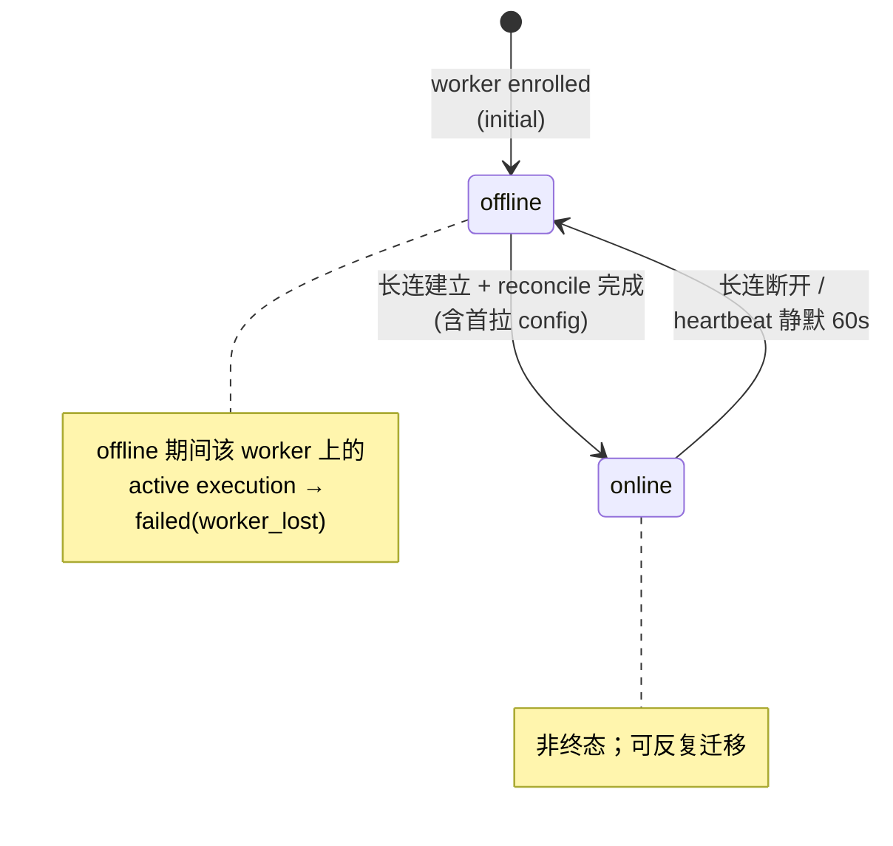

# Worker 聚合（+ BootstrapToken + WorkerProjectMapping 子从属）

> **DDD 战术层** · BC: Workforce
> 聚合: Worker（AR）+ BootstrapToken（Entity，子从属）+ WorkerProjectMapping（Entity，子从属）

Worker 是用户开发机上的常驻守护进程，注册到 center 后维持长连接、上报心跳、扫候选项目；每个 worker 在自己机器上能跑哪些 project = 哪些 WorkerProjectMapping。

> **本聚合不管"怎么干活"** —— per-execution 运行时 / shim / workspace 物理 / Agent CLI 子进程 / JSONL 解析 / Artifact / kill 进程级 / reconcile 端响应都归 [TaskRuntime BC](../task-runtime/02-task-execution.md)（[ADR-0019](../../../decisions/0019-bc-scheduling-execution-merged-to-task-runtime.md) carve）。

---

## § 1. Worker 状态机



- 初始：worker 进程启动 → 凭本机 credential 中的 `session_token` 建立长连接 → reconcile（[task-runtime § 3.2](../task-runtime/00-overview.md)）第一步拉 `WorkerConfig` → `worker.online`
- `online ↔ offline` 反复迁移，**非终态**
- offline 期间该 worker 上 active executions → TimeoutScanner 标 `failed(worker_lost)`（[task-runtime § 3.3](../task-runtime/00-overview.md)）

---

## § 2. 注册与认证（v2：一行命令接入）

> 设计依据：[ADR-0023 Worker Enroll 轻量化](../../../decisions/0023-worker-enroll-lightweight.md)

**流程**：

```bash
# 1. Center 端签发 enroll token（CLI 或远程 API 均可；走同一 endpoint）
agent-center worker token issue --worker-id=mac-mini-1
# → 终端打印 enroll token；TTL 默认 30 min；落 bootstrap_tokens 表 status=active

# 2. Worker 机一行接入（无需预写 worker.yaml）
agent-center join https://center.example.com:7000 \
    --token=<enroll-token> --worker-id=mac-mini-1
# → 走 POST /enroll-tokens/{token}/exchange
# → center 校验：active 且未过期 → 兑换 session_token + emit worker.bootstrap_token.used + worker.enrolled
# → daemon 自动写出 worker.yaml + ~/.agent-center/credentials (mode 0600)
# → 建立 WebSocket 长连接到 center
# → 调 reconcile 服务（第一步拉 WorkerConfig，详见 task-runtime/00-overview § 3.2）
# → 每次 online 探测本机已装的 agent CLI → emit worker.capability.detected
# → emit worker.online
```

**事件**：

| 事件 | 触发 | payload 关键字段 |
|---|---|---|
| `worker.bootstrap_token.issued` | token 签发 | `token_id, worker_id, expires_at, created_by` |
| `worker.bootstrap_token.used` | 兑换成 session | `token_id, worker_id, used_at` |
| `worker.bootstrap_token.expired` | TTL 到期（扫描器扫到） | `token_id, worker_id` |
| `worker.bootstrap_token.reissued` | reissue 操作 | `new_token_id, old_token_id, worker_id, reissued_by, old_status_at_reissue` |
| `worker.bootstrap_token.revoked` | 手动 revoke 或 reissue 撤旧 | `token_id, worker_id, revoked_by, reason` |
| `worker.enrolled` | session 兑换成功 | `worker_id` |
| `worker.online` | 长连建立 + reconcile 完成 | `worker_id, online_at` |
| `worker.offline` | 长连断开 / heartbeat 静默 | `worker_id, offline_at, reason+message`（[conventions § 16](../../../../rules/conventions.md)）|
| `worker.heartbeat` | 周期心跳 | `worker_id, working_seconds_accumulated`（容量信号）|
| `worker.capability.detected` | online 探测上报 | `worker_id, capabilities[]` |
| `worker.config.updated` | 用户改 config（长连推 worker） | `worker_id, changed_fields, by` |

---

## § 3. BootstrapToken Entity（子从属）

### 3.1 模型

```
bootstrap_token (
  id                ULID
  worker_id         FK → workers (强引用，不可变)
  value_hash        TEXT     -- token 明文 hash；明文仅签发时返回 CLI，DB 不存
  status            active | used | expired | revoked
  created_at        ISO8601 TEXT
  expires_at        ISO8601 TEXT   -- 默认 created_at + 30min
  used_at           ISO8601 TEXT, nullable
  revoked_at        ISO8601 TEXT, nullable
  created_by        TEXT     -- 签发 actor (admin / API caller)
)
```

### 3.2 状态机

```
                            ┌──────┐
issue ─→ active ─ exchange→ │ used │  (terminal)
           │                └──────┘
           ├─ TTL hit ─────→ expired
           └─ reissue/manual─→ revoked
```

### 3.3 Reissue 规则

| 旧 token 状态 | 允许 reissue | 行为 |
|---|---|---|
| `active` | ✅ | 旧 → `revoked`；新 `active` TTL 30 min |
| `expired` | ✅ | 旧保留 `expired`；新 `active` TTL 30 min |
| `revoked` | ✅ | 旧保留 `revoked`；新 `active` TTL 30 min |
| `used` | ❌ | 拒绝；CLI 引导用户走 remove + re-enroll |

并发 reissue：用 `SELECT ... FOR UPDATE` 锁住 `(worker_id, status=active)` 行，事务内 revoke 旧 + insert 新。

### 3.4 BootstrapToken Invariants

1. **`worker_id` 不可变**：token 跟 Worker 绑定
2. **同一 worker_id 同时至多 1 个 `active` token**
3. **`used` 是终态**：不可 reissue（一次性凭证使命已尽；rotate 走 [roadmap](../../../roadmap.md) v3）
4. **`expired` / `revoked` 也是终态**，但允许同 Worker 后续发新 token（旧 token 行保留作审计血缘）
5. **`value_hash` 不可逆**：明文仅签发时返回 CLI；之后 DB 只存 hash，校验时用同算法 hash 比对

---

## § 4. Worker Config（行为配置，center 主导）

> v1 的 `worker.yaml` 行为字段（concurrency / discovery / agent_cli）v2 一律迁到 **Worker AR 在 center DB 的字段**。worker 机的 `worker.yaml` 退化为 identity-only。

### 4.1 Worker AR v2 字段

```
Worker {
  // identity
  id              str        // 用户在 enroll 时指定，全局唯一
  status          enum       // online | offline
  last_heartbeat  timestamp

  // behavior config (center DB 主导)
  concurrency:    { per_agent_type: int }                              // 默认 2
  discovery:      { scan_paths: [str], exclude: [str],
                    scan_interval: duration }                          // scan_interval 默认 1h
  capabilities:   [{
                     agent_cli: str,
                     detected: bool,
                     enabled: bool,
                     version: str?,                  // v2: Probe 上报版本（ADR-0030）
                     supports_mcp: bool,             // v2: adapter 支持 MCP（ADR-0030）
                     supports_skills: bool,          // v2: adapter 支持 skill mount（ADR-0030）
                     supports_session: bool,         // v2: adapter 支持 session 续接（ADR-0030）
                  }]
}
```

### 4.2 Config 同步协议

- **reconcile 第一步拉 config**：worker 长连建立后，`ReconcileResponse` 顺带返回 `WorkerConfig { concurrency, discovery, capabilities_enabled }`；worker 端覆盖 in-memory（不落盘）
- **变更即时推送**：用户在 center 改配置（CLI / API）→ center 通过长连接 push `worker.config.updated` 事件 → worker 收到后重拉 config（**无需重启 daemon**）
- **重连**：worker 重连时再次走 reconcile，重新拉 config

### 4.3 Capabilities 自动探测

Worker daemon **每次 online**（首次 + 重连）调每个 adapter 的 `Probe()` + `SupportedFeatures()`（[ADR-0030](../../../decisions/0030-agentadapter-matrix-expansion.md)），结果上报 center。

每项 `capability` 字段含义：

- `agent_cli`：CLI 名（如 `claude-code` / `codex` / `opencode`）
- `detected`：worker 探测结果（true / false）
- `enabled`：用户开关；默认 = `detected`；可在 CLI 关掉某项
- `version`（v2）：Probe 上报的 CLI 版本字符串
- `supports_mcp`（v2，[ADR-0030](../../../decisions/0030-agentadapter-matrix-expansion.md)）：adapter 支持 MCP per-agent 注入
- `supports_skills`（v2）：adapter 支持 skill file mount（[ADR-0028](../../../decisions/0028-skill-file-mount-lite.md)）
- `supports_session`（v2）：adapter 支持 `--session-id` 续接

Center 派单时只考虑 `detected=true && enabled=true` 的 CLI；feature 校验链按 `supports_mcp / supports_skills` 决定是否 NACK reason=`feature_unsupported`（详 [ADR-0011](../../../decisions/0011-dispatch-reliability-protocol.md)）。

### 4.4 worker.yaml v2 形态（identity-only）

`worker.yaml` 由 `agent-center join` 命令自动写出，用户一般不直接编辑：

```yaml
worker:
  id: mac-mini-1
  center_endpoint: https://center.example.com:7000
  # session_token 落独立 credential 文件（~/.agent-center/credentials, mode 0600）
```

**行为字段不在 yaml**（concurrency / discovery / capabilities 全在 center DB），改这些走 `agent-center worker config set <id> <key>=<value>`。

---

## § 5. WorkerProjectMapping（Entity，子从属）

### 5.1 模型

```
worker_project_mapping (
  id                      ULID/UUID
  worker_id               FK → workers (强引用，不可变)
  project_id              FK → projects (强引用，不可变)
  base_path               TEXT  -- 主 checkout, 稳定；worktree_root 按约定 = base_path + ".wt"
  source_proposal_id      FK → worker_project_proposals (血缘)
  status                  active | invalidated
  invalidate_reason       nullable: path_missing | not_git_repo | manual_remove
  invalidate_message      nullable TEXT (reason+message 双字段, conventions § 16)
  added_at                ISO8601 TEXT
  invalidated_at          ISO8601 TEXT, nullable
)
```

**worktree_root 不存** —— 按约定 = `base_path + ".wt"`（详见 [task-runtime/02-task-execution § 8 workspace](../task-runtime/02-task-execution.md)）。

### 5.2 创建路径

唯一路径：**Proposal 走 accept** → 同事务建 Mapping。详见 [03-worker-project-proposal.md § 4](03-worker-project-proposal.md) + [ADR-0008](../../../decisions/0008-worker-project-mapping-via-discovery-proposal.md)。

v1/v2 不支持手动 CLI `worker mapping add`（运行时 add/remove 推迟到 [roadmap](../../../roadmap.md)）。

### 5.3 Invalidation

Worker 周期 scan 阶段对比既有 mapping 表：

```
1. Worker 扫 discovery.scan_paths（来自 center 下发的 WorkerConfig）找到所有 .git 目录（按 exclude glob 过滤）
2. Worker 拿到 center 上的现有 mapping 列表（经 RPC）
3. 对每条既有 mapping，检查 base_path:
   - base_path 不存在 → emit worker_project_mapping.invalidated (reason=path_missing)
   - base_path 存在但不是 git repo → emit worker_project_mapping.invalidated (reason=not_git_repo)
   - 正常 → 不动
4. Center 收事件 → mapping.status=invalidated（不实际删，保留血缘）
   → 飞书提示用户："Worker X 上 project Y 的路径失效了，是否重新映射？"
   → 不自动迁移（避免用户改路径正在测试时被系统错误处理）
```

### 5.4 同一 project 被多 worker 发现

Worker A 已 accepted `agent-center → /Users/.../code/agent-center`。
Worker B 扫到自己本地 `/home/.../code/agent-center`，suggested_project_id 也是 `agent-center`。

Center 检测到 project 已存在 → 仍然推飞书：

```
Worker home-server 也发现 agent-center 项目:
  📁 /home/oopslink/code/agent-center

是否在该 worker 上也启用?
[✅ 启用 (默认)] [❌ 不启用]
```

默认选项是 ✅ —— 一键即可，避免无意义的二次确认。详见 [03-worker-project-proposal.md § 4](03-worker-project-proposal.md)。

### 5.5 WorkerProjectMapping Invariants

1. **worker_id / project_id 不可变**：创建时填，永不改；改"项目主路径"= 走新 Proposal 流程
2. **base_path 不可变**：路径改变 → 走 invalidate → 新 Proposal
3. **同一 (worker_id, project_id) 至多 1 条 active mapping**：重新 accept 时旧 mapping 标 invalidated，新 mapping 取代
4. **terminal 状态 invalidated 不可逆**（要重新 active 需建新 mapping）
5. **invalidated 必带 reason + message**（[conventions § 16](../../../../rules/conventions.md)）

---

## § 6. 心跳与超时

- Worker 长连接建立后周期 emit `worker.heartbeat`（含 `working_seconds_accumulated` 增量等容量信号）
- Center 端 `worker_heartbeat_timeout`（默认 60s）：心跳静默超时 → worker → offline
- offline 后 worker 上所有 active execution → `failed(worker_lost)`（详见 [task-runtime/02-task-execution § timeout](../task-runtime/02-task-execution.md)）
- Worker 重连流程（含 reconcile worker 端 active/stale/unknown 处理 + 重拉 WorkerConfig）归 [task-runtime/00-overview § 3.2](../task-runtime/00-overview.md)

---

## § 7. CLI

| 命令 | 用途 | 同机要求 |
|---|---|---|
| `agent-center worker token issue --worker-id=<id>` | 签发 enroll token（终端打印；走 endpoint，CLI 与 API 共用） | 仍需 admin 凭证；可远程 |
| `agent-center worker token list --worker-id=<id>` | 列某 worker 的 token 历史 | center 同机 / 远程 |
| `agent-center worker token reissue --worker-id=<id>` | 重发（旧 active/expired/revoked → revoked，新 active TTL 30min；used 拒绝）| center 同机 / 远程 |
| `agent-center worker token revoke --token-id=<id>` | 手动作废 active token | center 同机 / 远程 |
| `agent-center join <center-endpoint> --token=<t> --worker-id=<id>` | Worker 机一行接入（首次）| worker 机 |
| `agent-center worker run` | 启动 daemon（自动读 `~/.agent-center/credentials`）| worker 机 |
| `agent-center worker list [--status=...]` | 列所有 worker（+ status + last heartbeat）| center 同机 / 远程（v2）|
| `agent-center worker status <worker_id>` | 看单个 worker 详情（含 config / capabilities）| center 同机 / 远程 |
| `agent-center worker config set <id> <key>=<value>` | 改行为配置（长连推 update 给在线 worker；offline 待重连时拉）| center 同机 / 远程 |
| `agent-center worker capability disable <id> <agent_cli>` | 关掉某项 CLI 派单 | center 同机 / 远程 |
| `agent-center worker capability enable <id> <agent_cli>` | 恢复某项 CLI 派单 | center 同机 / 远程 |
| `agent-center worker remove <worker_id>` | 删除 worker（含级联 mapping 标 invalidated） | center 同机 |
| `agent-center worker proposal list [--worker_id=...] [--status=pending]` | 列 proposal | center 同机 |
| `agent-center worker proposal unignore <proposal_id>` | 把先前 ignored 的提议重置为 pending | center 同机 |

完整 CLI 见 [agent-harness/02-skill-cli-tooling.md](../agent-harness/02-skill-cli-tooling.md)。

---

## § 8. Worker Invariants

1. **worker_id 不可变**：用户在 enroll 时指定，全局唯一，永不改
2. **enroll token used 是终态；同 worker 同时至多 1 个 active token**（详 § 3.4）
3. **session token 跟 worker_id 1:1**：重新 enroll（remove → 重发 token → join）触发新 session_token + 旧 token 立即失效
4. **online / offline 反复迁移**：非终态；可重连
5. **offline 时该 worker 不接新派单**：DispatchService 单活校验阶段会拒绝（[task-runtime/00-overview § 3.1](../task-runtime/00-overview.md)）
6. **heartbeat 静默 > 60s → 自动 offline**：TimeoutScanner 触发（[task-runtime/00-overview § 3.3](../task-runtime/00-overview.md)）
7. **behavior config 主权在 center**：worker 端 in-memory 缓存只覆写、不主动持久化；reconcile / config_updated 长连事件是唯一来源

---

## § 9. References

- [ADR-0023 Worker Enroll 轻量化](../../../decisions/0023-worker-enroll-lightweight.md)
- [ADR-0008 WorkerProjectMapping discovery proposal](../../../decisions/0008-worker-project-mapping-via-discovery-proposal.md)
- [ADR-0019 BC 合并](../../../decisions/0019-bc-scheduling-execution-merged-to-task-runtime.md)
- [00-overview.md](00-overview.md) — BC 入口（含 Domain Services / 跨 BC）
- [03-worker-project-proposal.md](03-worker-project-proposal.md) — Proposal 状态机 + 发现流程
- [02-project.md](02-project.md) — Project AR
- [task-runtime/02-task-execution.md § 9-12](../task-runtime/02-task-execution.md) — worker 端 per-execution 运行时（已 carve）
- [conventions § 13 安全](../../../../rules/conventions.md)（bootstrap / session token）
