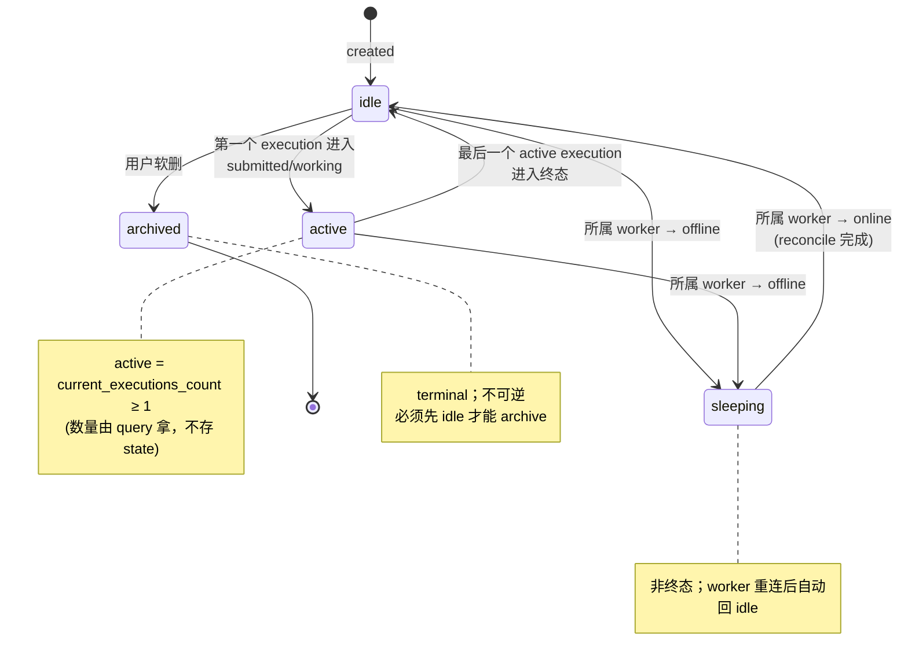

# AgentInstance 聚合（独立 AR）

> **DDD 战术层** · BC: Workforce · 聚合: AgentInstance（独立 AR）
>
> 设计依据：[ADR-0024 AgentInstance 一等公民化](../../../decisions/drafts/0024-agent-instance-first-class.md)

AgentInstance 把「agent」从 v1 的隐式概念（仅 `TaskExecution.agent_kind` 类型枚举）升级为**持久身份 + 配置 + 状态机**的一等公民。

> **本聚合不管「怎么干活」** —— per-execution 运行时 / shim / workspace 物理 / Agent CLI 子进程 / JSONL 解析 / Artifact / kill 进程级机制都归 [TaskRuntime BC](../task-runtime/02-task-execution.md)。AgentInstance 是逻辑身份层，**不是进程**。

---

## § 1. AgentInstance 状态机



---

## § 2. 模型

```
agent_instance (
  id                ULID         -- 主键
  name              str          -- 全局唯一（v2 单租户），用户起名
  agent_cli         enum         -- claude-code | codex | opencode | ...
  worker_id         FK → workers (v2 不可变；E2 后允许迁移)
  config            JSON         -- { instructions_ref?, mcp_config?, skills?, ... }
                                 -- G1 约定 instructions（home_dir/instructions.md）
                                 -- G4 约定 mcp_config（MCP 标准 schema + SecretRef，详 § 4）
                                 -- G5 约定 skills（home_dir/skills/，后续 ADR 填）
  max_concurrent    int?         -- null = 无 cap；=1 → 严格 1:1
  state             enum         -- idle | active | sleeping | archived
  created_at        ISO8601 TEXT
  archived_at       ISO8601 TEXT, nullable
  version           int          -- 乐观锁
)

UNIQUE INDEX agent_instance_name_uq (name)
INDEX agent_instance_worker_state_idx (worker_id, state)
```

### 计算字段（不存 DB）

| 字段 | 计算 |
|---|---|
| `home_dir` | `~/.agent-center-worker/agents/<id>/`（worker 本地约定路径）|
| `current_executions_count` | `SELECT count(*) FROM task_executions WHERE agent_instance_id=? AND status IN ('submitted','working','input_required')` |

---

## § 3. Home Directory（持久工作目录）

### 3.1 路径约定

```
~/.agent-center-worker/agents/<agent_instance_id>/
   ├─ instructions.md     # G1: agent-level system prompt 片段
   └─ notes/              # 用户随意；agent 进程在 execution 期间只读
```

`skills/` 等结构留口给 [G5](../../../drafts/v2-kickoff-2026-05-22.md) 后续讨论。

**G4 已定的 `mcp_config.json` 详细**：

```
~/.agent-center-worker/agents/<agent_instance_id>/
   ├─ instructions.md
   ├─ mcp_config.json          # G4: MCP 标准 schema + SecretRef（无明文）
   ├─ mcp_config.runtime.json  # G4: 派单时由 daemon just-in-time 生成（含明文，mode 0600）；execution 后 unlink
   ├─ skills/                  # G5（后续讨论）
   └─ notes/                   # 用户随意
```

详见 [ADR-0027 MCP per-agent 注入](../../../decisions/drafts/0027-mcp-per-agent-injection.md) + [ADR-0026 SecretManagement BC](../../../decisions/drafts/0026-user-secret-management-bc.md)。

### 3.2 写权限约束

- **execution 期间**：agent 进程对 home_dir **只读**
- **between-execution**：worker daemon 或用户可写（更新 instructions、装 skill）
- 多 execution 并发跑同一 agent 时不可能同时变更 home，避免文件 race

### 3.3 跟 worktree 的关系

worktree（[task-runtime/02-task-execution § 8](../task-runtime/02-task-execution.md)）是 per-execution 临时沙箱；home_dir 是持久。worker daemon 在 prompt-assembly 阶段把 `home_dir/instructions.md` 内容**叠加进 prompt 层次**（详见 [agent-harness/01-prompt-assembly.md](../agent-harness/01-prompt-assembly.md)），而不是把 home 文件挂到 worktree 内。两个目录互不污染。

---

## § 4. 并发模型（1:N + 两层 cap）

### 4.1 并发上限

| Cap | 落处 | 默认 |
|---|---|---|
| Worker 层 | `Worker.concurrency.per_agent_type` | 2（单 CLI 类型最大并跑） |
| AgentInstance 层 | `AgentInstance.max_concurrent` | null = 不另设上限，受 Worker 层兜底 |

### 4.2 派单校验链

DispatchService（[task-runtime/00-overview § 3.1](../task-runtime/00-overview.md)）派单时按顺序校验：

```
dispatch (task → agent_instance_id) {
  1. agent_instance.state ∈ {idle, active} ?
       否 → NACK reason=agent_unavailable
  2. agent_instance.agent_cli ∈ worker.capabilities[detected ∧ enabled] ?
       否 → NACK reason=capability_missing
  3. count(active executions on agent_instance) < min(
         worker.concurrency.per_agent_type,
         agent_instance.max_concurrent ?? ∞
     ) ?
       否 → NACK reason=agent_at_capacity（supervisor 决定排队 or 派给别的 agent）
  全过 → 起新 TaskExecution + DispatchEnvelope 下发
}
```

### 4.3 同 agent 并行 execution 的边界

| 项 | 共享 / 不共享 |
|---|---|
| `home_dir/instructions.md` | ✅ 读共享（execution 期间只读，不存在 race）|
| `home_dir/mcp_config.json` | ✅ 读共享（G4 后定）|
| `home_dir/skills/` | ✅ 读共享（G5 后定）|
| `home_dir/notes/` | ⚠️ 读共享，写仅 between-execution |
| worktree | ❌ 各自独立（per-execution shim 沿用）|
| agent in-process working memory | ❌ 各自独立 |
| TaskExecution trace / log | ❌ 各自独立（一条 trace 一个 execution）|

---

## § 5. AgentInstance 跟 Worker 的状态联动

| Worker 状态变化 | AgentInstance 自动行为 |
|---|---|
| worker → online | 该 worker 上 state=sleeping 的 agent 全部 → idle |
| worker → offline | 该 worker 上 state ∈ {idle, active} 的 agent 全部 → sleeping |

实现：监听 `worker.online` / `worker.offline` 事件，在 Workforce BC 内部触发 AgentInstance state 转移（同事务双写或异步事件驱动，详见 [00-overview § 3.x AgentInstanceLifecycleService](00-overview.md)）。

---

## § 6. CLI

| 命令 | 用途 |
|---|---|
| `agent-center agent create --name=<n> --worker=<id> --agent-cli=<cli> [--max-concurrent=<n>]` | 创建（也是 G2 `agent:create` 协议的实现底）|
| `agent-center agent list [--worker=<id>] [--state=<s>]` | 列 |
| `agent-center agent show <name>` | 详情（含 current_executions_count）|
| `agent-center agent config set <name> <key>=<value>` | 改 config / max_concurrent（长连推送给 worker 重拉本机 home_dir 状态？暂不做；config 变更生效以 between-execution 为准）|
| `agent-center agent archive <name>` | 软删（要求 state=idle；active 时拒绝）|

> **创建命令的同机要求**：v2 默认 center 同机 / 远程均可（CLI 走 admin endpoint）。G2 `agent:create` 飞书卡片协议是基于此 endpoint 的 UX 包装。

---

## § 7. AgentInstance Invariants

1. **name 全局唯一**（v2 单租户；UNIQUE INDEX 强制；冲突时 create 返回 ErrAgentInstanceNameTaken）
2. **worker_id 不可变**（v2 范围；改 worker = 走 archive + 新建流程；E2 / v3 加迁移路径）
3. **archived 终态不可逆**
4. **state 跟 worker 联动**（详 § 5）
5. **home_dir 在 execution 期间对 agent 进程只读**（应用层约束；agent 想沉淀经验走 supervisor memory [ADR-0012](../../../decisions/0012-memory-file-based.md) 或 task artifact 渠道）
6. **archived 禁止 active / sleeping**：必须先 idle 才能 archive
7. **max_concurrent ≥ 1**（如设值；null 表"不另设"）

---

## § 8. 创建路径（v2 范围）

唯一路径：**CLI `agent-center agent create ...`**（远程 endpoint）。

未来 [G2 `agent:create` 协议](../../../drafts/v2-kickoff-2026-05-22.md) 走飞书卡片做 UX 包装，但调用的是同一 endpoint + 同一 Factory。

---

## § 9. 跨聚合关系

| 关系 | 强弱 | 备注 |
|---|---|---|
| `AgentInstance → Worker`（`agent_instance.worker_id`）| 强 / v2 不可变 | tx 同步；删 Worker 前置要求该 worker 上所有 agent 都 archived |
| `TaskExecution → AgentInstance`（`task_execution.agent_instance_id`）| 强 / 不可变 | 派单契约字段；冻结 |
| `AgentInstance ↔ Project` | **无直接关联** | dispatch 时由 supervisor 选 (agent, task with project) 组合 |
| `AgentInstance.agent_cli` 跟 `Worker.capabilities` | 派单时校验 | dispatch 阶段要求 agent_cli ∈ worker.capabilities[detected ∧ enabled] |

---

## § 10. 事件

| 事件 | 触发 | payload 关键字段 |
|---|---|---|
| `agent_instance.created` | 新建 | id, name, agent_cli, worker_id, config |
| `agent_instance.config_updated` | 改 config / max_concurrent | id, changed_fields, by |
| `agent_instance.activated` | idle → active | id |
| `agent_instance.idle` | active → idle | id |
| `agent_instance.sleeping` | worker offline 联动 | id, worker_id |
| `agent_instance.awakened` | worker online 联动 | id, worker_id |
| `agent_instance.archived` | 用户软删 | id, archived_by |

---

## § 11. References

- [ADR-0024 AgentInstance 一等公民化](../../../decisions/drafts/0024-agent-instance-first-class.md)
- [ADR-0026 SecretManagement BC](../../../decisions/drafts/0026-user-secret-management-bc.md)（config.mcp_config 内嵌 SecretRef）
- [ADR-0027 MCP per-agent 注入](../../../decisions/drafts/0027-mcp-per-agent-injection.md)（config.mcp_config schema）
- [00-overview.md](00-overview.md) — BC 入口（含 AgentInstanceRepository / Domain Services）
- [01-worker.md](01-worker.md) — Worker AR（capabilities 字段 + agent 状态联动）
- [task-runtime/02-task-execution.md § 5](../task-runtime/02-task-execution.md) — TaskExecution.agent_instance_id 字段 + DispatchEnvelope v2 schema
- [agent-harness/01-prompt-assembly.md](../agent-harness/01-prompt-assembly.md) — prompt 层加 agent-level instructions + MCP 注入流程
- [secret-management/00-overview.md](../secret-management/00-overview.md) — SecretManagement BC
- [竞品报告 § 3.7](../../../../research/competitive-analysis-2026-05-21.md) — Slock Computer + Agent 模型对照
