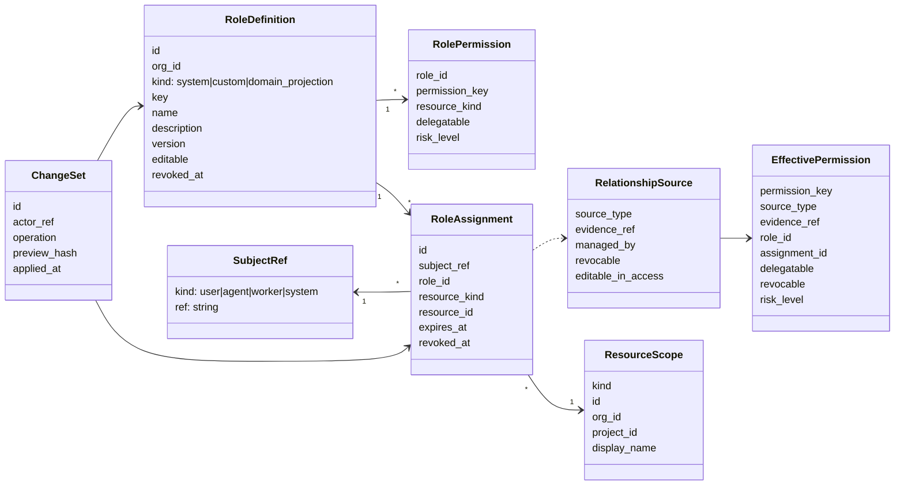

# Access 管理页与角色治理改造方案

状态：Proposal for implementation
日期：2026-08-17
基线：`origin/main@38577243933f219e34c1c34b14f0033f16852d56`
关联文档：[统一权限契约与现状冻结](unified-permission-contract.md)

## 1. 结论摘要

`/organizations/{org}/access` 不应继续做成一张平铺权限表。当前授权模型已经进入 Phase 1
统一授权层：`authorization.Service` 统一执行 check / explain / effective / batch 操作，但真实来源
仍包括 legacy membership、team policy、worker binding、admin bearer scope 和显式 role assignment。

因此 Access 管理页的主模型应从“权限列表”改为：

```text
Subject -> RelationshipSource / Role -> ResourceScope -> EffectivePermission
```

核心交付：

1. **模型层**：把 `RoleDefinition`、`RoleAssignment`、`RelationshipSource`、`EffectivePermission`
   和 `ChangeSet` 分清楚，明确哪些关系可在 Access 页修改，哪些只能跳回业务来源修改。
2. **后端层**：新增面向 UI 的 Access Graph read model 和 role / assignment / explain / preview API，
   让前端消费稳定投影，而不是直接拼多个底层权限接口。
3. **前端层**：把 Access 页面拆成 `Overview`、`Subjects`、`Roles`、`Resources`、`Matrix`、`Audit`
   六个视图。默认从 Subjects 进入，展示完整关系链、来源证据、可撤销性和修改影响预览。

第一阶段只要求把现有授权事实展示清楚并安全操作显式授权，不要求把所有 legacy membership
迁移进 `authorization_role_assignments`。

## 2. 当前问题

### 2.1 用户看不出“为什么有权限”

现有页面容易把以下事实混到同一层：

- `subject`：被授权或被检查的主体，例如 `user:<identity_id>`、`agent:<member_id>`、
  `worker:<worker_id>`、`system`。
- legacy/domain role：例如 `members.role=owner/admin/member`、`pm_project_members.role`、
  `team_members`。
- explicit role assignment：`authorization_role_assignments(subject_ref, role_id, resource_scope)`。
- effective permission：最终派生出的可执行权限。

用户看到一个 permission key 时，不能稳定回答：

- 谁拥有它？
- 因为什么关系拥有它？
- 作用在哪个 org / project / team / file / conversation / agent？
- 这个权限能不能在 Access 页撤销？
- 撤销会不会被另一条来源继续授予？

### 2.2 Role 和 Subject 没有在 UI 上解耦

当前模型里 role 本应独立于 subject 定义：

```text
RoleDefinition / RolePermission  定义一组权限
RoleAssignment                   subject + role + resource scope
```

但 UI 如果只围绕 subject 做 grant/revoke，就会弱化 role definition 的独立性；如果只展示 role
列表，又会掩盖 legacy membership 仍是权威来源的事实。

### 2.3 缺少可操作边界

有些关系可以在 Access 页修改：

- custom role definition；
- explicit role assignment；
- role assignment expiry；
- custom role permission set。

有些关系当前不能在 Access 页直接修改：

- org member role，应跳到 Members；
- project member role，应跳到 Project Members；
- team membership / curator policy，应跳到 Team settings / Memory policy；
- worker owner binding / admin bearer scope，多数应作为诊断信息。

页面必须直接表达这些边界，否则用户会误以为所有 effective permission 都能从 Access 页撤销。

### 2.4 缺少修改前影响预览

角色权限变化是高影响操作。编辑一个 custom role 可能影响多个 user / agent / scope；撤销一个
assignment 也可能因为 legacy source 仍存在而不会真正移除 permission。没有 preview 会导致
操作者无法判断是否安全。

## 3. 目标与非目标

### 3.1 目标

1. Access 页能解释 `subject -> role/source -> scope -> effective permission` 的完整链路。
2. Role definition 独立于 subject 创建、编辑、版本化和审计。
3. Assignment 负责把 role 绑定给 subject 和 resource scope。
4. Legacy/domain source 被显式投影为只读关系，保留现有业务表为权威来源。
5. 每个 effective permission 都带 source、evidence、risk、delegatable、revocable、managed_by。
6. 所有 grant / revoke / edit role 在 apply 前先 preview。
7. denied 也可解释，能看到 resource resolve、permission registry、guard 和 deny reason。
8. Audit 能按 subject / role / resource / change set 反查。

### 3.2 非目标

1. 不在第一阶段迁移 `members`、`pm_project_members`、`team_members` 等 legacy 表。
2. 不把 runtime capability 当作 access grant。
3. 不让普通 UI 修改 system role 的基础语义。
4. 不把 Access 页变成所有业务设置页的替代品；legacy/domain 关系仍跳转到业务来源修改。
5. 不在第一阶段做跨 org role 复用；custom role 先限定在单 org。

## 4. 当前授权基线

Phase 1 的真实基线：

- `authorization.Service` 是统一判定入口。
- `permission_definitions` 定义 permission key 与 resource kind 的适配关系。
- `authorization_roles` 和 `authorization_role_permissions` 定义 system / custom role 的权限集合。
- `authorization_role_assignments` 是显式 role assignment overlay。
- legacy 表仍是大量权限的权威来源。

当前主要 source：

| Source | 权威结构 | 示例权限 |
|---|---|---|
| `org_role` | `members.role` | `org.read`、`org.settings.manage`、`org.member.role.manage` |
| `project_member` | `pm_project_members` | `project.read`、task / issue / plan 访问 |
| `team_member` | `team_members` | `team.read`、`team.memory.propose` |
| `team_memory_policy` | `team_memory_policy_curators` | `team.memory.review` |
| `conversation_participant` | `conversations.participants` | conversation read/write |
| `file_scope` | `file_references` | file read/download |
| `admin_token_scope` | `admin_tokens.scopes_json` | internal admin / worker routes |
| `worker_owner` | worker token owner | worker self operations |
| `agent_worker_binding` | `agents.worker_id` / identity member | agent runtime-bound operations |
| `custom_role` | `authorization_role_assignments` | explicit overlay permissions |

核心不变量：

- `system` subject 直接 allow，仅用于迁移、系统事件和内部受控路径。
- 普通 subject 必须先 resolve resource 到 org 边界；跨 org 资源 fail closed。
- permission key 必须存在且适用于 resource kind。
- 显式授权必须同 org，subject 必须是 joined org member。
- agent 不允许被授予高风险 org/admin/secret 类权限。
- grant / revoke 需要 actor 拥有 delegatable 权限。
- last owner guard 必须阻止移除最后一个 org owner。

## 5. 目标模型变更

### 5.1 核心概念



### 5.2 Role kind

| Kind | 来源 | 可编辑性 | UI 行为 |
|---|---|---|---|
| `system` | seed role / code-owned defaults | 默认只读 | 展示 definition、usage、audit；普通 UI 不改权限集合 |
| `custom` | org 内自定义 role | 可编辑 | 支持 create / edit / delete / assign / revoke / version diff |
| `domain_projection` | legacy/domain source 投影 | 只读 | 展示为 role-like relationship；修改跳到业务页 |

### 5.3 Permission metadata

`permission_definitions` 需要补充或投影以下 metadata：

```ts
type PermissionMetadata = {
  key: string
  category: "org" | "project" | "team" | "conversation" | "file" |
            "agent" | "worker" | "secret" | "admin_token" | "runtime"
  resource_kinds: string[]
  action: string
  description: string
  risk_level: "low" | "medium" | "high" | "critical"
  grantable_subject_kinds: Array<"user" | "agent" | "worker">
  delegatable_allowed: boolean
}
```

权限 registry 是 UI 选择器和 lint 的权威来源。前端不能从 key 字符串猜 category、risk 或 subject
kind 限制。

### 5.4 Effective relationship

Access Graph 面向 UI 的最小关系单元：

```ts
type AccessRelationship = {
  id: string
  subject_ref: SubjectRef
  source_type: string
  source_label: string
  role?: RoleSummary
  scope: ResourceScope
  evidence_ref: string
  managed_by: {
    surface: "access" | "members" | "project_settings" | "team_settings" |
             "team_memory_policy" | "system" | "admin_token" | "worker"
    href?: string
  }
  editable_in_access: boolean
  revocable: boolean
  effective_permissions: EffectivePermission[]
}
```

这里 `editable_in_access=false` 不表示没有权限，而是表示 Access 页不是权威修改入口。

### 5.5 ChangeSet

所有批量或高影响修改都先产生 preview，再 apply：

```text
preview request -> preview_hash -> human confirmation -> apply(preview_hash)
```

ChangeSet 保存：

- actor；
- operation；
- before / after diff；
- impacted subjects；
- impacted resource scopes；
- added / removed effective permissions；
- warnings / blockers；
- audit event ids。

## 6. 后端功能设计

### 6.1 Read model API

#### `GET /api/orgs/{org}/access/graph`

用途：Access 页面主数据源。支持 subject-first 与 resource-first 两种查询。

Query：

```text
subject_ref?
resource_kind?
resource_id?
source_type?
risk_level?
include_system=false
include_bearer=false
limit=100
cursor?
```

响应：

```json
{
  "org_id": "org-...",
  "generated_at": "2026-08-17T08:00:00Z",
  "subjects": [
    {
      "subject_ref": "user:user-123",
      "display_name": "Alice",
      "kind": "user",
      "summary": {
        "relationships": 4,
        "custom_roles": 1,
        "high_risk_permissions": 2,
        "editable_relationships": 1
      },
      "relationships": [
        {
          "id": "rel:members:member-123",
          "source_type": "org_role",
          "source_label": "Org owner",
          "scope": {"kind": "org", "id": "org-...", "display_name": "ooo"},
          "evidence_ref": "members:member-123",
          "managed_by": {"surface": "members", "href": "/organizations/ooo/members"},
          "editable_in_access": false,
          "revocable": false,
          "effective_permissions": [
            {
              "permission_key": "org.settings.manage",
              "risk_level": "high",
              "delegatable": true,
              "revocable": false,
              "source_type": "org_role",
              "evidence_ref": "members:member-123"
            }
          ]
        }
      ]
    }
  ],
  "page": {"next_cursor": null}
}
```

要求：

- 不返回无法解释来源的 permission。
- 每个 relationship 至少包含一个 evidence ref。
- legacy source 的 display / href 在后端确定，前端不拼表名。

#### `GET /api/orgs/{org}/access/subjects`

用途：左侧 subject list 和搜索。

聚合：

- org users；
- org agents；
- workers；
- admin tokens；
- system subject 默认不展示，仅 debug 模式展示。

#### `GET /api/orgs/{org}/access/resources`

用途：resource-first 搜索入口。

支持 resource kind：

- org；
- project；
- team；
- task / issue / plan；
- conversation；
- file；
- agent；
- worker；
- admin token；
- secret；
- blob / git。

### 6.2 Role API

#### `GET /api/orgs/{org}/access/roles`

返回三类 role：

- system roles；
- custom roles；
- domain projected roles。

每个 role 带：

- permissions；
- editable；
- assignable；
- usage count；
- latest version；
- risk summary。

#### `POST /api/orgs/{org}/access/roles`

创建 custom role。请求：

```json
{
  "key": "project-maintainer",
  "name": "Project Maintainer",
  "description": "Can manage project work without changing org membership.",
  "permissions": [
    {"permission_key": "project.read", "resource_kind": "project", "delegatable": false},
    {"permission_key": "project.task.manage", "resource_kind": "project", "delegatable": false}
  ]
}
```

校验：

- key 在 org 内唯一；
- permission key 必须存在；
- resource kind 必须匹配 permission registry；
- agent-ineligible high-risk permission 需要标记为不可授予 agent；
- delegatable 只能在 registry 允许时开启。

#### `PATCH /api/orgs/{org}/access/roles/{role_id}`

修改 custom role definition。必须走 preview：

```text
PATCH preview -> impact diff -> apply
```

第一阶段可以实现为两个 endpoint：

- `POST /roles/{id}/preview`;
- `POST /roles/{id}/apply`.

#### `DELETE /api/orgs/{org}/access/roles/{role_id}`

只允许删除无 active assignment 的 custom role。若存在 usage，返回 usage 列表并要求先 revoke /
migrate assignments。

### 6.3 Assignment API

#### `POST /api/orgs/{org}/access/assignments/preview`

请求：

```json
{
  "role_id": "role-...",
  "subjects": ["user:user-123", "agent:agent-456"],
  "scope": {"kind": "project", "id": "project-..."},
  "expires_at": null
}
```

响应必须包含：

- allowed / blocked；
- added relationships；
- added effective permissions；
- warnings；
- blockers；
- audit preview；
- idempotency key / preview hash。

Blocker 示例：

- `subject_not_org_member`；
- `permission_not_applicable_to_scope`；
- `agent_high_risk_permission_denied`；
- `cross_org_scope`；
- `actor_not_delegatable`。

#### `POST /api/orgs/{org}/access/assignments/apply`

请求带 `preview_hash`，apply 时重新校验：

- actor 权限；
- role version；
- subject membership；
- resource scope；
- idempotency；
- blocker。

若 preview 后 role definition 变更，返回 `preview_stale`。

### 6.4 Revoke API

#### `POST /api/orgs/{org}/access/revoke/preview`

输入可以是 relationship id、assignment id 或 role usage selector。

响应必须区分：

- 可以直接 revoke 的 explicit assignment；
- legacy/domain source，不可在 Access 页 revoke；
- revoke 后权限仍由其他 source 保留；
- last owner guard；
- role version / assignment 已变化。

#### `POST /api/orgs/{org}/access/revoke/apply`

只处理 explicit assignment 和 custom role 相关修改。legacy/domain source 返回 `managed_elsewhere`。

### 6.5 Explain API

#### `POST /api/orgs/{org}/access/explain`

请求：

```json
{
  "subject_ref": "agent:agent-b5036ea8",
  "permission": "team.memory.review",
  "resource": {"kind": "team", "id": "team-f5a633d6"}
}
```

响应：

```json
{
  "allowed": true,
  "decision": {
    "source": "team_memory_policy",
    "reason": "subject is configured as memory curator for team policy",
    "evidence_ref": "team_memory_policy_curators:team-f5a633d6/agent:agent-b5036ea8"
  },
  "steps": [
    {"name": "normalize_subject", "status": "pass"},
    {"name": "resolve_resource", "status": "pass", "org_id": "org-..."},
    {"name": "permission_registry", "status": "pass"},
    {"name": "derive_legacy_effective", "status": "pass"},
    {"name": "derive_assignment_effective", "status": "skip"},
    {"name": "match_permission", "status": "pass"}
  ]
}
```

Denied response 也必须带 steps，不能只返回 `403`。

### 6.6 Audit API

#### `GET /api/orgs/{org}/access/audit`

Filters：

```text
subject_ref?
role_id?
resource_kind?
resource_id?
change_set_id?
operation?
actor_ref?
from?
to?
cursor?
```

要求：

- role editor、subject drawer、resource drawer 都能跳到相关 audit；
- audit event 不保存 secret 明文；
- before / after diff 使用稳定 JSON shape。

## 7. 前端交互设计

### 7.1 页面结构

```text
Access
  Overview
  Subjects
  Roles
  Resources
  Matrix
  Audit
```

默认进入 `Subjects`，因为多数问题来自“这个人/agent 到底拥有什么权限”。

### 7.2 Overview

展示治理摘要：

- high-risk permissions；
- custom roles；
- explicit assignments；
- stale / expiring assignments；
- agent blocked high-risk attempts；
- admin token scopes；
- recent changes；
- lint warnings。

Overview 不承担复杂编辑，只提供跳转。

### 7.3 Subjects

布局：

```text
left: subject list / filters / summary chips
right: selected subject relationship tree
drawer: explain / audit / edit assignment
```

Subject 列表字段：

- display name；
- kind；
- org role summary；
- project count；
- team count；
- custom role count；
- high-risk count；
- last changed。

Relationship tree 固定三层：

```text
Source / Role
  Scope
    Effective permissions
```

示例：

```text
Alice
  Org owner                         Managed in Members
    ooo
      org.read                      low    delegatable
      org.settings.manage           high   delegatable
      org.member.role.manage        high   delegatable

  Custom role: Project Maintainer   Editable here
    project: agent-center
      project.read                  low
      project.task.manage           medium
```

每个 permission cell：

- source badge；
- risk badge；
- delegatable；
- revocable；
- `Why?` action；
- audit jump。

### 7.4 Roles

三段：

1. System roles：只读，展示 permission definition 和 usage。
2. Custom roles：可创建、编辑、删除、查看 usage、分配 subject。
3. Domain projected roles：只读映射，例如 Org owner、Project member、Team member、Memory curator。

Role detail：

- definition；
- permission groups；
- usage；
- version history；
- audit timeline；
- impact preview。

Role editor：

- permission 按 category / resource kind / action 分组；
- 高风险权限显示明确警示；
- delegatable 独立开关；
- agent-ineligible permission 在 agent assignment preview 中 blocked；
- 保存前必须 preview。

### 7.5 Resources

resource-first 排查入口。选择一个 project / team / conversation / file / agent 后展示：

```text
Who can access this resource?
  subject -> source/role -> permissions
```

该视图用于回答：

- 谁能看这个 project？
- 哪些 agent 能读这个 team memory？
- 哪些 subject 能访问这个 conversation？
- 某个 file 是被哪个 scope 引用导致可访问？

### 7.6 Matrix

Matrix 只做概览，不做主要编辑入口。

维度：

- rows：subject；
- columns：resource category 或 risk category；
- cells：有/无、高风险数、custom role 数。

点击 cell 跳到 filtered graph。避免把所有 permission key 横向铺开，移动端不可用。

### 7.7 Audit

Audit 必须支持：

- subject filter；
- role filter；
- resource filter；
- change set filter；
- actor filter；
- operation filter；
- diff preview。

从任何 subject / role / resource drawer 都能跳到 filtered audit。

### 7.8 Preview modal

所有修改走 preview：

```text
Before
After
Added effective permissions
Removed effective permissions
Unaffected permissions still granted by another source
Warnings
Blockers
Audit events to be written
```

确认按钮必须表达操作对象，例如：

- `Assign role to 3 subjects`;
- `Revoke 1 assignment`;
- `Apply role permission changes`;
- `Delete unused role`。

### 7.9 移动端

移动端采用 drill-down：

```text
Subjects list -> Subject detail -> Relationship detail -> Permission explain
Roles list -> Role detail -> Usage / Edit
Resources list -> Resource detail -> Subject access detail
```

不以宽表为主，不在小屏上强行展示 Matrix 编辑。

## 8. 分阶段落地

### P0：关系可视化与安全操作边界

目标：让现有权限关系看得懂，不误导用户。

模型：

- `RelationshipSource` 投影；
- `EffectivePermission` metadata；
- `managed_by` / `revocable` / `editable_in_access`；
- permission risk metadata 的最小映射。

后端：

- `GET /access/graph`；
- `GET /access/subjects`；
- `GET /access/roles` 只读；
- `POST /access/explain`；
- `POST /assignments/preview/apply` 针对 custom role assignment；
- `POST /revoke/preview/apply` 针对 explicit assignment；
- audit filter。

前端：

- Subjects tab；
- relationship tree；
- source / risk / revocable badges；
- Why drawer；
- preview modal；
- legacy source 跳转。

验收：

- org owner、project member、team member、team memory curator、custom role、worker binding、admin token
  均能展示来源；
- 每条权限都有 evidence；
- legacy 权限不可在 Access 页误撤销；
- custom role assignment 可 preview / apply / revoke；
- denied explain 能展示 reason。

### P1：Role 治理

目标：让 custom role 真正独立定义和维护。

模型：

- role version；
- role usage；
- role diff；
- stale preview hash；
- role lint。

后端：

- custom role CRUD；
- role edit preview / apply；
- role usage；
- role diff；
- lint。

前端：

- Roles tab；
- role editor；
- usage list；
- version history；
- assign role wizard；
- delete role guard。

验收：

- 修改 custom role 前能看到影响 subject / scope / permissions；
- role 被使用时不能直接删除；
- version diff 可读；
- stale preview 被拒绝。

### P2：Resource-first、风险治理与批量回滚

目标：提升排查、审计和批量治理效率。

模型：

- resource access relation；
- change set；
- rollback preview；
- risk summary。

后端：

- resource search；
- resource-first subjects；
- change set audit；
- rollback preview；
- risk summary。

前端：

- Resources tab；
- Matrix tab；
- Risk summary；
- audit deep links；
- bulk operations。

验收：

- 能从任意 resource 回答“谁能访问，为什么”；
- bulk operation 有 change set 和反向预览；
- high-risk 权限可按 subject / role / resource 追踪。

## 9. 数据与迁移策略

### 9.1 第一阶段不迁移 legacy source

P0 不移动 `members`、`pm_project_members`、`team_members`、`team_memory_policy_curators` 等权威数据。
Access Graph 只做投影：

```text
legacy table row -> RelationshipSource -> EffectivePermission[]
```

好处：

- 行为不变；
- 可回滚；
- 不需要一次性解决所有历史数据一致性；
- 可以先验证 UI 和 explain 语义。

### 9.2 新增数据只服务 custom role 与 change set

如现有 `authorization_roles`、`authorization_role_permissions`、`authorization_role_assignments`
已满足 custom role 基础能力，P0 可先不增加表。

P1/P2 可能需要：

- `authorization_role_versions`；
- `authorization_change_sets`；
- `authorization_change_set_items`；
- permission metadata 扩展列或独立 metadata table。

所有 schema 改动必须 additive；不得删除 legacy 表或改变 legacy 写路径。

### 9.3 兼容 API

现有 `/api/access/*` 和 `/api/permissions/*` 保持兼容：

- `/permissions/*` 仍是统一授权判定契约；
- `/access/*` 逐步变成 workspace / UI projection；
- 旧前端页面可在 feature flag 后切换到 graph API；
- 没有迁移完成前，不移除旧 response 字段。

## 10. 权限与安全规则

1. 只有拥有 delegatable 权限的 actor 才能 grant / revoke 对应 permission。
2. custom role 不能绕过 permission registry。
3. agent 不能被授予高风险 org/admin/secret 权限。
4. system role 普通 UI 只读。
5. domain projected role 只读，修改跳回业务来源。
6. last org owner guard 必须在 preview 和 apply 都执行。
7. preview 不能替代 apply 时的再次校验。
8. audit 必须记录 actor、request id、idempotency key、before / after diff。
9. 所有跨 org resource scope fail closed。
10. admin token / worker binding 默认收起，避免普通操作者误当成业务 role。

## 11. 测试计划

### 11.1 后端单元与集成

- `authorization`：
  - role definition validation；
  - role assignment same-org guard；
  - agent high-risk denial；
  - last owner revoke denial；
  - permission resource kind mismatch；
  - stale preview hash；
  - custom role edit impact。

- `webconsole/api`：
  - graph API 包含 legacy sources；
  - graph API 包含 custom assignment；
  - explain allowed；
  - explain denied；
  - assignment preview / apply / replay；
  - revoke preview for legacy source returns `managed_elsewhere`；
  - audit filters。

- migration：
  - empty DB；
  - production-like DB；
  - repeated migration；
  - rollback-safe additive schema。

### 11.2 前端测试

- Subjects tab 渲染 relationship tree；
- source badge / risk badge / revocable state；
- Why drawer allowed / denied；
- legacy source 跳转；
- assignment preview modal；
- role editor permission grouping；
- stale preview error；
- resource-first view；
- mobile drill-down。

### 11.3 验收场景

1. human org owner：能看到 org owner 来源和高风险 org 权限；不可在 Access 页误删 legacy owner。
2. human project member：能看到 project scope 权限和 Project settings 跳转。
3. agent team member：能看到 team memory propose 权限。
4. agent memory curator：能看到 curator policy 来源和 `team.memory.review`。
5. custom role assignment：能 preview、apply、explain、revoke。
6. denied checker：agent 请求 high-risk org permission 显示 blocked reason。
7. resource-first：team 页面能反查所有有 team memory 权限的 subject。
8. audit：从 role detail 和 subject drawer 均能跳到同一 change set。

## 12. 风险与缓解

| 风险 | 影响 | 缓解 |
|---|---|---|
| Graph API 聚合过重 | Access 页面加载慢 | 分页、filter、默认不展开 system/bearer、按 subject/resource lazy load |
| legacy projection 与真实 check 不一致 | UI 误导 | projection 复用 `authorization.Service` 的 derivation 或同源 helper，并加 parity tests |
| role edit 影响面不清 | 误授权或误撤权 | 所有 role edit 必须 preview，并显示 before/after diff |
| 前端把 domain role 当 custom role 编辑 | 写入错误来源 | `managed_by` 和 `editable_in_access` 后端下发，前端只消费 |
| stale preview apply | race condition | preview hash 绑定 role version、assignment revision、actor 和 request |
| 权限 key 太多难选择 | role editor 不可用 | permission registry 按 category/resource/action 分组并支持搜索 |

## 13. Open questions

1. System role 是否允许 owner 在高级模式下 fork 为 custom role，而不是原地修改？
2. Custom role assignment 默认跟随 role latest，还是允许 pin role version？
3. Role definition 是否允许跨 project 复用但限制在 org 内，还是每个 resource kind 独立 role？
4. Admin token scope 是否纳入普通 Access 页面，还是只在 System / Admin Token 页面展示并从 Access 链接过去？
5. Bulk rollback 是直接执行反向 change set，还是只生成可审查的 rollback preview？

默认建议：

- system role 不原地编辑，只允许复制为 custom role；
- assignment 默认跟随 latest，P1 增加 version diff，P2 再考虑 pin；
- custom role 限定 org 内复用；
- admin token scope 在 Access 只做风险摘要和诊断链接；
- rollback 先只做 preview，不自动执行。

## 14. 推荐实施顺序

```text
P0.1 Access graph projection + backend parity tests
P0.2 Subjects tab + relationship tree + source badges
P0.3 Explain drawer + denied checker
P0.4 Assignment preview/apply/revoke for explicit custom role assignments
P0.5 Audit filters and legacy managed_elsewhere links
P1.1 Custom role CRUD + role editor
P1.2 Role usage + impact preview + version diff
P2.1 Resources tab + resource-first graph
P2.2 Matrix / risk summary / change set rollback preview
```

第一条交付线应避免重构底层授权语义，优先把现有事实正确投影出来。只要 P0 完成，
`/organizations/{org}/access` 就能回答当前最关键的产品问题：

```text
谁，通过什么关系，在什么范围，获得了哪些权限；这些权限哪些能在这里改，哪些必须去来源处改。
```
