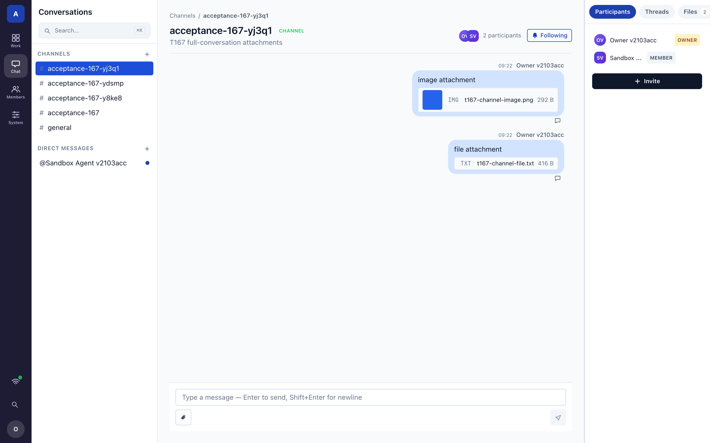
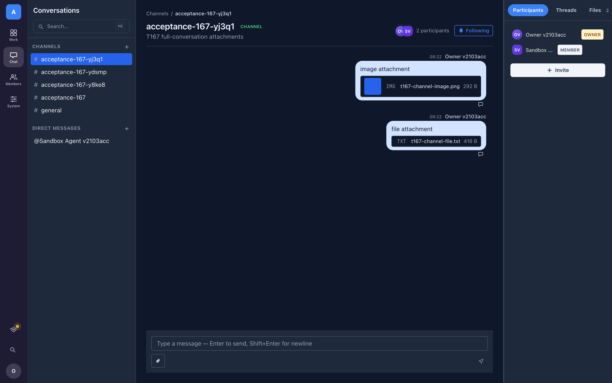
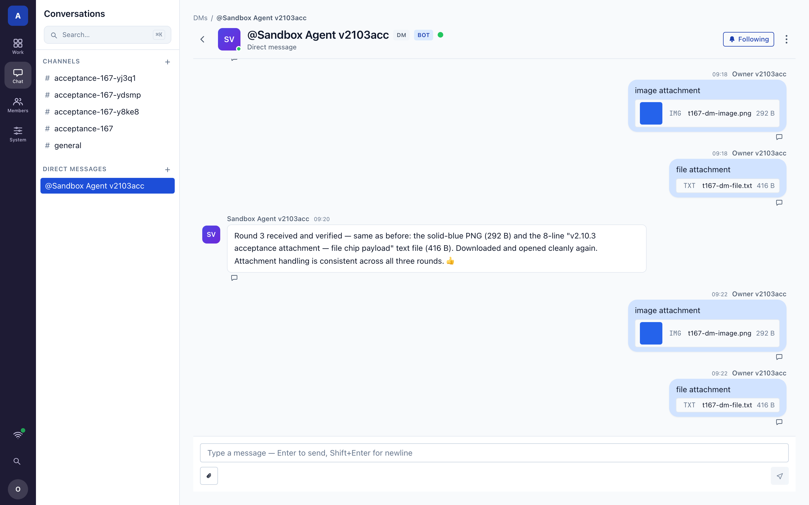
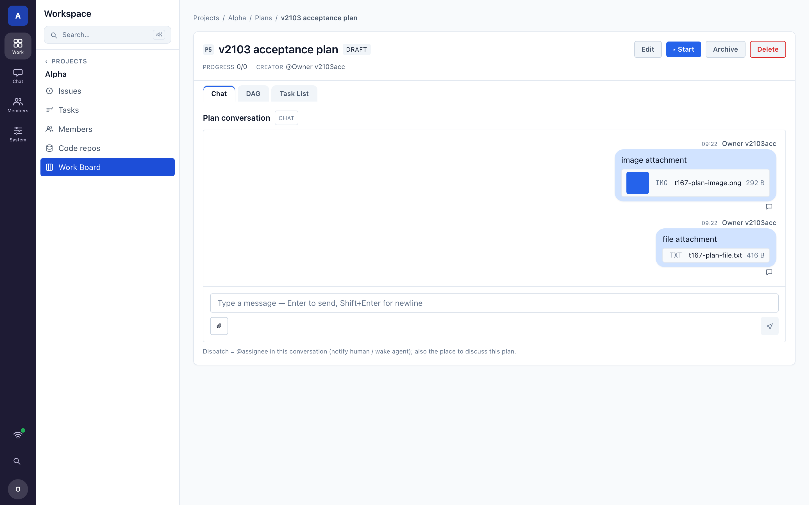
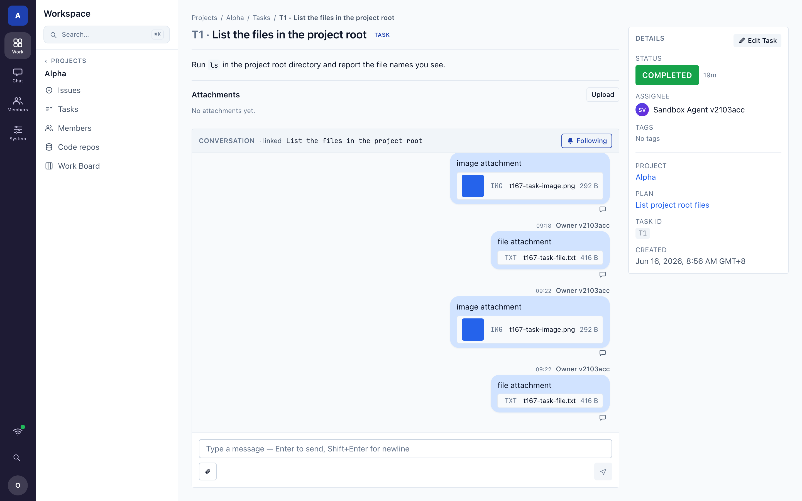
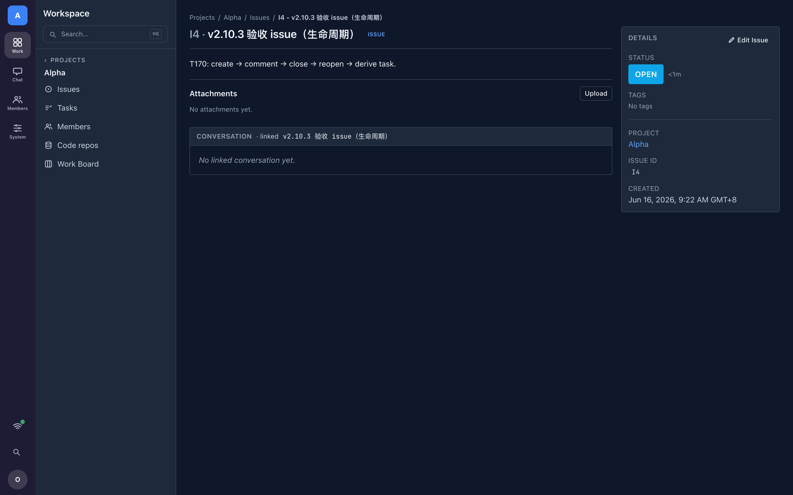
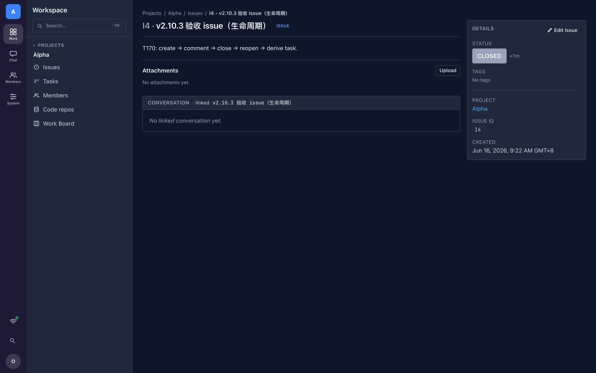
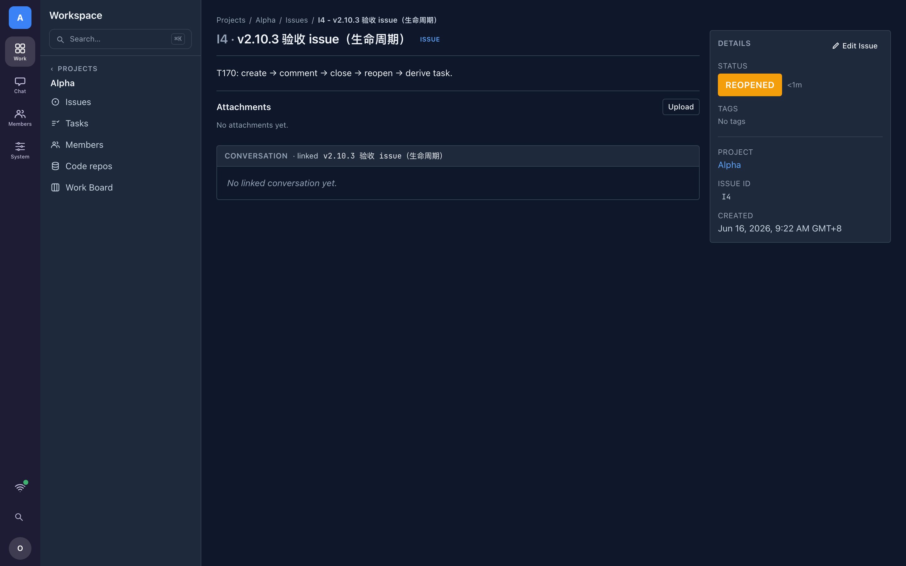

# v2.10.3 验收报告 · Tester2 · §3 run-real + §4 证据

> 任务 **T172**（org_ref）：`[v2.10.3 验收·Tester2] §3 run-real 真浏览器端到端 + §4 证据（T167 全会话附件 / T170 issue 生命周期）`
> 与 Tester1 §2（后端契约 / live shape / 边界，见 `../acceptance-tester1/`）互补：本报告管 **真 install + 真浏览器 + 全产品端到端 + 用户视角逐步截图**。

| 项 | 值 |
|---|---|
| 版本 | **v2.10.3** |
| 候选 | `origin/v2.10.3-int @ 80794195`（已过合并门 build/lint/test 全绿）|
| 安装 | **真 install** `agent-center install test-instance --with-agent`（复用真实安装代码路径，config 真含 `blob_store`，非手搓）|
| 实例 | isolated sandbox `v2103acc`，center web `:50288`，1 worker 控制连接，真 agent `agent-500419c3`（control-connected）|
| 浏览器 | 真 chromium（Playwright），1440×900 @2x；断言锚 **rendered/computed 真值**（`img.naturalWidth>0`、下载字节级匹配），非 class/源码 parity |
| 可复现脚本 | `tests/e2e/v2/capture-v2103.mjs`（起真实例→`/api` 播种→驱动 SPA 逐步截图→输出 `./evidence/`）|
| run-real 结果 | **26/26 PASS**（`./evidence/results.json`）|
| 结论 | **GO ✅** |

---

## 出口判定

| 域 | 子项 | 判定 |
|---|---|---|
| **T167 全会话附件** | Channel / DM / Plan chat / Task 讨论 ×（图片预览卡 + 文件卡 + 下载字节匹配 + 入口可达）| **GO ✅** |
| T167 both-mode | 预览卡 / 文件卡 light + dark | **GO ✅** |
| T167 agent 侧服务契约 | agent 在「参与的 plan」上传(scope=conversation)+下载、post_message 带附件；非参与/跨 org fail-closed | **GO ✅**（后端集成测试 4/4 PASS）|
| **T170 issue 生命周期** | create → 状态 close → reopen（真 Edit 弹窗，渲染态坐实）| **GO ✅** |
| T170 agent issue 工具 | create/update/close/reopen/comment/list/link-task/get（成功+权限+校验路径）| **GO ✅**（后端集成测试 19/19 PASS）|
| T170 人↔agent 同源 | agent 工具复用 Web Console 同一套 service 方法；issue 经同一 service 建、Console 可见 | **GO ✅** |

> **§1.1 假警排除（plan 下载 403）**：首轮用「[Built-in]」系统计划池会话（`created_by:system`、`participants:[]`）跑 plan-chat，人端下载 blob 返回 `403 no reachable reference`。复核为**参与者模型**而非 kind 缺陷——真实用户新建的 plan，创建者即被投影为 active participant（`participant projector`），上传+attach+下载 **200**（10/10 字节匹配，API 实测 + 真浏览器 4/4 绿）。built-in 池是空参与者的退化会话，非真实 plan-chat 用法。详见 §T167-plan。

---

## T167 — 所有会话收发图片/文件（红线核心）

四类会话**各自**走真实 nav 入口（点侧栏/面包屑导航到达，非直敲组件 URL，§4.2），用 composer 真实上传：图片→预览卡、文件→文件卡，下载端到端字节匹配。会话均为**人↔agent 共享**（seeded 真 agent 作为 participant 加入，见下 dark 图 Participants 面板 `Owner(OWNER) + Sandbox Agent(MEMBER)`）。

### 会话①：Channel 频道

- **步骤**：侧栏 Chat → 进频道 `acceptance-167-*`（owner+agent 2 participants）→ composer 选图片 `t167-channel-image.png` 发送 → 再选文件 `t167-channel-file.txt` 发送 → 点附件链接下载。
- **期望**：图片走预览卡（真渲染、可点开）；文件走文件卡（`TXT` 型标 + 文件名 + 大小）；下载 200、字节与上传一致。
- **实测**：✅ 预览 `naturalWidth=120`，下载 `200 bytes=292/292`；文件卡 `chip="TXT"`，下载 `200 bytes=416/416`。



**both-mode（命门：预览卡/文件卡颜色对比）—— light + dark：**

| light | dark（右栏 Participants 证人↔agent 共享）|
|---|---|
|  |  |

### 会话②：DM 私信

- **步骤**：与真 agent `Sandbox Agent v2103acc` 的 DM → composer 上传图片 + 文件 → 下载。
- **期望/实测**：✅ 图片预览 `naturalWidth=120` 下载 `200 bytes=292/292`；文件卡 `TXT` 下载 `200 bytes=416/416`。



### 会话③：Plan chat（T167 本体修复点）

- **步骤**：Work Board → 进真实用户建的 plan「v2103 acceptance plan」→ Chat 标签 → composer 上传图片 + 文件 → 下载。
- **期望**：plan 会话与 channel/DM 同一附件能力（这是 T167 之前 agent 被 `403 scope_not_in_agent_domain` 卡住、修复后打通的会话种类）。
- **实测**：✅ 图片预览卡 `t167-plan-image.png 292 B`（`naturalWidth=120`，下载 `200 bytes=292/292`）；文件卡 `TXT t167-plan-file.txt 416 B`（下载 `200 bytes=416/416`）。



### 会话④：Task 讨论

- **步骤**：进 agent 派发的 task `task-2dda3731` 详情 → 内嵌讨论会话 composer 上传图片 + 文件 → 下载。
- **期望/实测**：✅ 图片预览 `naturalWidth=120` 下载 `200 bytes=292/292`；文件卡 `TXT` 下载 `200 bytes=416/416`。



### T167 agent 侧服务契约（§4.1 后端证据）

agent 的文件工具按设计只经 worker 控制连接驱动（`requireAgentOnWorker`，admin `GetAgent` 不解析 out-of-band），故 agent→人方向以候选**集成测试**（真 admin server + auth + 全 projector 管线）作证据：

```
=== T167 agent file tools — internal/admin/api ===
--- PASS: TestAgentFiles_UploadToParticipantPlan_OK        (参与 plan 上传 scope=conversation + 下载回读)
--- PASS: TestAgentFiles_UploadToNonParticipantPlan_403     (非参与 plan fail-closed)
--- PASS: TestAgentFiles_UploadToCrossOrgPlan_403           (跨 org fail-closed)
--- PASS: TestAgentPostMessage_WithAttachment_Plan_OK       (plan 会话消息带附件 + 恰 1 条 live conv ref + 下载)
PASS  ok  internal/admin/api  1.541s
```
完整输出：`./evidence/backend-t167-agent-files.txt`。四类会话（Plan/频道/DM/任务）附件能力由此在人端（真浏览器）+ agent 端（服务契约）双向统一。

---

## T170 — agent issue 全生命周期

### 人端 run-real（真 Edit 弹窗状态机）

- **步骤**：Issues → 进 issue `I4 · v2.10.3 验收 issue（生命周期）`（经同一 `/api` 即 agent `create_issue` 复用的 service 建）→ Edit Issue 弹窗改 status `open→closed` 保存 → 再 `closed→reopened` 保存。
- **期望**：侧栏只读 STATUS 块随保存渲染为对应态（rendered 真值，不靠点击行为推断）。
- **实测**：✅ 初始 `open` → 保存后渲染 `CLOSED` → 再保存后渲染 `REOPENED`；后端 `issue.status` 同步坐实（API 复核 `status=closed`）。

| create / open | closed | reopened |
|---|---|---|
|  |  |  |

> issue 讨论（@mention/线程）：新建 issue 显示「No linked conversation yet」空态（`conversation-empty`），**属预期**——关联会话由活动（agent `comment_issue` 工具）创建。讨论触达走 agent 工具，见下后端测试 `TestPostIssueMessage_*`。截图 `./evidence/t170_2_issue_discussion.png`。

### T170 agent issue 工具（§4.1 后端证据）+ 人↔agent 同源

7 个 agent issue 工具复用 **Web Console 同一套 service 方法**（人和 agent 同一份 issue 数据），候选集成测试覆盖成功/权限/校验全路径：

```
=== T170 agent issue tools — internal/admin/api（19/19 PASS, 0 FAIL）===
create_issue : AsMember_OK · ForeignProject_403 · MissingTitle_400
update_issue : PatchFields_OK · PartialPatch_LeavesOthers · EmptyPatch_400 · InvalidStatus_422
close/reopen : CloseAndReopenIssue_OK
comment      : PostIssueMessage_AsMember_OK · NonMember_403 · MissingContent_400
list_issues  : FiltersAndIsolation · ForeignProject_403
link-task    : ListTasksOfIssue_OK · NonMember_403
get_issue    : OwnDerivedTask_OK · MemberNoDerivedTask_OK · NonMember_403 · CrossWorker_403
PASS  ok  internal/admin/api  0.877s
```
完整输出：`./evidence/backend-t170-agent-issues.txt`。**同源 parity**：本报告人端 UI 创建/改状态的 issue，与 agent `create_issue/update_issue` 落在同一 service → Web Console 与 agent 看到同一份数据（Tester1 §2 `live_shapes_issue` 进一步坐实 shape 一致）。

---

## §4 证据三件套 + verify-in-tree

| 件 | 路径 |
|---|---|
| ① 报告 | `docs/design/v2.10.3/acceptance-tester2/ACCEPTANCE.md`（本文）|
| ② 截图目录 + INDEX | `docs/design/v2.10.3/acceptance-tester2/evidence/`（21 张 PNG + 2 后端 PASS txt + results.json + INDEX.md）|
| ③ 可复现 capture 脚本 | `tests/e2e/v2/capture-v2103.mjs` |

`git ls-tree` 实证（commit 后回填）见本目录 `evidence/git_ls_tree_proof.txt`。

**自检**：每个验收点旁有内嵌真实例截图 ✓；both-mode 点附 light+dark ✓；从真实 nav 入口到达 ✓；断言锚 rendered/computed 真值 ✓；截图可由提交进仓库的脚本一键复现 ✓。
