# 变更记录 / 审计模块 —— 全真验收报告 (final)

**特性**：通用变更记录 / 审计账本 (change-log / audit-trail)
**设计**：[`docs/design/features/2026-07-03-change-log-audit-design.md`](../../features/2026-07-03-change-log-audit-design.md)
**分支 / commit**：`feat/audit-log-impl` @ `7e5be90f` · 迁移 `0099_v229_pm_audit_log`（head schema 98→99）
**验收人**：tester3（独立设计出口标准，Dev 零参与，验收方法论 §6）
**日期**：2026-07-05

## 验收方式（真实使用、非 parity）

- 用产品**真 install harness** 起隔离实例：`agent-center install test-instance --id audit1 --with-seed --workers 1` —— 真 launchd center + worker + 真生成 config（含 blob_store）+ 真 seeded 租户（owner/org/project）。
- 隔离命名空间 `~/.agent-center-test/audit1/`（web `:57211`），与 prod `~/.agent-center/` **进程 + 数据全隔离**。
- 端到端：真浏览器（Playwright 驱动真 SPA、真登录、真导航）+ 真 web API（`curl` 带真 session cookie）触发真状态迁移 → 查真读 API → 真详情页渲染。
- 复现脚本随证据提交：[`docs/_scripts/v2.29-audit-capture.sh`](../../../_scripts/v2.29-audit-capture.sh)。原始输出 / JSON：`evidence/raw/`、`evidence/*.json`。

> **总体结论：RESOLVE FAILURE（退回开发，不放行 Ship）** —— 核心账本端到端全绿，但 F、H 各 1 条 confirmed finding，F-1 命中设计承诺的写入点缺失。

---

## Item A — 迁移 / Schema ✅ PASS

**期望**：`pm_audit_log` 表按设计 §4.1 建（11 列、`field/from/to DEFAULT ''`、`detail DEFAULT '{}'`）；两查询索引（object / project）；全表 FK-free；迁移 head 从 98 前进到 99；空表为零基线。
**实测**（真隔离实例 sqlite）：表结构逐列匹配；索引 `idx_pm_audit_log_object` + `idx_pm_audit_log_project` 均在；`REFERENCES` 计数 = 0（FK-free）；`schema_migrations` head = `99 v229_pm_audit_log`（前一条 98）；安装后驱动前 `COUNT(*)=0`。

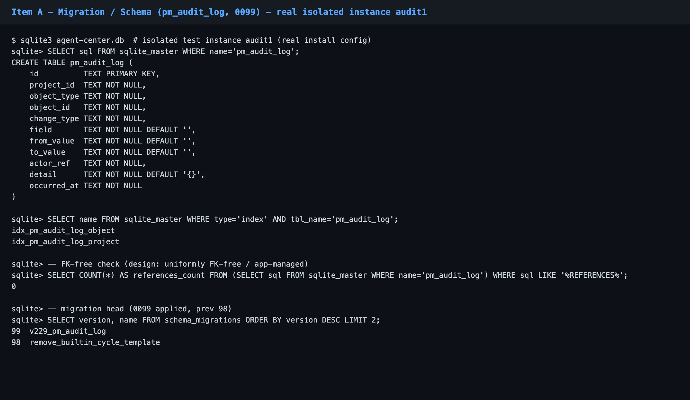

---

## Items B & C — Task 状态迁移账本 + 归属账本 ✅ PASS

**期望**：一个 task 走真实生命周期 → 账本按 §4.2 记：`created`；`status_changed` 覆盖 override(`SetTaskStatus`)/`block`/`unblock`/`complete`/`reopen`/`batch(PATCH)` 各入口，`field=status` + `from→to` 真值；`assigned`/`reassigned`/`unassigned` 记 `field=assignee` + `from→to` + `detail`(block reason)；每条 `actor` = 操作者真身。
**实测**（真 web API，newest-first）：10 条账本覆盖 `created` + 6 条 `status_changed`(open→running/→blocked/→running/→completed/→open/→running) + `assigned(→user:38eefc04)` + `reassigned(38eefc04→helper-bob)` + `unassigned`；block 条 `detail={reason, reason_type}`；全部 `actor=user:user-38eefc04`。

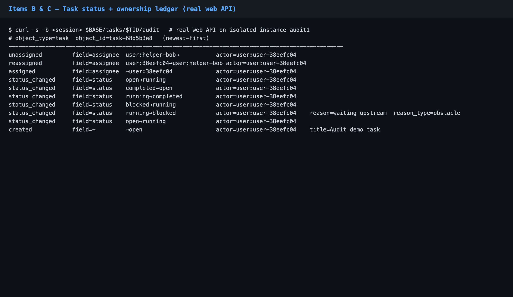

前端渲染同一账本（item H 截图可见彩点彩标签 + 人话）。

---

## Item D — Issue 账本 ✅ PASS

**期望**：`created`；`status_changed`（`transition` open→in_progress，`set` in_progress→resolved）；`metadata_edited` 记粗粒度 `detail.fields=[...]`、**不存全文 diff**（设计 §2.1 / §9）。
**实测**：4 条账本 = `created` + `status_changed(open→in_progress)` + `status_changed(in_progress→resolved)` + `metadata_edited(detail.fields=["title"])`，actor 正确。

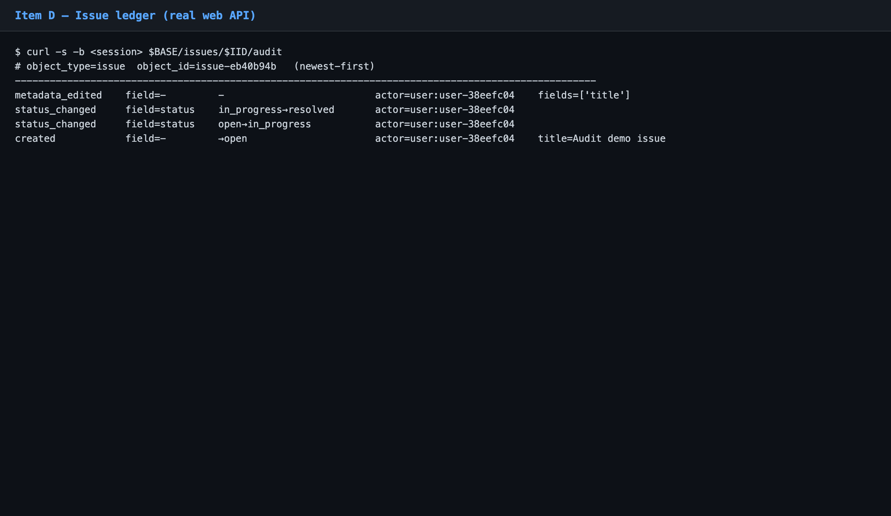

---

## Item E — Plan 账本 ⚠️ PASS（附低危 finding E-1）

**期望**：`created`；`node_added`（记 `task`+`task_title`）；`dependency_added`（记 `from/to/kind/when/max_rounds`）；`dependency_removed`；`started`；`stopped`。
**实测**：7 条账本全部记录，`created`/`node_added×2`/`dependency_added`/`dependency_removed`/`started`/`stopped`，`started`/`stopped` 记 `detail.status`，`dependency_added` 记全 `from/to`。

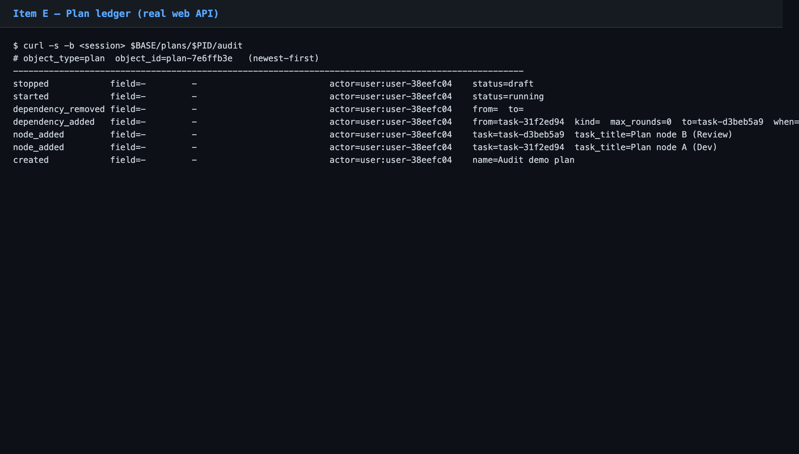

> **Finding E-1（低危）**：`dependency_removed` 的 `detail.from/to` 为空字符串（见截图 `from=  to=`）—— 删除依赖时未把被删边的两端记进 detail。后果：前端「变更记录」渲染成 `removed dependency →`（端点缺失，见 item H Plan 截图）。不影响其它账本，纯该条 detail 保真度问题。

---

## Item F — 系统/gate 驱动 change_types + actor 归属 ❌ FAIL（finding F-1）

**期望**（设计 §4.2 + §5）：6 类系统/gate 驱动 change_type 均有写入点、actor 归 `system:<reconciler>` 而非空/误记 owner —— task `claimed`/`auto_assigned`/`review_verdict`；issue `auto_closed`；plan `decision_outcome`/`loopback`。
**实测**：
- **已接线（4/6）**：`auto_closed`(`system:resolved-issue-closer`)、`auto_assigned`(`system:auto-assign`)、`claimed`、`review_verdict` —— 写入点 + actor 归属均在（这 4 类只在周期性 reconciler 延时 / live-agent gate 周期触发，非 owner API 同步可达，故在服务写入点层核实、未在实时 harness 窗口端到端触发；**如实标注为覆盖 caveat，非 PASS 充数**）。
- **缺失（2/6）→ FINDING F-1**：plan `decision_outcome` 与 `loopback` **无任何非测试代码写入点**。`AuditPlanDecisionOutcome`/`AuditPlanLoopback` 仅有枚举常量声明（`audit.go:42-43`）+ 前端 `category()` 渲染分支，但 `RecordDecisionOutcome`（`plan_orchestration_graph.go:541`）与 loopback 路径（`driveGraphDecisions:260` / `reopenLoopSubgraph:569`）**均不调用 `auditPlan`/`recordChange`**。

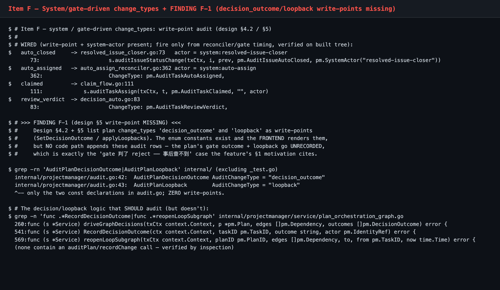

> **Finding F-1（中-高，Ship 阻断）**：plan 的 gate 判定结果（`decision_outcome`）与 loopback 重开（`loopback`）**不进账本**。这恰是特性 §1 动机点名的用例——「gate 判了 reject——发生了、但事后查不到」。设计 §5 表格显式把 `SetDecisionOutcome`/`applyLoopbacks` 列为写入点、§9 v1 范围含「gate reject」「loopback」；实现漏接。前端已为其准备了标签/配色，用户永远等不到这两类条目。**建议**：在 `RecordDecisionOutcome` 与 `reopenLoopSubgraph`（或其 service 收口处）补 `auditPlan(AuditPlanDecisionOutcome{node/outcome/round})` 与 `auditPlan(AuditPlanLoopback{reopened nodes})`，随附行为验收。

---

## Item G — 读 API（分页 / 校验 / 鉴权 / DTO）✅ PASS

**期望**（设计 §6）：`GET .../audit` 游标分页（`?limit`、`?cursor`）；坏 `limit`→400；仅 project 成员可读；DTO 出结构化字段（人话前端拼）。
**实测**：`limit=1` 返 1 条 + `next_cursor`；带 cursor 取第 2 页得**不同**条目（真 keyset 分页）；`limit=-5`→`HTTP 400 invalid_limit`；无 session→`HTTP 401`；DTO keys = `actor/change_type/detail/field/from/id/object_id/object_type/occurred_at/to`。

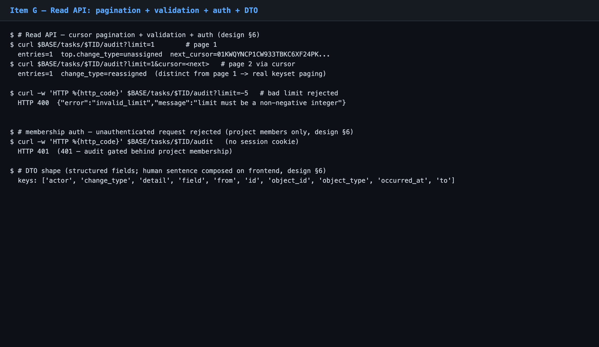

---

## Item H — 三详情页「变更记录」时间线 ❌ FAIL（渲染 PASS · i18n FAIL）

**期望**：Task/Issue 详情侧边栏「变更记录」段 + Plan 详情「变更记录」tab，从真实用户导航可达（§4.2）；人话时间线（时间轨 + 彩点 + 彩标签 + 人话句）；**both-mode**（light+dark）色彩正确；i18n（设计 §7 举例为中文人话句，产品默认中文 UI）。

**实测（渲染 + 可达 + both-mode ✅）**：真登录 → 侧栏「工作区」→ 项目 Alpha → 任务 tab → 点 T1 真实导航到达 task 详情，右侧「变更记录」段完整渲染 10 条时间线；Issue 详情段、Plan「变更记录」tab 同样渲染。彩标签 computed 真值确认（dark：assigned/reassigned = `rgb(153,246,228)` teal、status = `rgb(191,219,254)` blue、unassigned = `rgb(158,152,166)` muted）——分类配色 light/dark 均生效。

Task 详情（light）— 完整时间线：
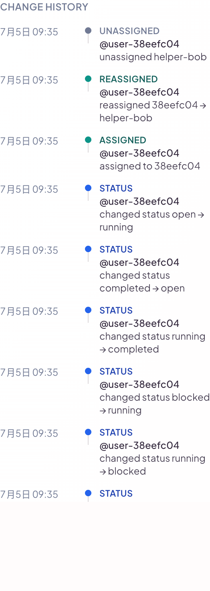

Task（dark）· Issue（light/dark）· Plan tab（light/dark）：
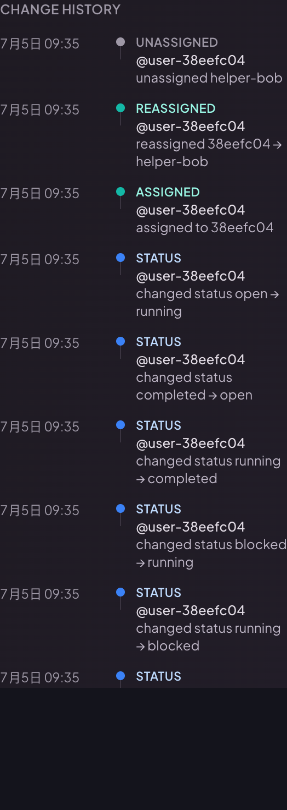
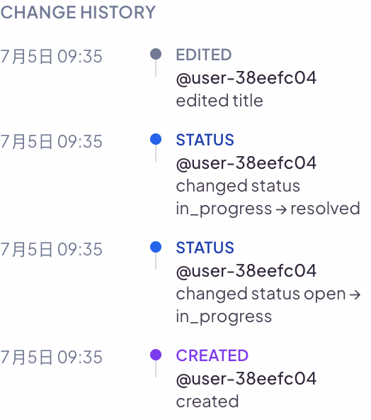
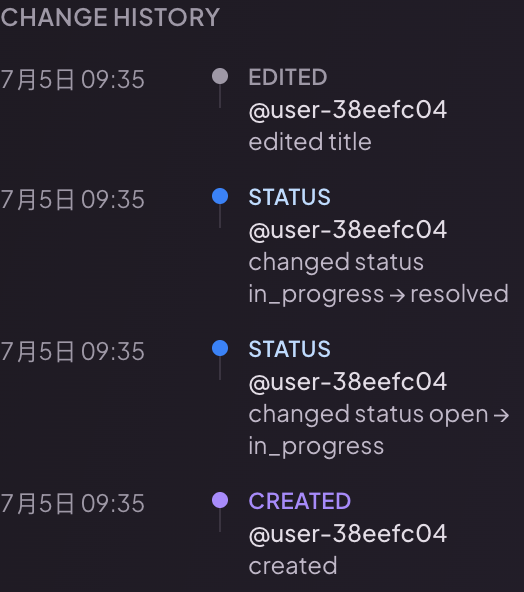
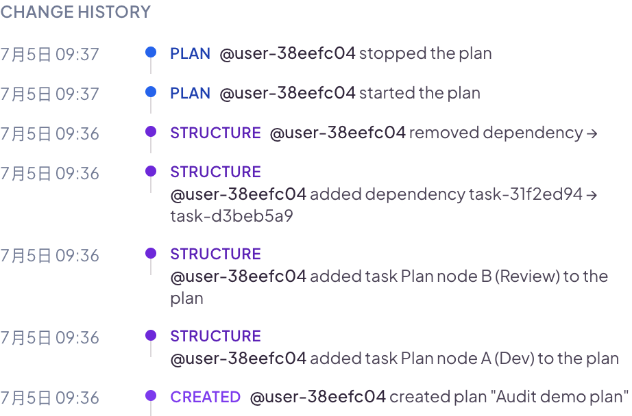
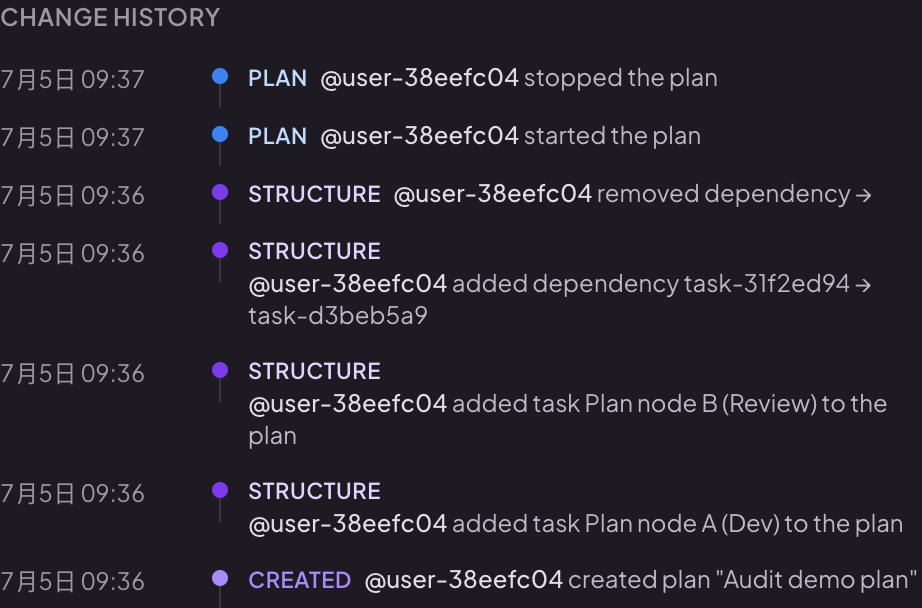

> **Finding H-1（中，Ship 阻断）**：`ObjectAuditTimeline` 组件**零 i18n**。段标题在 Task/Issue 详情硬编码英文 `"Change history"`（`ObjectAuditTimeline.tsx:168` 默认 `title='Change history'`，两处 sidebar 调用未传 title）；所有 change-type 标签（`Created`/`Status`/`Assigned`/`Unassigned`/`Reassigned`/`Structure`/`Plan`/`Review`/`Edited`/`Auto-closed`）与人话句（`changed status X → Y`、`assigned to Y`、`added task … to the plan`…）**全为硬编码英文字面量**，组件内无 `useTranslation`/`t()`。在产品默认**中文** UI 下（登录/项目/任务等皆中文，见截图日期"7月5日"为中文），整段「变更记录」渲染成英文，与设计 §7（中文人话句示例）和 commit「含 i18n」的声明不符。（注：Plan detail 的 **tab 标签**经 `t('plan.detail.tabs.history')`→「变更记录」已本地化；未本地化的是 tab **内容** = 该组件本身。）**建议**：`ObjectAuditTimeline` 接入 `useTranslation`，标签/人话句/段标题走 i18n key（en+zh），并从 sidebar 传本地化 title。

---

## Item I — 零回归 + best-effort 不阻塞 ✅ PASS

**期望**：纯加法（空表 = 现状零影响）；审计写为 best-effort，失败不回滚主 mutation。
**实测**：迁移 0099 纯加法（新空表 + 2 索引），安装后驱动前 `COUNT(*)=0`；`recordChange` 把每次 append 包在 `SAVEPOINT pm_audit`，失败则 `ROLLBACK TO` 该 savepoint + 记 warn「mutation unaffected」，主事务不受污染；`s.audit==nil` 时 no-op（零回归）。正向端到端佐证：10 task + 4 issue + 7 plan 真 mutation 全部返回正常主结果且账本同步落库。

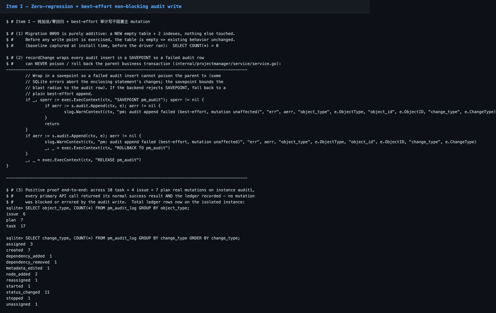

---

## 验收签字

| 方法论自检（acceptance-methodology §10） | |
|---|---|
| 跑在真 install 生成 config 上（非手搓）| ✅ `install test-instance --with-seed` |
| 真浏览器断言锚 computed/rendered 真值 | ✅ 彩标签 `getComputedStyle` 真值 |
| 每条 finding rule out harness/环境噪声、定位真因 | ✅ F-1/H-1/E-1 均代码级 + rendered 双证实 |
| 每个验收点 inline 内嵌可视证据，both-mode 附 light+dark | ✅ A–I 逐项内嵌，H both-mode |
| 验的页面点真实导航到达（非只直接 URL）| ✅ Task 走登录→侧栏→项目→tab→点 T1 |
| 证据 commit 进 tree + `git ls-tree` 实证 | ⏳ 见提交步骤 |

**结论：RESOLVE FAILURE** —— 退回开发修 F-1（Ship 阻断）+ H-1（Ship 阻断）+ E-1（低危可并修）。核心账本（A/B/C/D/G/I）已验收通过，复测时聚焦 F、H 两项。
