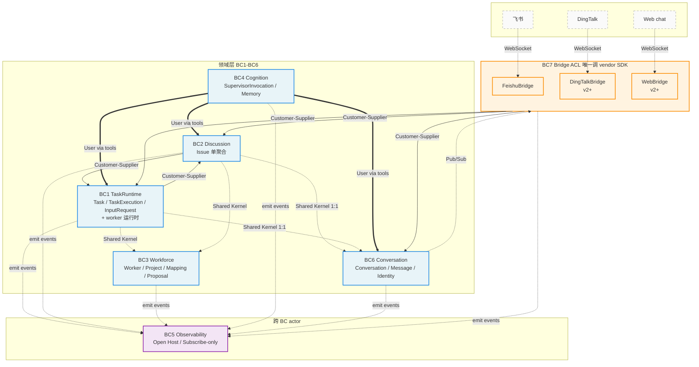
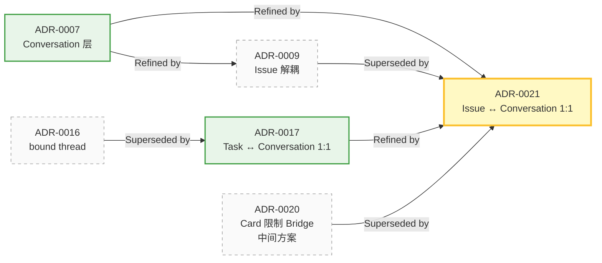

## 7 个限界上下文（BC）地图

**关键解读**：

- **领域层 BC1-BC6**：零 vendor 依赖；只跟其它 BC 通过 Shared Kernel / Customer-Supplier 模式交互；所有外发通过 emit domain events
- **Bridge BC7（ACL）**：唯一调 vendor SDK 的地方；订阅领域事件做 outbound；inbound 调领域 API 写入；不持业务聚合
- **Observability BC5（Open Host）**：所有 BC emit 事件到 `events` 表；只订阅不发起，提供统一查询接口（inspect / query / ps / stats / logs）
- **Cognition BC4 跨切**：Supervisor 通过 CLI 工具（同 user 用的同一套）调任何 BC 的动作命令；不为 supervisor 单造 RPC

## DDD 推进状态

7 个 BC 的战术设计 + Repository 接口签名全部 ✅；剩 implementation 层 SQL schema / dialect 适配（TBD）+ Saga（v1 不必）。详细推进 plan 见 [DDD 蓝图](/design/ddd-blueprint)。

## ADR 演进主线

完整 21 个 ADR 见 [决策索引](/design/decisions/)。
