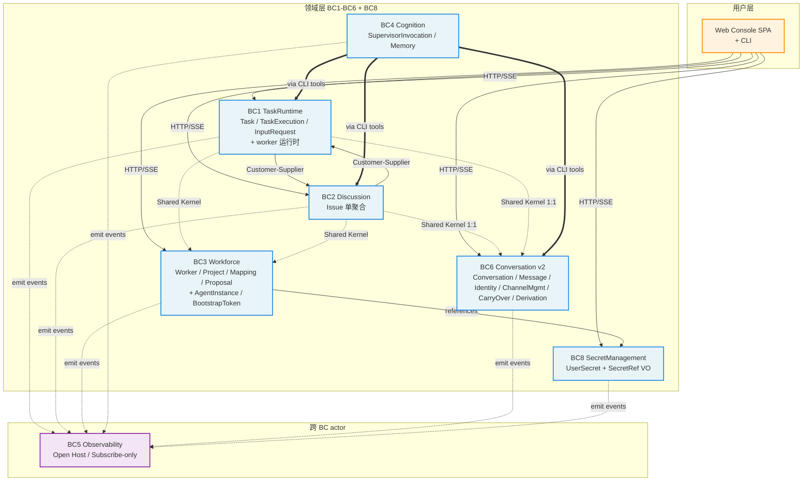

## 6 个限界上下文（BC）地图

> v2 架构（per [ADR-0031](/design/decisions/0031-v2-drop-bridge-vendor-integration.md) 撤回 v1 Bridge BC + vendor 集成；新增 BC8 [SecretManagement](/design/decisions/0026-user-secret-management-bc.md)）。用户入口收窄到 Web Console + CLI（per [ADR-0037](/design/decisions/0037-web-console-as-main-user-ui.md) / [ADR-0038](/design/decisions/0038-cli-ux-enhancement.md)）。

**关键解读（v2）**：

- **领域层 BC1-BC6 + BC8**：零 vendor 依赖；BC 之间通过 Shared Kernel / Customer-Supplier 模式交互；所有外发通过 emit domain events
- **用户入口**：Web Console SPA（loopback bind, [ADR-0037](/design/decisions/0037-web-console-as-main-user-ui.md)）+ CLI；vendor IM 接入留给 v3+ 重新设计
- **Observability BC5（Open Host）**：所有 BC emit 事件到 `events` 表；只订阅不发起，提供统一查询接口（inspect / query / ps / stats / logs）
- **Cognition BC4 跨切**：Supervisor 通过 CLI 工具（同 user 用的同一套）调任何 BC 的动作命令；不为 supervisor 单造 RPC
- **SecretManagement BC8**：v2 新增；中心化 user secret 管理；plaintext 永不在 UI / API / SSE / log 出现（[ADR-0026 § 5](/design/decisions/0026-user-secret-management-bc.md)）

## DDD 推进状态

v2 GA 闭环：6 个 BC 的战术设计 + Repository 接口签名 + 实现层 SQL schema / SQLite 适配全部 ✅。详细推进 plan 见 [DDD 蓝图](/design/ddd-blueprint)。
