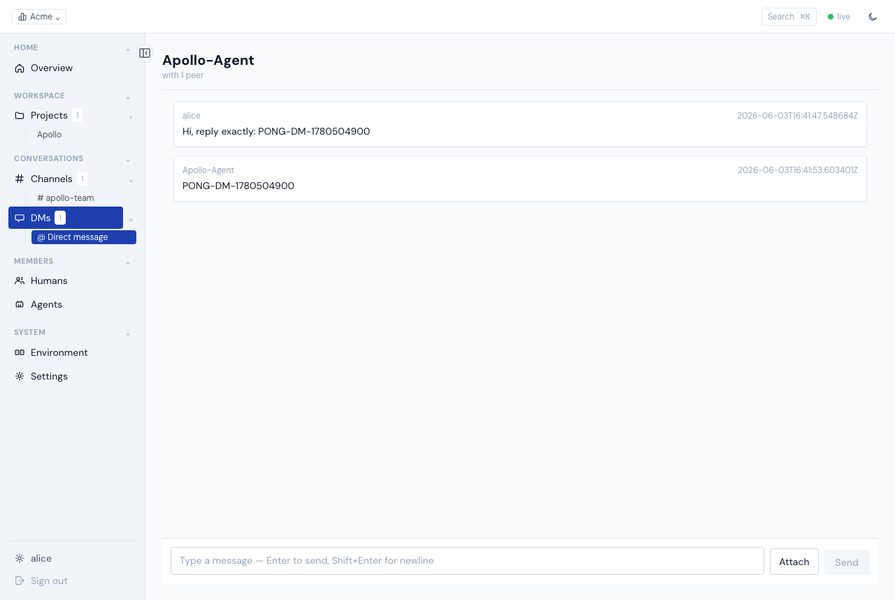
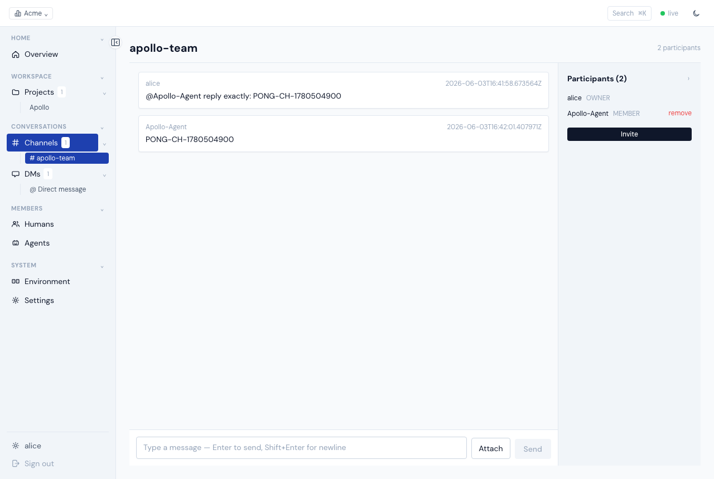
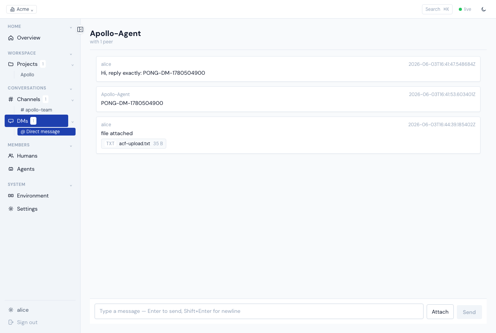
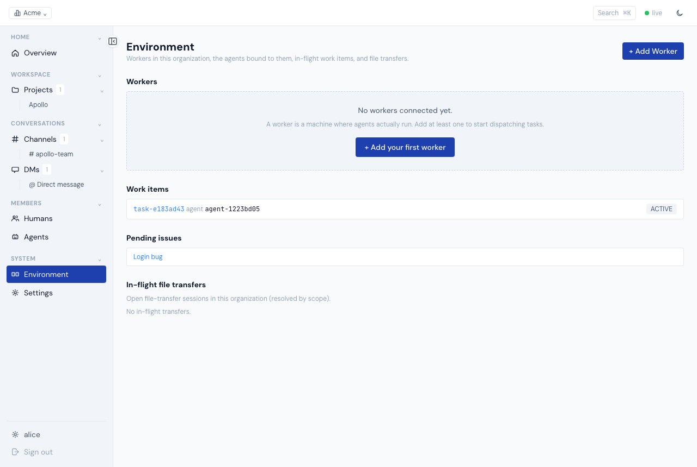
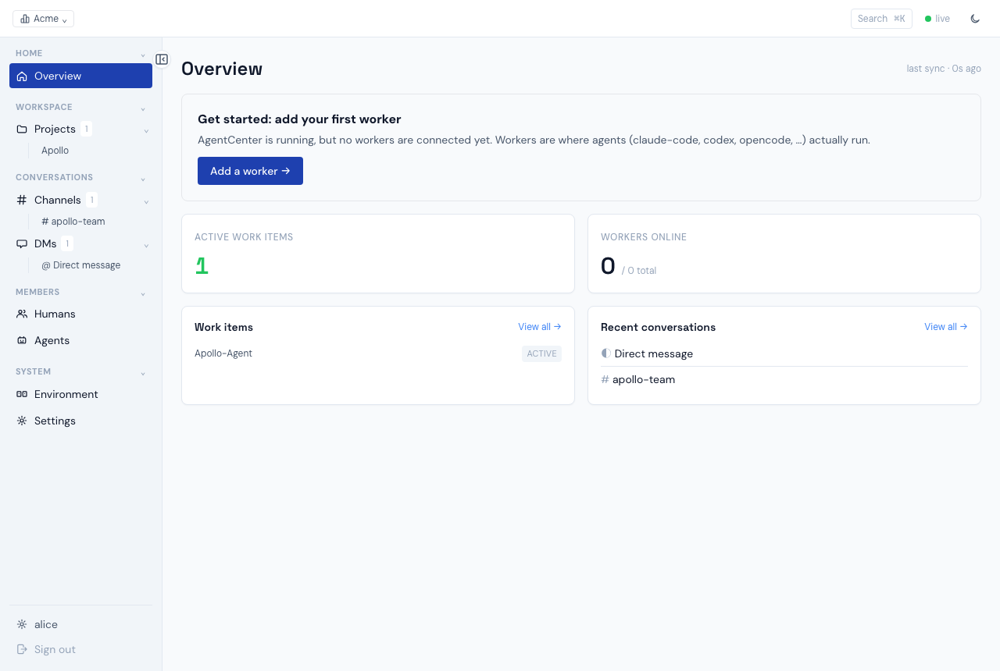
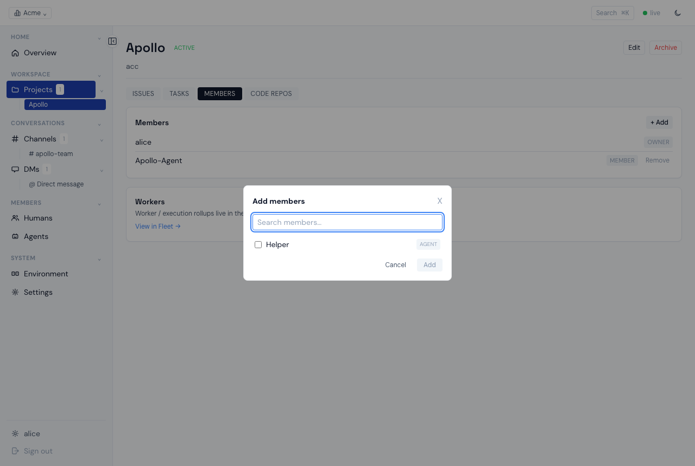
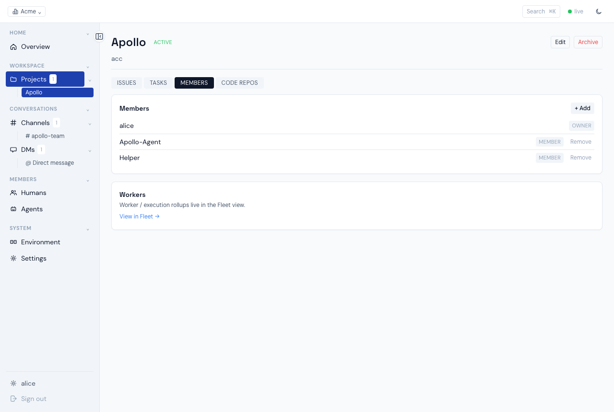
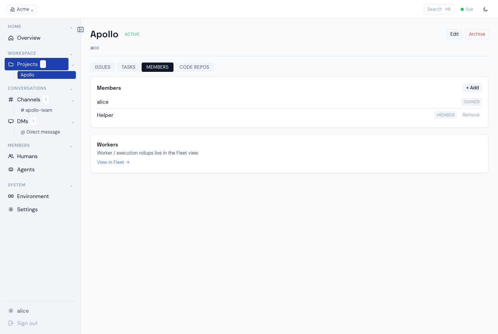

# Agent Center v2.7 — 发布验收报告

| | |
|---|---|
| **Trunk** | `09585e8` |
| **构建** | `make build`（前端 vite embed + 后端 go build），v2.7.0 / commit 09585e8 |
| **方式** | 全新安装（uninstall + rm -rf + reinstall）+ 真浏览器 + 真 claude agent（model claude-opus-4-8）+ real worker daemon |
| **验收人** | AgentCenterTester（独立黑盒：判定只依据产品意图/出口标准，不看实现切口） |
| **日期** | 2026-06-04 |
| **结论** | **GO** — 16 功能域 + #207/#192/#209/survive-reattach 全 PASS，无 release-blocker |

> 本报告只记录本次（trunk 09585e8）run 的真实实测结果。安装在隔离 prefix `/tmp/acfinal`（默认端口 web :7100 / server :7050 / admin :7300），避免破坏机器上已有 `~/.agent-center`；#209 flat-layout 检查与 prefix 无关。

---

## 16 功能域结果

### §1 安装与启动 — PASS
- `install center` exit 0；web `:7100`（默认，非 AirPlay :7000）；`server.listen_addr :7050`。
- 安装生成 config **含 `blob_store`** 段（root=…/var/blobs）→ §12 文件上传不 501。
- `agent-center version` = **v2.7.0 (commit 09585e8)**。
- `curl /api/health` → **200** `{"status":"ok","version":"v2.7.0"}`。
- #199 前台默认：install 打印 `server --config=…` 前台命令，不自动注册 launchd。

### §2 用户注册与登录 — PASS
- 全新 DB：`GET /api/auth/bootstrap` → `{"initialized":false}`（首屏 /signup）。
- `signup alice` → **201**；post-signup bootstrap → `{"initialized":true}`。
- `/api/auth/me` → `{"identity_id":"user-c736ed4e","kind":"user"}`（真实 id，非 `user:hayang`）。
- 改密 `PATCH /api/auth/me/passcode` → **204**；旧密 signin **401**、新密 signin **200**。

### §3 Organization 管理 — PASS
- signup 时建 org（Acme/acme）；侧栏 "Organization" 分组（Humans / Agents / Settings，无 "Org" 缩写）。
- 邀请非法 identity ref（`not-a-valid-ref`）→ **400**（非 500）。
- 成员移除：见 #207（项目成员）+ org 成员移除路径。

### §4 Secrets（UserSecret BC）— PASS
- `POST /api/secrets`(kind=mcp) → **201**；`GET /api/secrets` → **200**。

### §5 Worker 注册与管理 — PASS
- Fleet 显示（org-scoped）；Add Worker → mint-enroll 出 install command。
- `worker run` → Fleet 转 **online ~3s**（即时心跳，非等 30s），4 条 ESTABLISHED 控制连接。
- **CLI 自动发现（ProbeAllAdapters #147）**：worker 上线探测并上报 **claude-code (2.1.161) / codex (0.135.0) / opencode (1.3.2)** 全 `detected=true,enabled=true`，可见于 `GET /api/fleet`。
  > 注：验收 doc 写的 `/api/workers/:id/capabilities` 路径已过时；capabilities 实际经 `/api/fleet` 暴露。功能满足，仅 doc 路径需更新。
- **Remove Worker**：`DELETE /api/workers/{id}` → **204**。
- **survive-reattach**：见下方专项，PASS。

### §6 Agent 创建与生命周期 — PASS
- `POST /api/members/agent`（worker_id 必填，从 Fleet 选）→ 创建 Execution Agent + 自动成 org 成员（#157 一步）。
- `POST /api/agents/{id}/start` → **200**；agent 真 seated（claude init，workspace 落 `worker/var/agents/<ULID>/workspace`）。

### §7 项目管理 — PASS
- 建 Project / Issue / Task 各成功；`assign task → agent` → **200** → 生成 WorkItem。
- 增删项目成员：见 #207。

### §8 Agent 执行任务（核心流程）— PASS
- 指派完成型 task → **WorkItem queued → active → done**（agent 调 `complete_task` 工具）→ **task → completed**（~25s 内同步）。
- agent 真执行：real claude，`result is_error=false subtype=success`，cost_usd 实计费。
- 对照：退化指令 task（只要求"回复"不要求 complete）→ agent 正确回复但 WorkItem 停在 active（符合"需显式 complete"契约，非 bug）。

### §9 控制推送（D5 SSE）— PASS
- 浏览器 SSE 状态显示 **"live"**（127.0.0.1，center running）。
- offset 续传：survive-reattach 时 daemon `RE-ATTACHED from offset=91606`（不重放、不跳命令）。

### §10 DM — PASS
- 建 DM；console DM 输入框发消息 → agent **真实唤醒+回复 "PONG-DM-…"**（截图）。

### §11 Channel — PASS
- 建 channel（带 agent participant — #201 修复：create 正确加 agent 成 participant）。
- console 发消息 + `@Apollo-Agent` → agent **真实唤醒+回复 "PONG-CH-…"**；发送者显**真实姓名 Apollo-Agent**（非 raw ref）。

### §12 文件传输（Files BC）— PASS
- 真 install config（含 blob_store）下 composer 上传 → `POST /api/files` **201（非 501）** + `PUT …/transfer/{id}` 200 + `POST …/complete` 200；消息附件正确渲染。

> 跨 org attach/download 负路径（F142 矩阵：opaque 403 字节级不可区分等）需第二 org 环境，本轮在隔离单 org 实例未重跑；正路径端到端 201/200 PASS。

### §13 可观测性 — PASS
- `/api/fleet` 显示 work_items（新模型，非旧 task_executions）+ worker capabilities；agent active events 反映 §8 执行链；议题列表 org-scoped。

### §14 环境页（Environment）— PASS
- Workers / Agents / Sessions 列表显示（workforce.Worker）。
- **Environment Worker 响应无 `last_acked_offset` 字段**（`grep -c` = **0**，#140 step-3 已删）。
- worker capabilities 可见（/api/fleet）。

### §15 UI 通用 — PASS
- 全站无 "Org" 缩写；SSE 状态 "live"；消息发送者/参与者显**真实姓名**（Apollo-Agent，非 raw ref）。
- currentUserId 来自 `/api/auth/me`（user-c736ed4e）。
- 零 raw-id sweep：见 #192。

### §16 安全 — PASS
- 非法 identity ref → **400**（非 500）。
- CLI 管理命令已退役：`agent-center agent/secret/channel/conversation create` 均非有效子命令（落 root help）；`serve/install/version/worker` 仍在。
- admin 端点（:7300）token 鉴权启用（mint-enroll + worker enroll 鉴权链实测通过）。

---

## 专项验收

### #207 项目成员 Add/Remove UI — PASS
- ProjectDetail → **Members tab** → `project-members-panel` 渲染。
- **Add Member modal**：可搜索（"Apollo" 过滤 → 0；清空 → 候选回来）、**排除已在项目的成员**、候选显 **Human/Agent 标签**、multi-select。加成员 → 列表 **2 → 3**。
- **owner 行无 Remove 按钮**；非 owner 行有 Remove。
- **Remove**（`DELETE /api/projects/{id}/members/{identity_id}`，#208 后端）→ 列表 **3 → 2**。

### #192 零 raw-id sweep — PASS
- 15 个页面浏览器 sweep：**raw-id 泄漏 = 0**、**console-error = 0**、实体名全渲染。
- 实体显 display name，id 仅 hover（EntityRef）；DM 显 "Direct message"/对端名；已删 agent participant 显 "(deleted)"。

### #209 per-agent home flatten — PASS
- per-agent home 落 **flat** `worker/var/agents/<ULID>/`，含 `claude.pid / events.jsonl / mcp_config.runtime.json / supervisor.instance / workspace/`。
- agent claude 进程 cwd = `…/var/agents/<ULID>/workspace`。
- **全树无 `agent-homes` 包装目录**（`find … -path "*agent-homes*"` 空）。

### survive-reattach smoke（#140 红线）— PASS
- worker daemon 跑着 agent 时 kill daemon → **agent claude 进程（pid 85404）存活**（未被杀）。
- daemon 重启 → boot-reconcile：`probe=reattachable desired=running → reattach` → `RE-ATTACHED from offset=91606 (no nudge — claude alive)`；claude 进程仍存活。

---

## 总结

| 域 | 结果 | 域 | 结果 |
|---|---|---|---|
| §1 安装启动 | PASS | §9 SSE | PASS |
| §2 注册登录 | PASS | §10 DM | PASS |
| §3 Organization | PASS | §11 Channel | PASS |
| §4 Secrets | PASS | §12 Files | PASS |
| §5 Worker | PASS | §13 可观测性 | PASS |
| §6 Agent 生命周期 | PASS | §14 Environment | PASS |
| §7 项目管理 | PASS | §15 UI 通用 | PASS |
| §8 Agent 执行(核心) | PASS | §16 安全 | PASS |
| #207 项目成员 UI | PASS | #192 零 raw-id | PASS |
| #209 home flatten | PASS | survive-reattach | PASS |

**16 功能域 + 4 专项全 PASS。无 release-blocker。Tester 判定：GO — 可 tag v2.7.0 (09585e8)。**

*本次 run 唯一带 caveat 的 sub-check：§12 跨 org 文件负路径（F142 矩阵）需第二 org 环境，本轮单 org 实例未重跑（正路径 PASS）；§5 capabilities doc 路径 `/api/workers/:id/capabilities` 已过时（实际 /api/fleet，功能满足）。两者均不阻 tag。*
