# Agent Center v2.9.1 — 发布验收报告（用户视角 · 真实例 · 关键步骤截图）

| | |
|---|---|
| **验收 ref** | `v2.9.1` @ `fa9cdcd` |
| **构建** | `make build`（前端 vite embed + 后端 go build），v2.9.1 |
| **方式** | 真 `bin/agent-center` 真实例 + 真浏览器（Chromium 1440×900@2x）；用户视角端到端,数据走与 Web Console 同一套 `/api` 播种(注册→项目/频道/线程/任务/Plan/归档) |
| **复现** | `tests/e2e/v2/capture-v291.mjs`(起真实例→`/api` 播种→Playwright 截图→`docs/release/evidence/v2.9.1-screenshots/`),一键重跑 |
| **验收人** | AgentCenterPD |
| **日期** | 2026-06-14 |
| **结论** | **GO** — 关键能力 A–I 在真实例+真浏览器下逐步截图坐实,console error = 0 |

> 本报告为**截图补强版**(回应 owner:首版纯文字、缺截图)。每个能力点旁 inline 内嵌真实例截图(§4.1),both-mode 命门附亮/暗两张(§4.2/§4.3)。

---

## A. Thread 消息串(派生 / 侧栏 / 列表)— PASS

**A1 频道 + 派生线程**：打开 `#general`,每条顶层消息显示线程按钮 + 回复数 chip(2 / 1);右栏 THREADS 面板列出 2 个线程(回复 2 / 1)。console=0。

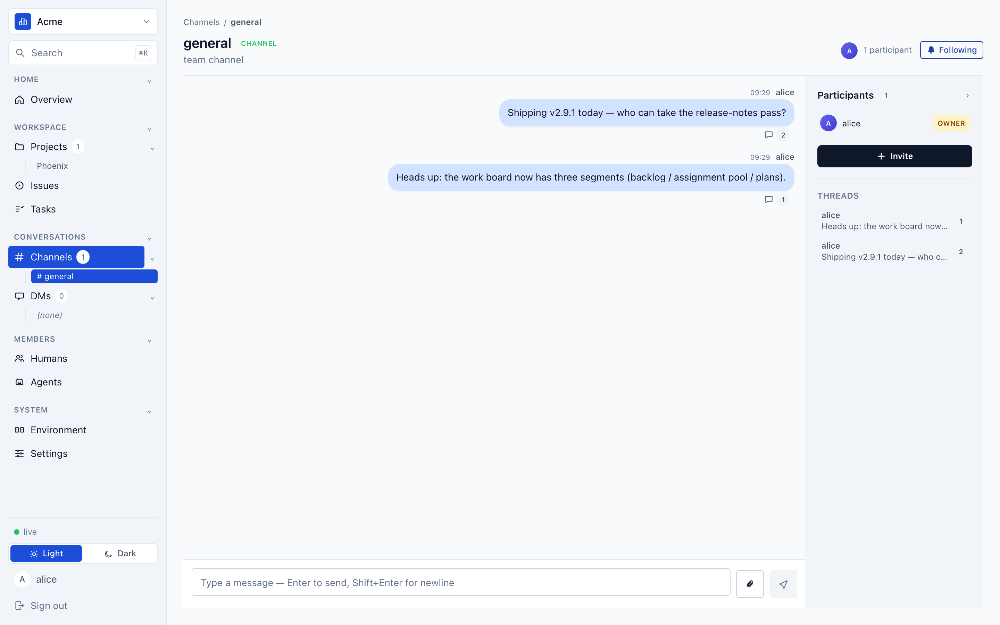

**A2 ThreadSidebar(root + 回复 + 回复框)**：点消息线程按钮 → 弹出侧栏,标题「Thread · 2 replies」,root + 2 条回复按时间序,底部回复框。

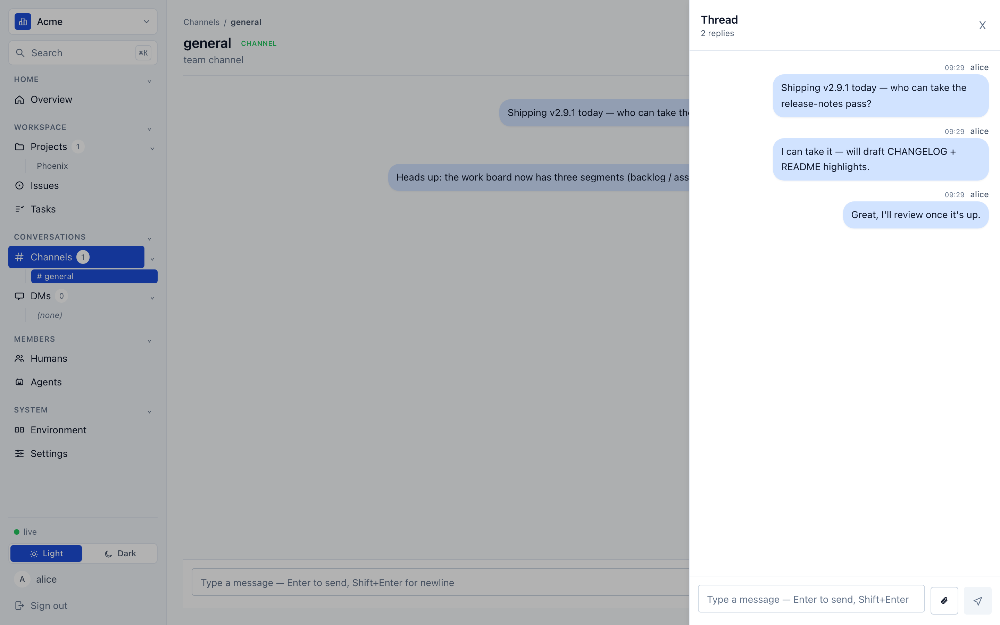

**A3 参与者栏线程列表**：每线程显示发起人 / 预览 / 回复数(1 / 2)。

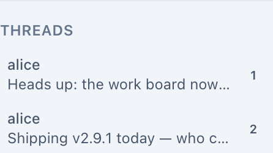

---

## B. Task 状态机 7→5(ADR-0046)— PASS

打开 Tasks 页,状态过滤**恰为** open / running / completed / discarded / reopened —— `blocked` / `verified` 已删。任务带 org 号 T1–T7。

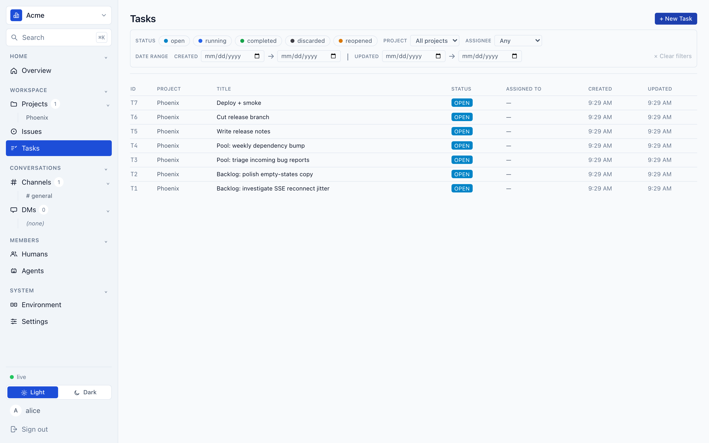

---

## C. claimable + 内置指派池(ADR-0047)— PASS

项目 Work Board 三段:**Backlog**(unscheduled — not claimable)/ **Assignment Pool**(Built-in · always running · claimable)/ **结构化 Plan**(Release v2.9.1 DRAFT,3 卡)。

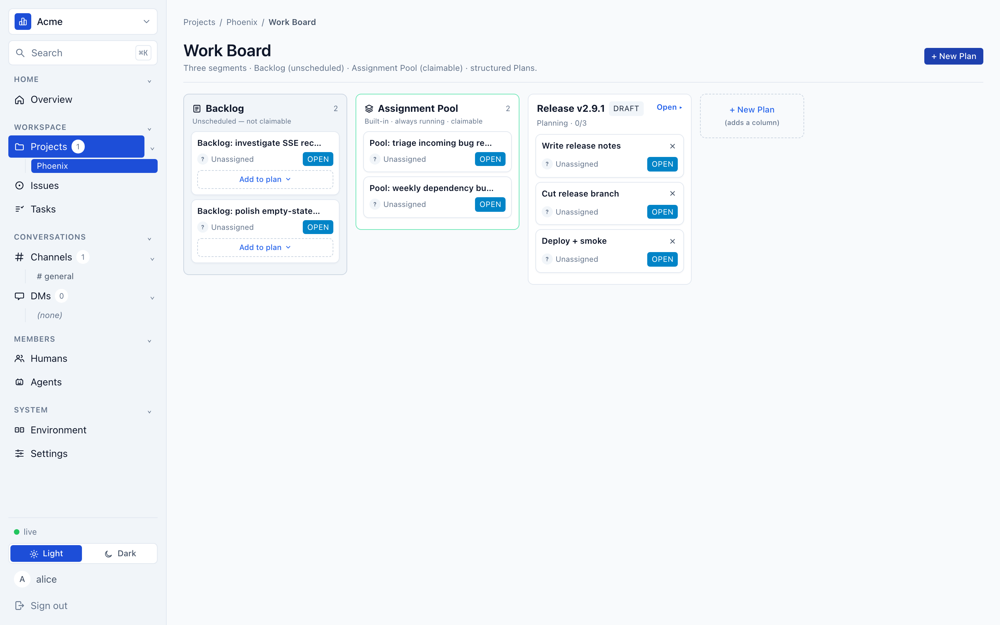

---

## D. 看板可见性 / 归档隐藏 — PASS

- Tasks 列表默认排终态(见 B 图,org 号 T1–T7);归档项目的任务默认不在 org 列表。
- 频道:活动列表默认排除已归档(见 G)。

---

## E. 工具 / 门(list_tasks · eslint-gate · no-raw-colors)— PASS（非 UI 表面）

非浏览器表面,不截图;由 §0 全绿门(go build/test + tests/integration + make lint + vitest)+ PD §-1 + data/API class-guard 覆盖。

## F. 恢复 / 运维(unblock_task · auto-redispatch)— PASS（非 UI 表面）

非浏览器表面,不截图;由 §0 门 + data/API class-guard(restart→死锁恢复、stale 节点自动重派)覆盖。

---

## G. 频道归档 — PASS

Channels 页展开「Archived / 已归档」:`general` ACTIVE 在活动列表(计数 1);`old-incidents` ARCHIVED 在归档组(单独分区、只读)。证明默认排除 + 归档分区。

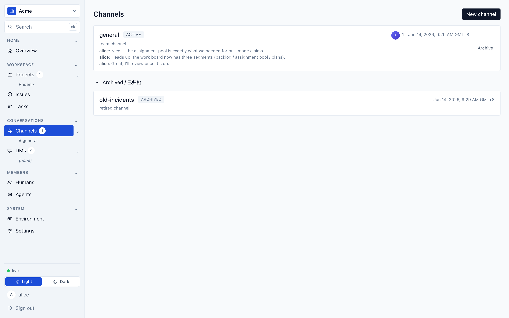

---

## H. Plan 详情 UX(三 tab + DAG + Task 号 + 连线编辑)— PASS

**H1 三 tab(默认 Chat)**：

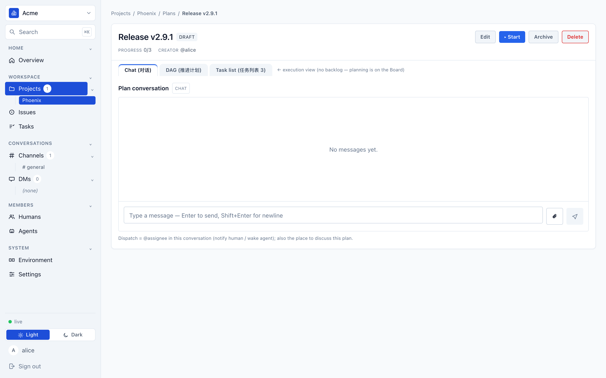

**H2 DAG + Task 号 + 连线编辑 + 派生状态**：START→T5→T6→T7→END;T5 READY / T6·T7 BLOCKED(派生 §9.2);每节点 `+Dep` 连线编辑;状态 legend;Compact 切换。

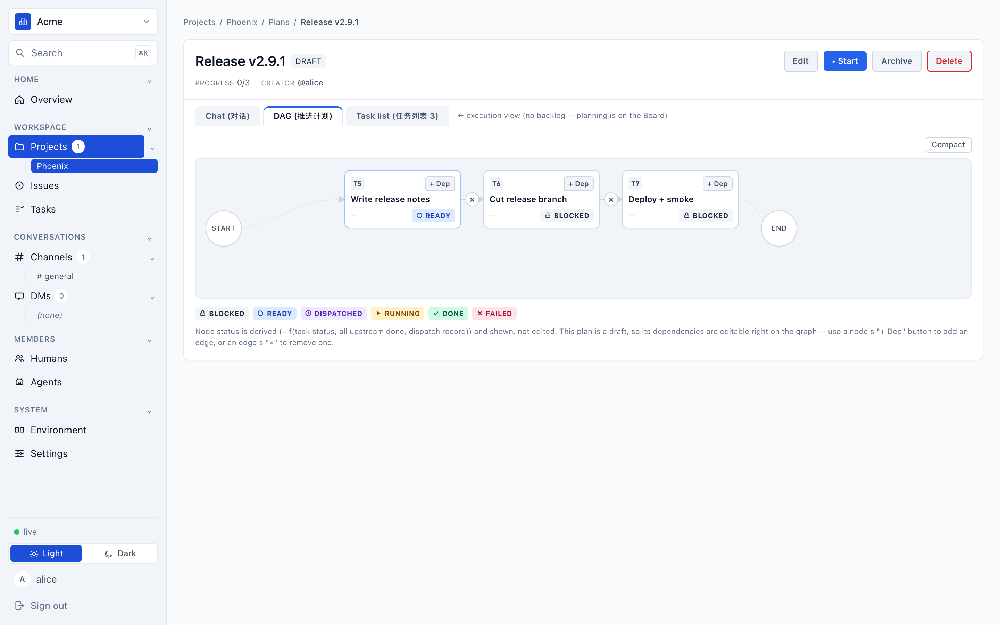

**H3 Task list tab**：

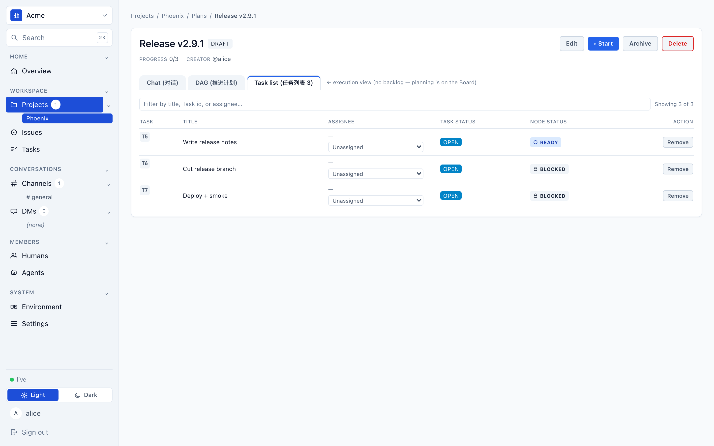

---

## I. both-mode 暗色(AA 不退)— PASS

**I1 暗色 频道 / 线程**：暗主题全应用,线程 chip / THREADS 面板可读,console=0。

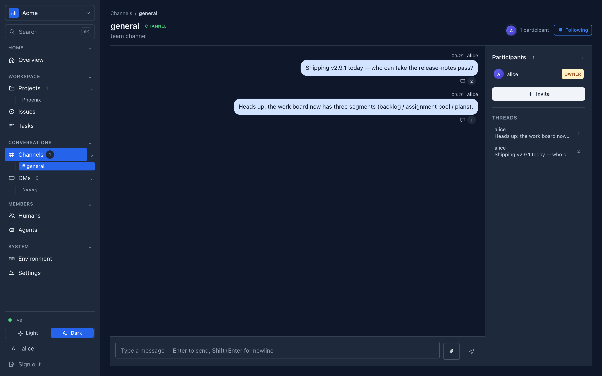

**I2 暗色 Work Board**：三段看板暗色下渲染、可读。

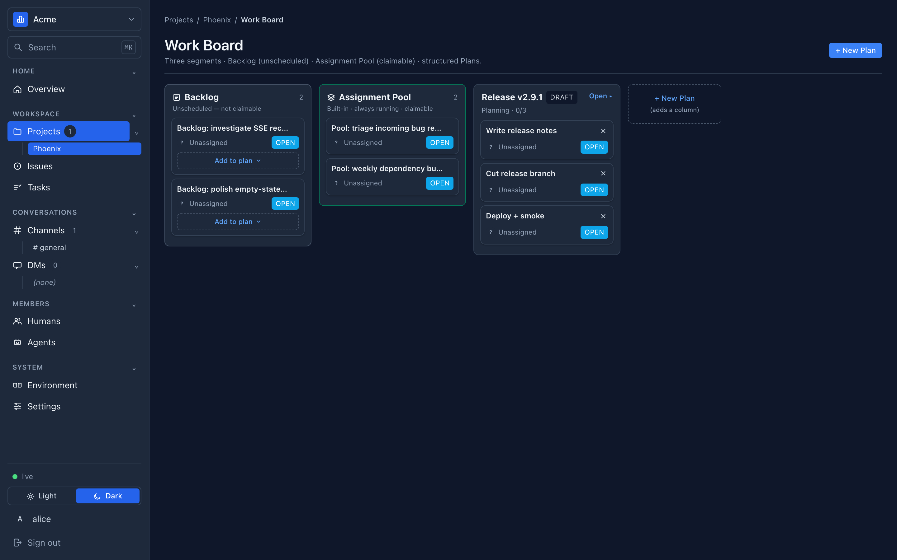

---

## 诚实备注

- **截图 provenance**：全部在 PD 亲手起的 v2.9.1 真实例(`fa9cdcd`)+ 真 Chromium 抓,数据走与 Web Console 同一套 `/api`(用户视角真路径),非 mock。复现脚本随仓库。
- **看板卡片显示 Unassigned**：本次播种用 alice(人)做 assignee,其 ref 格式被 ADR-0033 拒(非阻塞);看板三段结构与 claimable 标识不受影响;claimable 谓词真值由 data/API class-guard(baseline + 9 单条件翻转)覆盖。
- **@agent 在线程内回复(真 LLM 唤醒)**：需 enrolled worker + 真 agent,本截图集未含;该链路(F4:线程内 @agent 回复落 thread 内而非顶层)由 Tester data/API class-guards 覆盖。
- **E/F 非 UI 表面**:不截图,由 §0 门 + §-1 + data/API class-guard 覆盖。
- **sites 首页 showcase / roadmap** = 非阻塞 fast-follow(待截图)。

**结论:v2.9.1 关键能力在真实例 + 真浏览器下逐步截图坐实,console error = 0,具备发布条件。建议 owner 拍板 tag + promote + 部署。**
