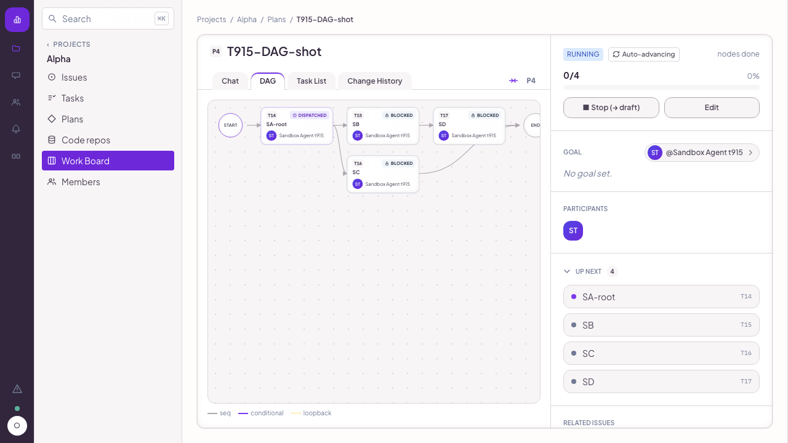
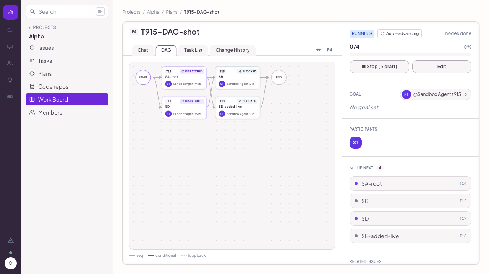
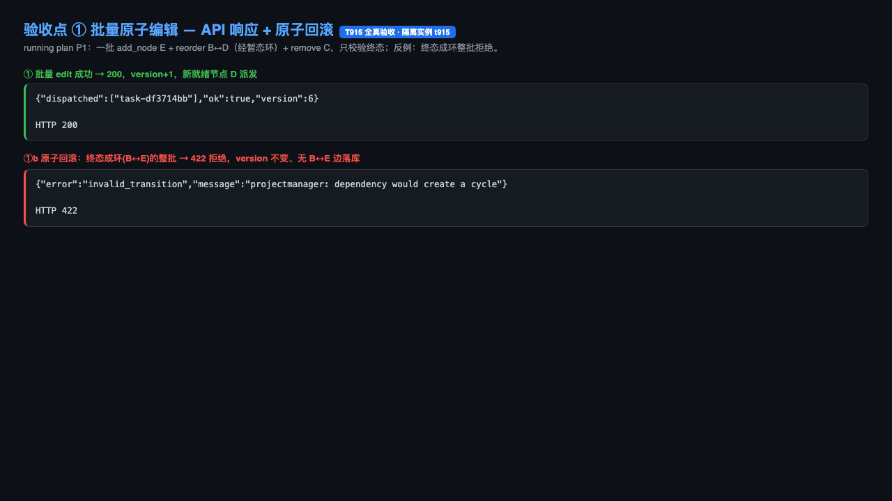
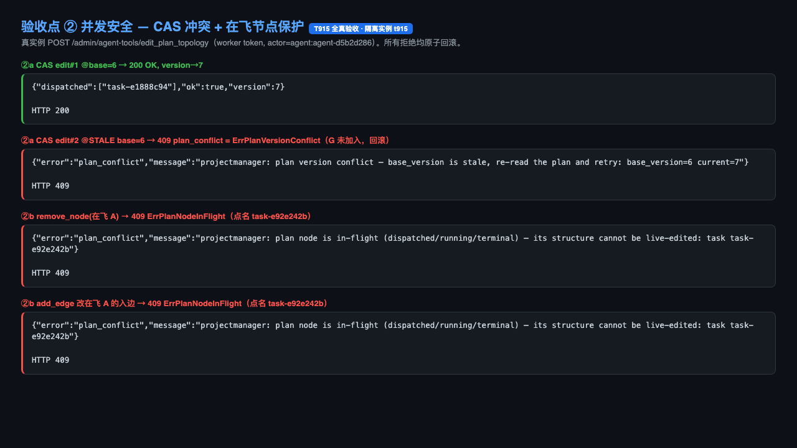
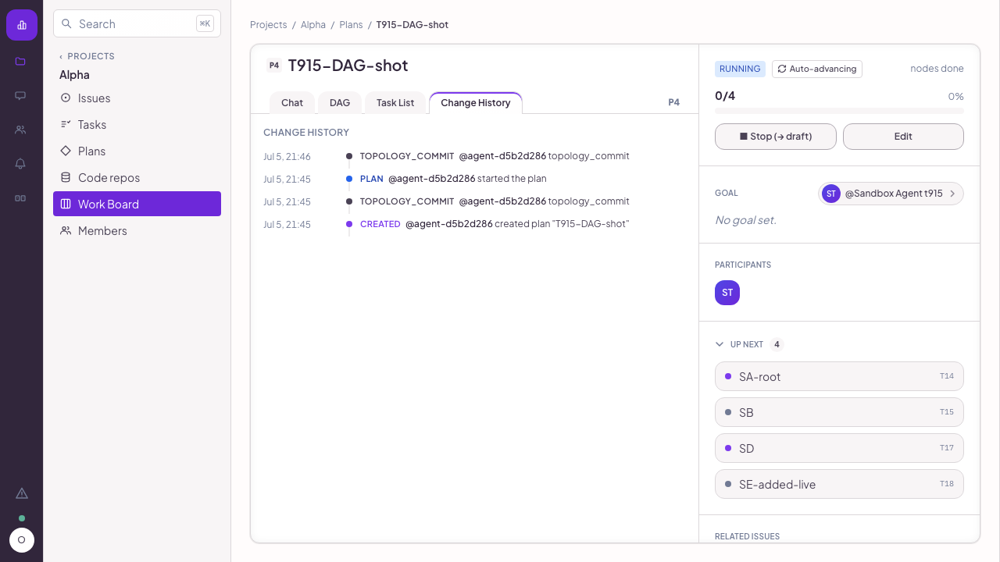
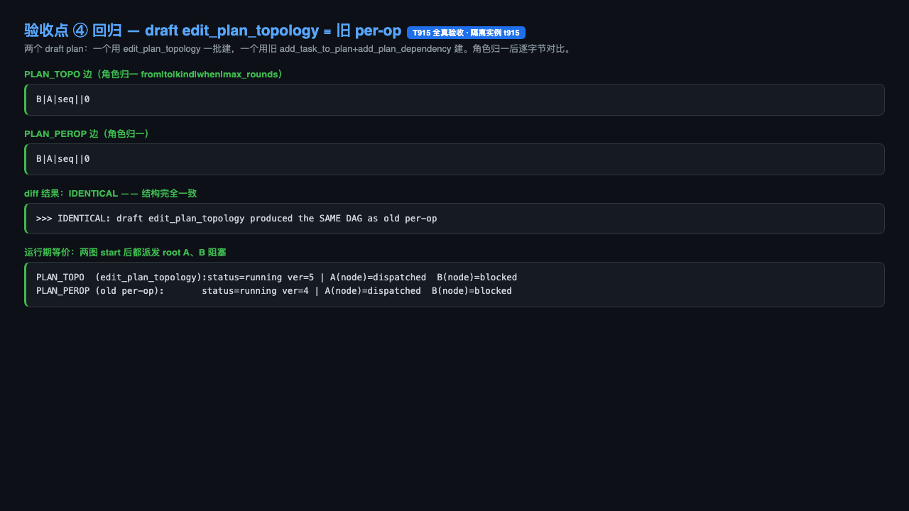

# T915 全真验收报告 — 运行中 plan 动态拓扑编辑 (`edit_plan_topology`)

- **Issue**: issue-00995bf5 · **Plan**: plan-3a770000 · **Task**: T915 (task-e3ed5144)
- **Branch**: `dev/live-topo` @ `82b1f796`（单 MVP commit，落后 origin/main 0）
- **验收人**: agent-center-tester1 · **日期**: 2026-07-05
- **方法**: 部署级真跑（`install test-instance --with-agent --id t915`，隔离 namespace
  `~/.agent-center-test/t915/`，真 center + SPA-embed 二进制），worker `launchctl bootout`
  以保证状态确定（center + projector 仍在，真派发照常写 dispatch record）。所有编辑经真
  admin agent-tool `POST /admin/agent-tools/edit_plan_topology`（worker token, actor=真 agent
  `agent:agent-d5b2d286`）驱动，终态经 SQLite DB + SPA DAG/Change-History 双向核验。
- **参考**: `docs/rules/acceptance-methodology.md`（§0 真实使用、§4.1 每验收点内嵌可视证据）。

## 结论：**PASS**（4/4 验收点，均证据支撑，含 2 条非阻断说明）

| # | 验收点 | 结论 | 关键证据 |
|---|---|---|---|
| ① | 批量 add/remove 节点+边、reorder，原子应用 + 终态正确 | ✅ PASS | DAG 前后截图 + API 200 + 原子回滚(成环整批 422) |
| ② | 并发：CAS→ErrPlanVersionConflict；触在飞节点→ErrPlanNodeInFlight | ✅ PASS | 409 plan_conflict ×3（点名冲突节点），全部原子回滚 |
| ③ | audit ledger 有 topology_commit（from/to version + ops diff + actor） | ✅ PASS | 3 行 topology_commit（DB + Change-History UI），拒绝的编辑写 0 行 |
| ④ | draft 走 edit_plan_topology 与旧 per-op 等价（回归） | ✅ PASS | 结构逐字节一致 + 运行期派发一致 |

补充回归门：`go build ./...` 0、`go vet`（pm/admin/mcphost）0、`go test`
`mcphost`+`admin/api` green、feature 单测 7 例 `-race` green。

---

## ① 批量原子拓扑编辑 + 只校验终态

在**运行中** plan（`T915-DAG-shot`：START→SA-root(DISPATCHED)→SB/SC/SD BLOCKED）上，一批
`[add_node SE, add_edge SE→SA, add_edge SB→SD, remove_edge SD→SB, remove_node SC]` 原子提交。
其中 `add SB→SD` + `remove SD→SB` 构成**暂态 A↔B 环**——只校验终态使其合法；per-op 工具做不到。

- API：`{"dispatched":["task-00916797"],"ok":true,"version":6}`（version 5→6，恰 +1；SD 因失去
  对 SB 的依赖变为 root 被**立即派发**——证明"重算 ready set + 派发新就绪节点"）。
- 终态 DB：节点 `{SA,SB,SD,SE}`（SC 已回 backlog）、边 `{SB→SA, SB→SD, SE→SA}`，在飞 SA 未被扰动。
- **原子回滚**：另一批终态成环 `[add B→E, add E→B]` → `HTTP 422 dependency would create a cycle`，
  version 不变、无 B↔E 边落库（整批 all-or-nothing）。

编辑前 DAG（SA 派发中，SB/SC/SD 阻塞）：


编辑后 DAG（SE 新增、SC 消失、SD 升为已派发 root、SA 不变）：


API 响应 + 原子回滚：


## ② 并发安全 — CAS 冲突 + 在飞节点保护

同一 running plan，`get_plan` 读 base_version。

- **CAS（编辑 vs 编辑）**：edit#1 @base=6 → 200，version→7；edit#2 复用**陈旧** base=6 →
  `HTTP 409 plan_conflict` `plan version conflict — base_version is stale ... base_version=6 current=7`
  = **ErrPlanVersionConflict**；被拒节点未落库（回滚）。
- **在飞节点（编辑 vs 派发）**：A-root 已派发（dispatch record 存在→immutable）。
  `remove_node(A)` 与 `add_edge` 改 A 入边（加 `A→H`，无环）均 →
  `HTTP 409 plan_conflict` `plan node is in-flight ... : task task-e92e242b` = **ErrPlanNodeInFlight**，
  **点名冲突节点**；两者均原子回滚（H 未加入、无 A→H 边、version 不变）。



## ③ audit ledger — `topology_commit`

`pm_audit_log` 中 `object_type=plan, change_type=topology_commit` 每次成功提交恰一行，
`detail` JSON 含 `from_version→to_version`、完整 `ops` diff、`added_nodes/removed_nodes`，
`actor_ref=agent:agent-d5b2d286`。**被拒的编辑（成环/CAS/在飞）写 0 行**——再证原子性。

```
[commit #1] from_version=1 -> to_version=2  added=[A,B,C,D] removed=[]   (draft 建图: 4 node + 3 edge)
[commit #2] from_version=5 -> to_version=6  added=[E] removed=[C]        (①批量: add E / reorder B↔D / remove C)
[commit #3] from_version=6 -> to_version=7  added=[F] removed=[]         (②CAS edit#1)
actor_ref 每行 = agent:agent-d5b2d286
```

产品 Change-History 页真渲染该账本（`TOPOLOGY_COMMIT @agent-d5b2d286`）：


## ④ 回归 — draft `edit_plan_topology` ≡ 旧 per-op

两个 draft plan：`T915-P4-topo` 用 `edit_plan_topology` 一批建（add_node×2 + add_edge B→A），
`T915-P4-perop` 用旧 `add_task_to_plan×2 + add_plan_dependency` 建。角色归一后：

- **结构逐字节一致**：两图边集 `diff` 为空（`B|A|seq||0`）。
- **运行期一致**：两图 `start_plan` 后都派发 root A（node_status=dispatched）、B 阻塞（blocked），
  dispatch record A=1/B=0。



---

## 非阻断说明（不影响 PASS，供 PD/Ship 知悉）

1. **per-op 工具为"软退役"而非硬删除**：设计 §3 称 edit_plan_topology 为唯一入口、"退役 per-op
   工具"。实现将 `add_task_to_plan / remove_task_from_plan / add_plan_dependency /
   remove_plan_dependency` 的工具描述标为 `DEPRECATED — prefer edit_plan_topology`，但仍保留在
   agent-facing 集合中（draft 仍可用、向后兼容）。这是更安全的 MVP 选择（也正是④回归对比得以进行的
   前提）；若后续要"硬退役"需另起任务。**判定：可接受的刻意收敛，非缺陷。**
2. **两类冲突 HTTP 码不同**：CAS/在飞 → `409 plan_conflict`（状态冲突类）；终态成环 →
   `422 invalid_transition`（校验类，ErrPlanCycle）。均语义正确，只是分属两类；本报告已分别验证。

## 复现
- 驱动脚本：真跑逐项（本报告随附命令流，evidence 原始输出见 `/tmp/t915-evidence/`）。
- 截图可复现：隔离实例 + 真 SPA DAG / Change-History 导航截图；后端点用真 API 响应 + DB SELECT 渲染。
